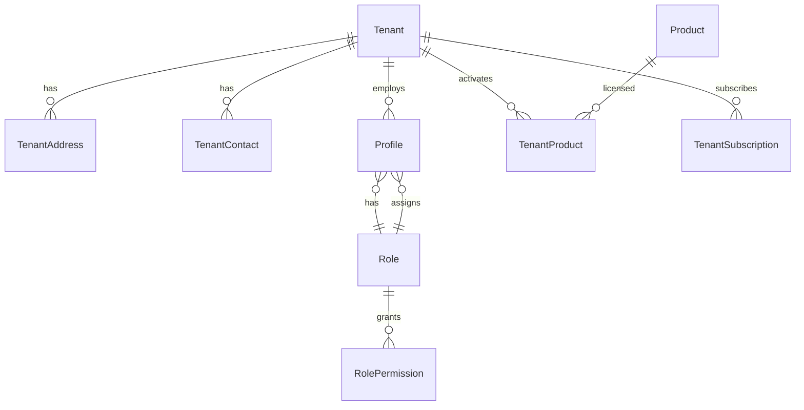

# CareSuite+ — Datenmodell

## Kern-Entitäten

## Plattform-Entitäten

| Entität | Beschreibung | Mandant |
|---------|--------------|---------|
| `Tenant` | Pflegedienst / Unternehmen | — |
| `TenantAddress` | Adresse des Mandanten | ja |
| `TenantContact` | Ansprechpartner | ja |
| `Profile` | Benutzerprofil (1:1 auth.users) | ja |
| `Role` | Rollendefinition | nein (global) |
| `RolePermission` | Recht je Rolle | nein |
| `Product` | Modul-Stammdaten | nein |
| `TenantProduct` | Aktives Modul je Mandant | ja |
| `TenantSubscription` | Abo-Status | ja |

`TenantProduct` Felder (Office Basis-Modul): `accessSource`, `includedByModuleKey`, `isBaseIncluded`, `billingStatus` — siehe `docs/product/office-base-module.md`.

## Fachmodule (Kern-Entitäten)

| Modul | Entitäten |
|-------|-----------|
| Office | Client (+ erweiterte Akte), Employee, Appointment, Invoice, Document |

Erweiterte Klient:innen-Akte: siehe [client-data-model.md](./client-data-model.md).
| Assist | Assignment, CareRecord, Signature |
| Pflege | CarePlan, VitalSign, WoundDocumentation |
| Stationär | Resident, Room, Handover |
| Beratung | CounselingCase, Protocol |
| Akademie | Course, Lesson, Certificate |
| Integrationen | IntegrationProvider (`secretReference`) |
| Plattform | AiJob, OcrJob, TelemedicineSession |

## Gemeinsame Felder

Alle mandantenbezogenen Entitäten erweitern `TenantScopedEntity`:

- `id`, `tenantId`, `createdAt`, `updatedAt`
- `status: WorkflowStatus` (wo fachlich passend)

## Workflow-Status

`entwurf` → `aktiv` → `in_bearbeitung` → `abgeschlossen` | `archiviert` | `fehlerhaft` | `gesperrt`

Übergangsregeln werden in WP 015 als Statusmaschine implementiert.
