# CareSuite+ — Telematikinfrastruktur (TI-Modul)

## Übersicht

Das TI-Modul integriert die deutsche Telematikinfrastruktur in CareSuite+ — demo-first mit Supabase-ready Architektur.

**Module:** KIM-Postfach, eGK, ePA, eMP, E-Rezept, Dokumentenzuordnung, Provider-Verwaltung, Einwilligungen, Audit-Log.

## Sicherheitsgrenzen

```mermaid
flowchart TB
  subgraph Client["Expo App (Client)"]
    UI[TI Screens & Hooks]
    Services[ti/* Services]
  end

  subgraph Supabase["Supabase"]
    RLS[(TI Tables + RLS)]
    Edge[ti-provider-proxy]
    Vault[(Vault Secrets)]
  end

  subgraph TI["TI-Infrastruktur"]
    KIM[KIM-Connector]
    EGK[eGK-Kartenleser]
    EPA[ePA-Gateway]
  end

  UI --> Services
  Services -->|"anon key + JWT"| RLS
  Services -->|"invoke (stub)"| Edge
  Edge -->|"secret_reference only"| Vault
  Edge --> KIM
  Edge --> EGK
  Edge --> EPA

  style Client fill:#0a1628,stroke:#62F3FF
  style Supabase fill:#1a2332,stroke:#62F3FF
  style TI fill:#0d2818,stroke:#4ade80
```



## Nicht verhandelbare Regeln

| Regel | Umsetzung |
|-------|-----------|
| Keine Secrets im Frontend | `secretReference: vault:...` only |
| Kein service_role im Client | Edge Function mit Service Role |
| Consent vor med. Daten | `checkTIConsent()` in KIM-Services |
| Mandantenisolation | `tenant_id` + RLS auf allen Tabellen |
| Audit | `ti_audit_events` bei sicherheitsrelevanten Aktionen |
| OCR/AI nur Vorschlag | `importStatus: pending` → manuelle Bestätigung |

## Verzeichnisstruktur

```
app/business/ti/           # Expo Router
src/features/ti/           # (reserviert)
src/screens/ti/            # Screens
src/components/ti/         # TI-UI
src/types/modules/ti/      # Types
src/lib/ti/                # Services + Adapters
src/hooks/ti/              # Hooks
src/data/demo/ti/          # Demo-Daten
supabase/migrations/0009_ti_module.sql
supabase/functions/ti-provider-proxy/
```

## Berechtigungen

- `ti.view`, `ti.admin`
- `ti.kim.view`, `ti.kim.manage`
- `ti.consent.manage`, `ti.audit.view`, `ti.provider.manage`
- `ti.egk.view`, `ti.epa.view`, `ti.emp.view`, `ti.erezept.view`

## Migration Tabellen

`ti_providers`, `ti_provider_checks`, `kim_mailboxes`, `kim_messages`, `kim_attachments`, `ti_document_assignments`, `egk_insurance_data_drafts`, `epa_connections`, `emp_medication_plans`, `emp_medication_items`, `erezept_items`, `ti_consents`, `ti_audit_events`, `ti_permissions`

## Produktiv-Integration (offen)

1. Edge Function `ti-provider-proxy` mit echtem Vault-Lookup
2. gematik-konforme KIM/eGK/ePA-Connectors
3. Supabase Repositories statt Demo-In-Memory
4. Realtime-Sync für KIM-Postfach
5. ePA-FDG-konforme Consent-Workflows mit Signatur
