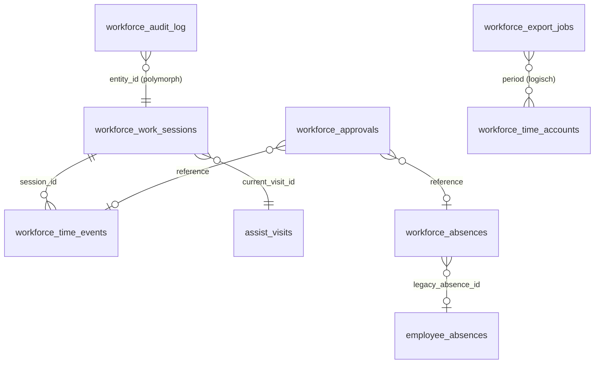
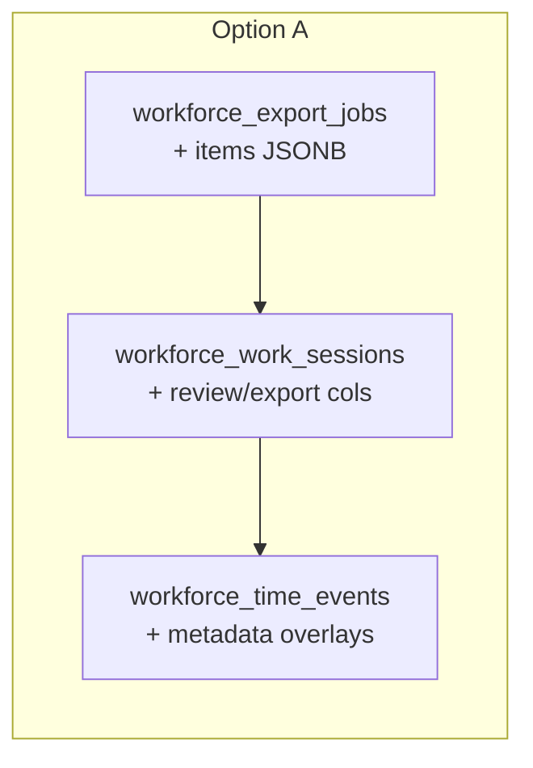
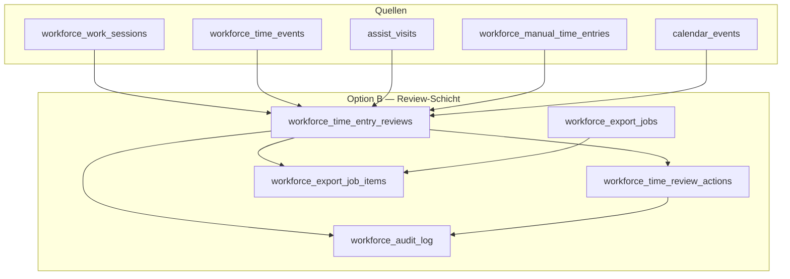
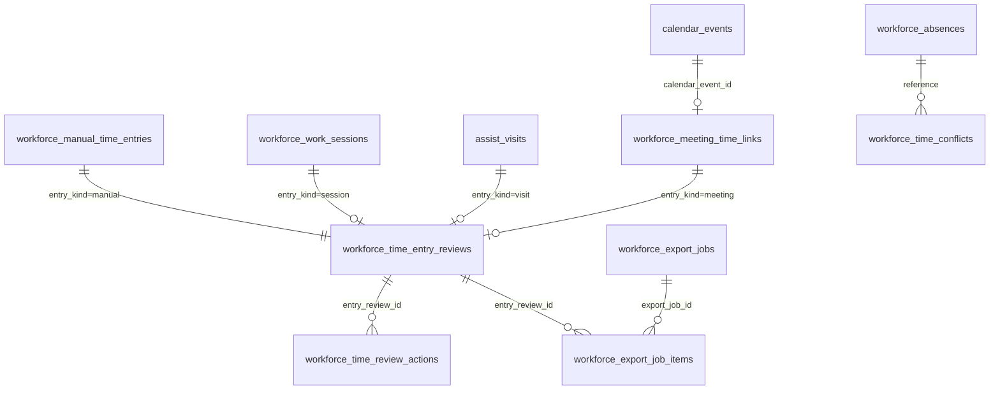
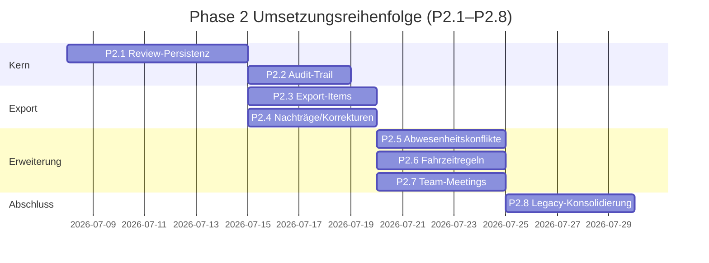
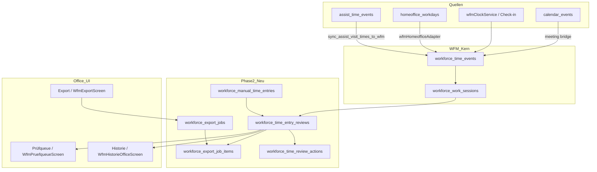

# WFM Phase 2 — Architekturvorschlag (Review, Export, Audit)

**Stand:** 2026-07-07  
**Scope:** Schema- und Architekturvorschlag — **keine Implementierung, keine Migration**  
**Phase-1-Basis:** Commit `55a79a96` (`fix(wfm): stabilize time tracking shell and legacy gate`), 177 Tests grün  
**Referenz:** [`wfm-phase1-boundaries.md`](./wfm-phase1-boundaries.md)

---

## 1. Ausgangslage

CareSuite+ hat in Phase 1 die fachliche **Single Source of Truth (SSOT)** für Zeiterfassung im Modul **WFM** (`src/lib/wfm/`) etabliert. Rohdaten liegen in `workforce_time_events` und `workforce_work_sessions` (Entwurf Migration 0190); Office-Arbeitszeit nutzt eine stabile **10-Tab-Shell** unter `/business/office/time-tracking/` (`OfficeTimeTrackingShell`, `officeTimeTrackingNav.ts`).

| Erreicht (Phase 1) | Offen (Phase 2) |
|--------------------|-----------------|
| WFM als SSOT bestätigt (`wfmLegacyGate` blockiert `timeTrackingStore` in Produktion) | Persistenter **Review-Status** pro Zeitblock |
| Routing, Redirects, Prüfqueue-/Historie-/Export-UI | Persistenter **Export-Status** und Export-Protokoll auf Eintragsebene |
| Sessions/Events aus Supabase (`wfmWorkSessionRepository`) | Zentraler **Audit-Trail** ohne In-Memory-Mischbetrieb |
| Abwesenheiten Office über `wfmAbsenceService` → `workforce_absences` | Fahrzeitregeln, Team-Meetings, Abwesenheits-Konsolidierung |
| 177 Tests grün (WFM + Legacy-Gate) | Legacy-Silos kontrolliert konsolidieren |

**Zentrale Lücke:** Office-Prüfung, Export-Warnungen, manuelle Nachträge und Visit-Begründungen laufen über `wfmOfficeTimekeepingStore` (In-Memory). Entscheidungen gehen bei App-Neustart verloren — dokumentiert in Phase 1, fachlich blockierend für Prüfqueue und Lohnexport.

**Vorherige Analyse:** Option B (separate Review-/Export-/Audit-Schicht über unveränderte `workforce_*`-Events) wird empfohlen.

---

## 2. Bestehender Ist-Stand

### 2.1 WFM-Kern (`workforce_*`) — Migrationen 0190–0195, 0223–0225

| Tabelle | Migration | Zweck | Relevante Spalten |
|---------|-----------|-------|-------------------|
| `workforce_time_events` | 0190 | Append-only Zeitstempel (SSOT) | `event_type`, `work_mode`, `source`, `occurred_at`, `session_id`, `reference_type/id`, `correction_of_id`, `metadata` |
| `workforce_work_sessions` | 0190, 0192 | Tages-/Schicht-Session (Realtime) | `work_date`, `status`, `work_mode`, `gross/net/pause_minutes`, `current_visit_id`, `display_status`, `metadata` |
| `workforce_absences` | 0190 | Kanonische Abwesenheiten | `absence_type`, `status`, `starts_at/ends_at`, `legacy_absence_id` → `employee_absences` |
| `workforce_approvals` | 0190 | Genehmigungsworkflow | `approval_type` (`time_correction`, `vacation`, …), `reference_type/id`, `status`, `payload` |
| `workforce_time_accounts` | 0190 | Monatliche Snapshots | `target/actual/overtime_minutes`, `traffic_light`, `is_closed` |
| `workforce_audit_log` | 0190 | Revisionssichere Änderungen | `entity_type/id`, `action`, `actor_id`, `summary`, `metadata`, `prev_hash/entry_hash` |
| `workforce_export_jobs` | 0193, 0195 | Export-Job-Metadaten | `export_format`, `period_year/month`, `status`, `row_count`, `checksum` |
| `workforce_checkin_tokens` | 0194 | QR-Büro-Check-in | `token_code`, `location_label`, Geofence |
| `workforce_rule_violations` | 0194 | ArbZG-Warnungen | `rule_key`, `severity`, `work_date`, `session_id` |

**Hinweis:** 0190 ist als **ENTWURF** markiert („nur nach expliziter Freigabe anwenden“). RLS wurde in 0223/0224/0225 nachgeschärft (`resolve_current_employee_id`, RPC `sync_assist_visit_times_to_wfm`).



### 2.2 Legacy Payroll-Zeit (`employee_time_*`) — Migration 0133

Paralleles, assignment-zentriertes Modell mit **vollständigem Review-/Export-Lifecycle**:

| Tabelle | Besonderheit |
|---------|--------------|
| `employee_time_entries` | `status`: draft → … → **approved → exported → locked**; `entry_type` inkl. `travel_time`, `correction_time` |
| `employee_time_periods` | Perioden-Aggregat mit `approved_by/at`, `exported_at`, `locked_at` |
| `employee_time_corrections` | FK auf `time_entry_id`, `audit_event_id` |
| `travel_time_entries` | `actual/estimated_travel_minutes`, `counts_as_work_time`, `source` |
| `mileage_log_entries` | Fahrtenbuch mit Export-Status |
| `assignment_pause_events` | Pausen je Einsatz |
| `payroll_export_batches/items/audit_events` | Provider-Export-Lifecycle (DATEV, Lexware, …) |

**Bewertung:** Enthält das fachliche Status-Modell, das Office-Prüfung braucht — ist aber **nicht** an `workforce_*` angebunden.

### 2.3 Abwesenheiten — Dual-System

| Tabelle / Quelle | Migration | Nutzung |
|------------------|-----------|---------|
| `employee_absences` | 0051 (+ Rekreation 0190) | Legacy `absenceService`, Personalakte, Compliance, Kalender |
| `employee_absence_requests` | 0051 | Legacy-Antragsflow |
| `vacation_entitlements/balances` | 0051 | Urlaubskontingent Legacy |
| `absence_audit_events` | 0051 | Legacy-Audit |
| `workforce_absences` | 0190 | **WFM SSOT** — Office-Arbeitszeit, MA-Portal |

Typ-Mapping nicht 1:1 (z. B. Legacy `appointment`, `suspension` vs. WFM `school`, `maternity`).

### 2.4 Homeoffice / Bürozeit — Migration 0161

| Tabelle | Rolle |
|---------|-------|
| `tenant_time_tracking_settings` | Modul-Einstellungen (`TimeTrackingSettingsScreen`) |
| `tenant_work_organizations/cost_centers/projects/activity_types` | Kataloge |
| `homeoffice_workdays` | Tages-Workday (`user_id`-basiert) |
| `homeoffice_time_entries` | Zeitblöcke pro Tag |
| `homeoffice_activity_events` | Metadata-only Aktivitätssignale |
| `homeoffice_inactivity_checks/warnings` | Inaktivitäts-Workflow |
| `homeoffice_correction_requests` | HO-Korrekturanträge |
| `homeoffice_audit_logs` | HO-Audit |

Sync: `wfmHomeofficeAdapter` → `workforce_time_events`; Backfill 0195 (`homeoffice_start`-Events).

### 2.5 Einsatz-/Visit-Zeitquellen

| Tabelle | Migration | Rolle |
|---------|-----------|-------|
| `assist_time_events` | 0156 | SSOT Fahrt/Einsatz/Pause (`drive_start/end`, `service_start/end`, …) |
| `assist_visits` | diverse | Einsatz-Entität, FK in Sessions |
| `assist_tracking_sessions` | 0156 | GPS-Tracking |
| `employee_mobility_settings` | 0191 | Verkehrsmittel, Routenparameter |

Sync: RPC `sync_assist_visit_times_to_wfm` (0224/0225) → `workforce_time_events`; Client: `wfmAssistAdapter`.

### 2.6 Kalender / Team-Meetings

| Tabelle | Migration | Relevanz |
|---------|-----------|----------|
| `calendar_events` | 0117 | Zentraler Kalender; Dedupe `(tenant_id, source_type, source_id)` |

WFM kennt `meeting_start` / `meeting_end` als `event_type` in `workforce_time_events`, aber **keine** Persistenz- oder Sync-Logik für Team-Meetings (Tab `/team-meetings` = Platzhalter).

### 2.7 WFM-Services (`src/lib/wfm/`)

| Service | Persistenz | Rolle |
|---------|------------|-------|
| `wfmWorkSessionRepository` | Supabase Sessions/Events | CRUD, `resolveEmployeeIdForUser` |
| `wfmClockService` | Sessions/Events | Stempeln, Pause, Moduswechsel |
| `wfmAssistAdapter` | Events + RPC | Assist → WFM Mirror |
| `wfmHomeofficeAdapter` | Events/Sessions | HO → WFM |
| `wfmCheckinService` | `workforce_checkin_tokens` | Büro-QR |
| `wfmRuleEngine` | `workforce_rule_violations` | ArbZG |
| `wfmTimeAccountService` | `workforce_time_accounts` | Monatskonto |
| `wfmTeamTodayService` / `wfmLiveStatusService` | Sessions (Realtime) | Live, Zeitkonten |
| **`wfmOfficeTimekeepingService`** | **Hybrid:** DB + **Store** | Historie, KPIs, Korrektur, Prüfung, Export-Warnungen |
| **`wfmOfficeTimekeepingStore`** | **In-Memory** | Overlays, Nachträge, Justifications, Messages |
| `wfmVisitDeviationAmpelService` | berechnet | Start/End-Ampel (grün/gelb/rot/blau) |
| `wfmOfficeDataJoinService` | berechnet | Plan/Ist-JOIN |
| `wfmOfficePlannedVisitRepository` | Assignments/Visits | Geplante Einsätze |
| **`wfmOfficeAuditService`** | Dual-Write: Store + `workforce_audit_log` | Audit (best-effort) |
| **`wfmExportService`** | Sessions + optional `workforce_export_jobs` | CSV/PDF/DATEV, `createWfmExportJob` |
| **`wfmAbsenceService`** | `workforce_absences` | Abwesenheiten Office/Portal |
| `wfmAbsenceApprovalWorkflow` | Approvals + Calendar | Genehmigung |
| `wfmAbsenceConflictService` | berechnet | Überlappungen, Einsatz-Konflikte |
| `wfmAbsenceCalendarBridge` | → `calendarSyncService` | Kalender-Sync |
| `wfmCorrectionService` / `wfmApprovalService` | `workforce_approvals` | Portal-Korrekturanträge |
| **`wfmLegacyGate`** | Env-Flag | `timeTrackingStore` nur Demo/Test |

### 2.8 Legacy-Adapter und parallele Silos

| Komponente | Datenquelle | Status |
|------------|-------------|--------|
| `timeTrackingStore` | In-Memory | Nur bei `EXPO_PUBLIC_WFM_LEGACY_STORE=true` oder Demo |
| `absenceService` / `absenceStore` | In-Memory / `employee_absences` | Personalakte, Compliance — nicht Office-Arbeitszeit |
| `employeeTimeService` | `employee_time_*` Konzept | Payroll-Pipeline, nicht WFM-integriert |
| `timeTrackingExportService` | Legacy | Nur via `wfmLegacyGate` |

### 2.9 Phase-1-In-Memory (kein Schema)

| Store-Inhalt | Service | Überlebt Reload? |
|--------------|---------|------------------|
| Review-Overlays (`setEntryOverlay`) | `wfmOfficeTimekeepingStore` | **Nein** |
| Manuelle Nachträge (`manualEntries`) | `wfmOfficeTimekeepingStore` | **Nein** |
| Visit-Justifications, Office-Messages | `wfmOfficeTimekeepingStore` | **Nein** |
| Audit-Cache | `wfmOfficeTimekeepingStore` + `wfmOfficeAuditService` | **Nein** (lokal) |

**Review-Statuswerte (UI/Typen):** `WfmOfficeTimeEntryStatus` in `src/types/modules/wfmOfficeTimekeeping.ts`:  
`open` | `pending_review` | `approved` | `rejected` | `corrected` | `exported` | `locked`

**Export-Status (UI):** `not_exported` | `export_ready` | `exported`

---

## 3. Lückenanalyse

| Lücke | Ist-Zustand | Auswirkung | Phase-2-Ziel |
|-------|-------------|------------|--------------|
| **Review-Status** | `wfmOfficeTimekeepingStore.entryOverlays`; `reviewWfmOfficeTimeEntry` → `setEntryOverlay()` | Prüfentscheidungen gehen bei Reload verloren | Persistente Review-Schicht |
| **Export-Status** | Overlay-Feld `exportStatus`; keine DB-Verknüpfung | Kein nachvollziehbarer Export pro Zeitblock | `workforce_export_job_items` + Review-Join |
| **Export-Warnungen** | `getWfmOfficeExportWarnings` filtert In-Memory-Status | Warnungen unzuverlässig nach Reload | Join auf persistente Reviews |
| **Audit-Historie** | Dual-Write Store + `workforce_audit_log` (best-effort); Historie mischt lokal/remote | Manuelle Korrekturen/Nachträge nicht zentral nachvollziehbar | Audit ausschließlich DB; Review-Actions-Tabelle |
| **Manuelle Nachträge** | `wfmOfficeTimekeepingStore.manualEntries` | Nachträge nicht dauerhaft | `workforce_manual_time_entries` |
| **Visit-Begründungen** | `visitJustifications` Map im Store | Rot/Blau-Abweichungen nicht persistent | JSONB in Review oder eigene Actions |
| **Export-Jobs** | `createWfmExportJob` schreibt optional Job (Status sofort `completed`); keine Items | Exporthistorie ohne Einzelbezug | Items-Tabelle + Status-Flow |
| **Fahrzeitregeln** | Tab Platzhalter; Bausteine in 0133/0191/Assist | Keine mandantenweite Regel-Persistenz | `workforce_travel_rules` |
| **Team-Meetings** | Tab Platzhalter; `calendar_events` + Event-Typen vorhanden | Keine Kalender→WFM-Brücke | `workforce_meeting_time_links` |
| **Abwesenheiten** | Dual-System; `legacy_absence_id` vorbereitet | Drift Personalakte ↔ WFM | Read-only Backfill, kein Auto-Merge |
| **Legacy-Silos** | `employee_time_*`, `absenceService` parallel | Kompatibilität, keine Datenkorruption | Read-only / Fallback / manuelle Migration |

---

## 4. Option A — Minimale Erweiterung `workforce_*`

### Beschreibung

Review- und Export-Status direkt auf bestehende Tabellen legen:

- `workforce_work_sessions`: + `review_status`, `export_status`, `reviewed_by/at`, `export_job_id`
- `workforce_time_events.metadata`: Justifications, Ampel-Snapshot, Korrektur-Overlays
- Manuelle Nachträge als `event_type = manual_booking` + Metadata
- `workforce_export_jobs.metadata`: Item-Liste als JSONB



### Vorteile

- Wenige neue Tabellen; schneller erster Cut
- Nutzt vorhandenes RLS auf Sessions
- Bestehende Session-Queries bleiben gültig

### Nachteile

- **Visit-Block ≠ Session:** Ein Tag, mehrere Einsätze — Prüfqueue arbeitet auf `WfmOfficeTimeEntry` (Visit-Granularität)
- Append-only Events vs. mutable Review-Status widerspricht SSOT-Prinzip
- Event-Tabelle wird überladen
- Export pro Visit nicht sauber abbildbar

### Risiken

| Risiko | Schwere |
|--------|---------|
| Falsche Granularität (Session statt Visit) | **Hoch** |
| Race Conditions bei Session-Updates | Mittel |
| Korrupte Audit-Nachvollziehbarkeit | Mittel |

### RLS-Auswirkungen

Gering — Erweiterung bestehender Policies `wfm_sessions_select/update` um Review-Felder.

### Testaufwand

Mittel, aber viele Edge Cases (Multi-Visit-Tag, Session-only vs. Visit-Rows).

### Migrationsaufwand

Niedrig (~1 Migration, ALTER TABLE).

### Rückwärtskompatibilität

Gut für Session-Queries; schlecht für Office-UI-Modell.

---

## 5. Option B — Separate Review-/Export-/Audit-Schicht

### Beschreibung

Unveränderte `workforce_time_events` / `workforce_work_sessions` als Rohdaten-SSOT; Office-Prüfung, Export und Audit in **eigenen Tabellen** mit polymorphen Referenzen auf Sessions, Visits, manuelle Nachträge und Kalender-Events.

### Vorgeschlagene Tabellen / Entitäten

| Canonical (0190-Konvention) | Alias (Doku/Alt) |
|-------------------------------|------------------|
| `workforce_time_entry_reviews` | `wfm_time_reviews` |
| `workforce_time_review_actions` | `wfm_time_review_audit` |
| `workforce_export_jobs` (bestehend) | `wfm_time_export_batches` |
| `workforce_export_job_items` | `wfm_time_export_items` |
| `workforce_manual_time_entries` | `wfm_time_adjustments` |
| `workforce_travel_rules` | `wfm_travel_time_rules` |
| `workforce_time_conflicts` | `wfm_time_conflicts` |
| `workforce_meeting_time_links` | — |

### Keys / Referenzen auf `workforce_*`

| `entry_kind` | `reference_id` | Stabiler `reference_key` (UNIQUE) |
|--------------|----------------|-----------------------------------|
| `session` | `workforce_work_sessions.id` | `{tenant}:{employee}:{work_date}:session:{session_id}` |
| `visit` | `assist_visits.id` | `{tenant}:{employee}:{work_date}:visit:{visit_id}` |
| `manual` | `workforce_manual_time_entries.id` | `{tenant}:{employee}:{work_date}:manual:{id}` |
| `meeting` | `calendar_events.id` | `{tenant}:{employee}:{work_date}:meeting:{event_id}` |

Materialisierung: Review-Zeile bei erstem Zugriff (Prüfqueue, Ampel Rot/Blau, manueller Nachtrag) — **lazy upsert**.

### Review-Modell

Spiegelt `WfmOfficeTimeEntry` / `reviewWfmOfficeTimeEntry`:

```
review_status: open | pending_review | approved | rejected | corrected | exported | locked
export_status: not_exported | export_ready | exported
reviewed_by, reviewed_at, review_note, office_comment
ampel_snapshot JSONB (start/end/overall)
justifications JSONB (start/end text + timestamps)
flags JSONB
```

Automatik: `wfmVisitDeviationAmpelService` → Rot/Blau setzt `pending_review` (heute Store-Overlay).

### Export-Modell

1. `createWfmExportJob` erstellt `workforce_export_jobs` (Status-Flow: `pending` → `processing` → `completed` | `failed`)
2. Pro exportiertem Review: `workforce_export_job_items` mit `entry_review_id`, `checksum`, `exported_at`
3. Review `export_status = exported`, optional `export_job_id`
4. `getWfmOfficeExportWarnings` joinet persistente Reviews statt Store

### Audit-Modell

- Weiterhin `workforce_audit_log` für fachliche Zusammenfassungen (`writeWfmOfficeAudit`)
- Ergänzend `workforce_time_review_actions`: jede Review-Transition (approved, rejected, correction, export) mit `prev_status`, `new_status`, `actor_id`, `reason`
- Store-Audit (`appendAuditEntry`) entfällt in Produktion



### Vorteile

- Korrekte Granularität (Visit, Session, Nachtrag, Meeting)
- Events bleiben append-only
- Office-UI 1:1 abbildbar
- Klare Export-Joins; Pattern analog `employee_time_entries.status` (0133)
- Geringeres Risiko für bestehende WFM-Tests (Sessions/Events unverändert)

### Nachteile

- Mehr Tabellen und RLS-Policies
- Lazy-Materialisierung bei erstem Review nötig
- JOIN-Komplexität in `wfmOfficeTimekeepingService`

### Risiken

| Risiko | Schwere | Mitigation |
|--------|---------|------------|
| Referenz-Key-Drift | Mittel | UNIQUE + dokumentierte Key-Generierung |
| Dual-Write Store während Cutover | Mittel | Feature-Flag, schrittweise Entfernung Store |
| Migration 0190 nicht remote | Hoch | P2.0 Verify vor Review-Migration |

### RLS-Auswirkungen

Mittel — neue Policies analog `wfm_sessions_select` + `time.tracking.admin.correct` / `time.tracking.team.view`.

### Testaufwand

Gut strukturiert: Repository-Unit-Tests + Integration Reload-Persistenz.

### Migrationsaufwand

Mittel (~2–4 Migrationen: Reviews, Manual Entries, Export Items, optional Travel/Meeting/Conflicts).

### Rückwärtskompatibilität

Sessions/Events unverändert; Store parallel bis Cutover; Fallback bei fehlender Tabelle wie heute (`isSupabaseMissingTableError`).

---

## 6. Empfehlung

**Klare Empfehlung: Option B.**

| Kriterium | Begründung |
|-----------|------------|
| `workforce_*` Events stabil | Append-only SSOT bleibt unangetastet; Assist-Sync-RPC unverändert |
| Review/Export/Audit getrennt | Office-Lifecycle orthogonal zu Rohdaten |
| WFM-Tests | Session-/Event-Tests (`zeit2`, `zeit3`, Assist) ohne Schema-Bruch |
| Nachvollziehbarkeit | Review-Actions + Export-Items + Audit-Log |
| Erweiterbarkeit | Fahrzeitregeln, Nachträge, Team-Meetings, Abwesenheitskonflikte, Exportprotokolle |

Option A scheitert an der **Visit-Block-Granularität** — Kern der Prüfqueue (`WfmPruefqueueScreen`, `wfmOfficeDataJoinService`).

---

## 7. Vorläufiges Zielmodell Option B

> Architekturvorschlag — **keine fertige Migration**. Canonical-Namen folgen 0190 (`workforce_*`); Aliase in Klammern.

### 7.1 `workforce_time_entry_reviews` (`wfm_time_reviews`)

| Aspekt | Inhalt |
|--------|--------|
| **Zweck** | Persistenter Prüf- und Export-Status pro Office-Zeitblock |
| **Bezug** | Polymorph: Session, Visit, Manual, Meeting via `entry_kind` + `reference_id` / `reference_key` |
| **Felder** | `id`, `tenant_id`, `employee_id`, `work_date`, `entry_kind`, `reference_id`, `reference_key`, `review_status`, `export_status`, `reviewed_by`, `reviewed_at`, `review_note`, `office_comment`, `export_job_id`, `exported_at`, `ampel_snapshot JSONB`, `justifications JSONB`, `flags JSONB`, `metadata JSONB`, `created_at`, `updated_at` |
| **Status Review** | `open`, `pending_review`, `approved`, `rejected`, `corrected`, `exported`, `locked` |
| **Status Export** | `not_exported`, `export_ready`, `exported` |
| **RLS** | SELECT: eigener MA + `time.tracking.team.view` + Admin; UPDATE Review: `time.tracking.admin.correct` |
| **Offene Entscheidung** | Terminal-Status `locked` vs. `exported` — dürfen Korrekturen nach Export? (siehe §12) |

### 7.2 `workforce_time_review_actions` (`wfm_time_review_audit`)

| Aspekt | Inhalt |
|--------|--------|
| **Zweck** | Append-only Audit jeder Review-Transition |
| **Bezug** | FK `entry_review_id` → `workforce_time_entry_reviews` |
| **Felder** | `id`, `tenant_id`, `entry_review_id`, `action` (`review_approved`, `review_rejected`, `review_corrected`, `review_exported`, `review_reopened`, …), `prev_status`, `new_status`, `actor_id`, `reason`, `metadata JSONB`, `created_at` |
| **Statuswerte** | Actions unabhängig; verweisen auf Review-Status |
| **RLS** | SELECT: `time.audit.view` / `time.tracking.admin.view`; INSERT: Admin-Correct + System |
| **Offene Entscheidung** | Redundanz zu `workforce_audit_log` — beide oder nur Actions? |

### 7.3 `workforce_export_jobs` + `workforce_export_job_items`

**Jobs (bestehend, 0193):**

| Aspekt | Inhalt |
|--------|--------|
| **Zweck** | Export-Lauf auf Mandanten-/Periodenebene |
| **Felder (Erweiterung)** | + `employee_filter JSONB`, `warnings_acknowledged BOOLEAN`, `file_storage_path TEXT`, `warnings JSONB` |
| **Status** | `pending`, `processing`, `completed`, `failed` |
| **RLS** | wie 0193: `time.tracking.admin.export` |

**Items (neu):**

| Aspekt | Inhalt |
|--------|--------|
| **Zweck** | Protokoll: welcher Review-Eintrag in welchem Job exportiert wurde |
| **Bezug** | `export_job_id` → Jobs; `entry_review_id` → Reviews |
| **Felder** | `id`, `tenant_id`, `export_job_id`, `entry_review_id`, `employee_id`, `work_date`, `checksum`, `exported_at`, `metadata JSONB` |
| **RLS** | SELECT: Export-Berechtigung; INSERT: Export-Job-Erstellung |
| **Offene Entscheidung** | Re-Export bereits exportierter Items — blockieren oder neuer Job mit Korrektur-Flag? |

### 7.4 `workforce_manual_time_entries` (`wfm_time_adjustments`)

| Aspekt | Inhalt |
|--------|--------|
| **Zweck** | Persistente Office-Nachträge (`createWfmOfficeManualEntry`) |
| **Bezug** | 1:1 Review via `entry_kind = manual`; optional `workforce_time_events` nach Freigabe |
| **Felder** | `id`, `tenant_id`, `employee_id`, `work_date`, `work_kind`, `started_at`, `ended_at`, `gross/net/pause_minutes`, `reason`, `created_by`, `source` (`office`), `status` (`draft`, `submitted`, `approved`, `rejected`), `metadata JSONB`, Timestamps |
| **RLS** | INSERT: Office Admin; SELECT: Team-View |
| **Offene Entscheidung** | Nach Freigabe Event erzeugen (`manual_booking`) oder nur Review? |

### 7.5 `workforce_travel_rules` (`wfm_travel_time_rules`)

| Aspekt | Inhalt |
|--------|--------|
| **Zweck** | Mandanten-Fahrzeitregeln (Tab `/fahrzeitregeln`) |
| **Bezug** | Logische Anwendung auf `travel_time_entries`, `assist_time_events`, WFM `visit_drive_start` / `travel_*` |
| **Felder** | `id`, `tenant_id`, `rule_key`, `name`, `priority`, `conditions JSONB`, `counts_as_work_time`, `min_billable_minutes`, `route_source` (`status_times`, `route_provider`, `manual`), `is_active`, Timestamps |
| **RLS** | SELECT: Team; ALL: `time.settings.manage` / Admin |
| **Offene Entscheidung** | Regel-Engine in DB (RPC) vs. Service (`wfmRuleEngine`-Erweiterung)? |

### 7.6 `workforce_time_conflicts` (`wfm_time_conflicts`)

| Aspekt | Inhalt |
|--------|--------|
| **Zweck** | Persistente Konflikt-Snapshots (`wfmAbsenceConflictService`) |
| **Bezug** | `reference_type`: `workforce_absence`, `workforce_work_session`, `calendar_event`, `assist_visit` |
| **Felder** | `id`, `tenant_id`, `employee_id`, `conflict_type` (`absence_overlap`, `assignment_conflict`, `double_booking`, …), `reference_type`, `reference_id`, `conflicting_reference_type`, `conflicting_reference_id`, `severity`, `status` (`open`, `acknowledged`, `resolved`), `detected_at`, `resolved_by/at`, `metadata JSONB` |
| **RLS** | SELECT: Office Abwesenheiten + Admin; UPDATE: `office.employees.absences.manage` |
| **Offene Entscheidung** | JSONB in `workforce_absences.metadata` statt eigene Tabelle? |

### 7.7 `workforce_meeting_time_links` (Kalender-Brücke)

| Aspekt | Inhalt |
|--------|--------|
| **Zweck** | Verknüpfung Team-Meeting (`calendar_events`) ↔ WFM-Zeit (`meeting_start/end` Events) |
| **Bezug** | `calendar_event_id`, optional `workforce_time_event_id`, `entry_review_id` |
| **Felder** | `id`, `tenant_id`, `employee_id`, `calendar_event_id`, `work_date`, `planned_start/end`, `actual_start/end`, `attendance_status` (`invited`, `attended`, `partial`, `absent`), `sync_status`, `metadata JSONB` |
| **RLS** | SELECT: Team + Portal (eigene); INSERT/UPDATE: Office / Meeting-Organisator |
| **Offene Entscheidung** | `reference_type = calendar_event` in Events ausreichend ohne Link-Tabelle? |



---

## 8. RLS-Matrix (vorläufig)

Legende: ✅ erlaubt | 🔒 eingeschränkt (eigene Daten) | ❌ verboten | ⚙️ Service Role (Bypass RLS)

| Operation | Mitarbeitende (Portal) | Office (Team-View) | Admin (`time.tracking.admin.*`) | Service Role |
|-----------|------------------------|--------------------|---------------------------------|--------------|
| Eigene Zeiten lesen (Sessions/Events) | ✅ `workforce_current_employee_id()` | 🔒 Team-Permission | ✅ | ⚙️ |
| Eigene Reviews lesen | ✅ eigene `employee_id` | ✅ `time.tracking.team.view` | ✅ | ⚙️ |
| Alle Zeitkonten lesen | ❌ (nur eigene) | ✅ `time.tracking.team.view` | ✅ | ⚙️ |
| Eigene Nachträge beantragen | ✅ Portal + Manual INSERT | — | ✅ Admin anlegen | ⚙️ |
| Review durchführen | ❌ | ❌ (nur lesen) | ✅ `time.tracking.admin.correct` | ⚙️ |
| Export ausführen | ❌ | ❌ | ✅ `time.tracking.admin.export` | ⚙️ |
| Export freigeben (Warnungen bestätigen) | ❌ | ❌ | ✅ Export + `warnings_acknowledged` | ⚙️ |
| Exportprotokolle lesen | ❌ | 🔒 eigene Jobs | ✅ alle Jobs + Items | ⚙️ |
| Audit lesen | 🔒 eigene Einträge (optional) | ✅ `time.tracking.team.view` | ✅ `time.audit.view` | ⚙️ |
| Audit schreiben | 🔒 eigene Aktionen (Justification) | ❌ | ✅ Korrektur/Review | ⚙️ INSERT policies |
| Fahrzeitregeln verwalten | ❌ | 🔒 lesen | ✅ `time.settings.manage` | ⚙️ |
| Abwesenheitskonflikte bearbeiten | 🔒 eigene Konflikte lesen | ✅ `office.employees.absences.manage` | ✅ | ⚙️ |

**Permissions (bestehend, 0190):** `time.tracking.own.start`, `time.tracking.team.view`, `time.tracking.admin.view`, `time.tracking.admin.correct`, `time.tracking.admin.export`, `time.audit.view`, `time.settings.manage`, `office.employees.absences.*`, `portal.employee.absences.*`.

---

## 9. Legacy-Konsolidierung

### 9.1 Read-only (Phase 2a)

| Silo | Begründung |
|------|------------|
| `absenceService` / `absenceStore` | Personalakte, Compliance, Replacement |
| `employeeTimeService` / `employee_time_*` | Payroll-Pipeline separater Lifecycle |
| `payroll_export_batches/items` | DATEV-Connect, rechtliche Aufbewahrung |
| `homeoffice_*` (direkte Writes) | Weiter über `wfmHomeofficeAdapter` |
| `assist_time_events` | Assist-SSOT; nur Mirror nach WFM |

### 9.2 Fallback (Übergang)

| Situation | Fallback |
|-----------|----------|
| Review-Tabelle fehlt (Migration nicht applied) | Phase-1-Store + UI-Hinweis |
| `workforce_export_jobs` fehlt | Export liefert Datei, kein Protokoll |
| Legacy-Absence in Personalakte | `absenceService` read-only |
| `resolve_current_employee_id` fehlt | RPC 0225 / Demo-Modus |

### 9.3 Nicht auto-mergen

- Historische **Payroll-Exporte** (`payroll_export_*`)
- Abweichende **Absence-Typen** ohne Mapping (`suspension`, `appointment`, …)
- **Doppelte Genehmigungsflows** — Office nur WFM
- **Assist-Rohdaten** — nie in WFM überschreiben
- **In-Memory-Nachträge** aus Phase 1 — nicht rekonstruierbar

### 9.4 Manuell geprüfte Migration

| Quelle | Ziel | Strategie |
|--------|------|-----------|
| `employee_absences` | `workforce_absences` | `legacy_absence_id`; idempotenter Backfill; Typ-Mapping-Tabelle |
| `vacation_balances` | WFM-Metadaten / View | Sync bei Approval, nicht Bulk |
| `homeoffice_correction_requests` | `workforce_approvals` | Typ-Mapping |
| `travel_time_entries` | WFM-Events / Travel-Segments | Assignment-Bridge, Fall-für-Fall |

### 9.5 Services — später auf WFM lesen

| Service | Ziel-Read-Pfad |
|---------|----------------|
| Office-Arbeitszeit (alle Tabs) | bereits WFM |
| Personalakte Abwesenheiten | `wfmAbsenceService` (nach Backfill) |
| Compliance-Cockpit | read-only `workforce_absences` + Legacy-Fallback |
| Payroll-Export | weiter `employee_time_*` bis explizite Bridge |
| Kalender | `wfmAbsenceCalendarBridge` + Meeting-Bridge (neu) |

---

## 10. Akzeptanzkriterien Phase 2

### 10.1 Technisch

- [ ] Review-Entscheidung überlebt App-Reload und Browser-Tab-Wechsel
- [ ] `wfmOfficeTimekeepingStore` für Review/Export **nicht mehr** in Produktionspfaden
- [ ] Persistenter Export-Status pro Zeitblock (`export_status` + Job-Items)
- [ ] Audit-Trail für Korrekturen/Nachträge zentral (`workforce_audit_log` + Review-Actions)
- [ ] RLS-Tests: kein Fremd-Tenant/-Employee
- [ ] Migration 0190 remote applied und verified
- [ ] **177+ Tests grün**; Assist-Sync-RPC funktional
- [ ] Legacy-Kompatibilität: `wfmLegacyGate`, Demo-Modus, fehlende Tabellen graceful

### 10.2 Fachlich

- [ ] Zeitkonto pro Mitarbeitendem prüfbar (Zeitkonten-Tab + Reviews)
- [ ] Fehlende Buchungen prüfbar (`planned_missing_actual` + Review)
- [ ] Nachträge prüfbar und persistent (Prüfqueue)
- [ ] Export blockiert/warnt bei offenen kritischen Fällen (`getWfmOfficeExportWarnings` auf DB)
- [ ] Exporthistorie nachvollziehbar (Jobs + Items)
- [ ] Fahrzeitregeln: Schema + Read-Pfad (UI darf Platzhalter bleiben)
- [ ] Abwesenheitskonflikte: Snapshot bei Antrag sichtbar
- [ ] Team-Meetings: Kalender-Brücke vorbereitet

### 10.3 Tests

| Ebene | Scope |
|-------|-------|
| Unit | Review-Repository, Export-Item-Builder, `reference_key`-Generierung, Ampel → `pending_review` |
| Integration | `reviewWfmOfficeTimeEntry` → DB → Reload; Export → Items → `exported` |
| Regression | `zeit2OfficeTeamTimekeeping`, `zeit3OfficeTimekeeping`, `wfmExportService`, Absence-Portal |
| RLS | Policy-Smoke mit Test-Rollen |
| Smoke (manuell) | Rot-Ampel → Justification → Freigabe → Reload; CSV-Export → Job-Historie |

### 10.4 Rollback

1. Feature-Flag `EXPO_PUBLIC_WFM_PERSISTENT_REVIEW=false` → Phase-1-Store
2. Additive Tabellen — Rollback = Policies deaktivieren, Services auf Store
3. Kein DELETE auf `workforce_*`-Kern
4. Export-Jobs bleiben gültig; kein erzwungener Re-Export

---

## 11. Priorisierte Umsetzungsreihenfolge

| Phase | Deliverable | Inhalt | Abhängigkeit |
|-------|-------------|--------|--------------|
| **P2.1** | Review-Persistenz | `workforce_time_entry_reviews`, Repository, Cutover `reviewWfmOfficeTimeEntry`, `setEntryOverlay` → DB | 0190 remote verified |
| **P2.2** | Audit-Trail | `workforce_time_review_actions`, Audit nur DB, Historie-Tab | P2.1 |
| **P2.3** | Export-Batches/Items | `workforce_export_job_items`, Export-Status-Flow, `getWfmOfficeExportWarnings` Join | P2.1 |
| **P2.4** | Nachträge/Korrekturen | `workforce_manual_time_entries`, Portal-Korrekturen via `workforce_approvals` vereinheitlichen | P2.1 |
| **P2.5** | Abwesenheitskonflikte | `workforce_time_conflicts`, Backfill-Strategie `employee_absences` → `workforce_absences` (read-only Dual) | P2.1 |
| **P2.6** | Fahrzeitregeln | `workforce_travel_rules`, Service-Read für Tab `/fahrzeitregeln` | P2.3 |
| **P2.7** | Team-Meeting-Zeitlogik | `workforce_meeting_time_links`, Kalender→Event-Bridge | P2.3 |
| **P2.8** | Legacy-Konsolidierung | Store entfernen, `timeTrackingStore` aus Prod, dokumentierte Manual-Migrations | P2.3–P2.7 |



**Voraussetzung vor P2.1:** Migration 0190 (und abhängige 0192–0195) auf Remote **applied + verified** — sonst Review-Schicht ohne FK-Ziel.

---

## 12. Offene Freigabeentscheidungen

| # | Thema | Optionen | Empfehlung (vorläufig) |
|---|-------|----------|------------------------|
| 1 | **Finale Tabellennamen** | `workforce_*` vs. `wfm_*` | `workforce_*` (0190-Konvention); Aliase in Services optional |
| 2 | **Referenzmodell** | Nur `reference_id` vs. + `reference_key` UNIQUE | Beides — Key für idempotente Upserts |
| 3 | **Review-Statuswerte** | UI-Set vs. DB-Subset | 1:1 mit `WfmOfficeTimeEntryStatus` |
| 4 | **Export-Statuswerte** | UI vs. Job-Status | UI: 3 Werte; Job: 0193-Set |
| 5 | **RLS-Matrix** | Feingranular vs. Admin-Bundle | Matrix §8 — vor Migration freigeben |
| 6 | **Audit-Pflichtfelder** | Nur `workforce_audit_log` vs. + Actions | Beide: Log für Summary, Actions für Transitionen |
| 7 | **Exportierte, nachträglich geänderte Zeiten** | Block / Re-Export / Korrektur-Workflow | `locked` blockiert; Re-Export nur mit Admin + neuem Job + Audit |
| 8 | **Legacy-Daten** | Auto-Merge vs. read-only + Manual | **Kein Auto-Merge** für Payroll/Assist; Absences mit Mapping-Tabelle |

**Freigabe-Checkliste vor `supabase db push`:**

1. Option B Schema-Review (Review-Tabelle + Keys) — **dieses Dokument**
2. Bestätigung: 0190 auf Remote applied oder in gleicher Welle
3. RLS-Matrix (§8) abgenommen
4. Cutover-Plan `wfmOfficeTimekeepingStore` + Feature-Flag
5. Entscheidung §12.7 (post-export changes) fachlich abgenommen

---

## Anhang: Ziel-Datenfluss Phase 2



---

**Zusammenfassung:** Phase 1 stabilisiert WFM-SSOT und Office-Shell; Review, Export-Status, Nachträge und Visit-Justifications bleiben In-Memory. Phase 2 soll **Option B** umsetzen: Review-Schicht über unveränderte Events/Sessions, persistente Nachträge, Export-Items und Audit-Actions. Legacy-Silos bleiben read-only; Payroll und Assist werden nicht auto-gemerged. Das Schema ist **architektonisch vorbereitet**, migrationsfreigabereif **nach** Freigabe der offenen Entscheidungen (§12).
