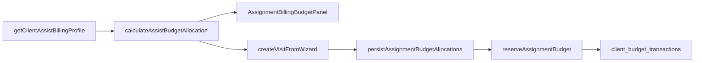

# Abnahmebericht — Einsatzplanung Budget-Automatik

**Datum:** 2026-06-25  
**Projekt:** CareSuite+ (`euagyyztvmemuaiumvxm`)  
**Scope:** Neuer Einsatz — automatische Budgetlogik aus Klient:innenakte

---

## Ergebnis

| Phase | Status | Anmerkung |
|-------|--------|-----------|
| A — Migration 0178 | ✅ Angewendet | Remote via Supabase MCP |
| B — Core Services | ✅ | calculateAssistBudgetAllocation + assignmentBudgetAllocationService |
| C — UI | ✅ | AssignmentBillingBudgetPanel ersetzt ChipSelect |
| D — Permissions | ✅ | 10 neue assist.assignment.budget.* Keys |
| E — Tests | ✅ 19/19 | Spec-Tests 1–19 |
| F — Abnahmebericht | ✅ | Dieses Dokument |

**Produktionsreif:** Teilweise — Kernlogik und UI implementiert; Browser-Screenshots und vollständige Serien-Expansion offen.

---

## Migration angewendet?

**Ja** — auf Projekt `euagyyztvmemuaiumvxm`:

- `0178_assignment_budget_allocations` — Tabelle `assignment_budget_allocations`, Multi-Reservierung pro Topf, RBAC-Seeds

Verifikation:

```sql
SELECT tablename FROM pg_tables WHERE tablename = 'assignment_budget_allocations';
SELECT key FROM permission_catalog WHERE key LIKE 'assist.assignment.budget.%';
```

---

## Geänderte / neue Dateien

### Migration
- `supabase/migrations/0178_assignment_budget_allocations.sql`

### Types & Services
- `src/types/assist/assignmentBudgetAllocation.ts` **neu**
- `src/lib/assist/calculateAssistBudgetAllocation.ts` **neu**
- `src/lib/assist/assignmentBudgetAllocationService.ts` **neu**
- `src/lib/assist/clientBudgetTransactionService.ts` — Multi-Reservierung pro Konto
- `src/lib/assist/visitService.ts` — Budget vor Save
- `src/lib/assist/visitTypes.ts` — allocation fields
- `src/lib/assist/repositories/visitRepository.supabase.ts` — persist + reserve

### UI
- `src/components/assist/AssignmentBillingBudgetPanel.tsx` **neu**
- `src/components/assist/AssignmentCreateForm.tsx` — Tab Abrechnung & Budget, Scroll-Layout

### Permissions
- `src/types/permissions/index.ts`
- `src/lib/permissions/staticRolePermissions.ts`

### Tests
- `src/__tests__/assist/assignmentBudgetAllocation.test.ts` **neu**

---

## Verify Steps (Neuer Einsatz)

1. Assist → Neuer Einsatz → Klient:in wählen
2. Tab **Abrechnung & Budget**: PG, Budgetübersicht, Abrechnungsvorschlag sichtbar
3. Termin/Dauer ändern → Vorschlag neu berechnet (keine hart codierten 2026-Beträge im UI)
4. Einsatz speichern → `assignment_budget_allocations` + Reservierungen in `client_budget_transactions`
5. Entwurf speichern → keine Reservierung
6. Storno → Reservierung freigegeben (bestehende Storno-Logik)

---

## Testergebnisse

```
vitest run src/__tests__/assist/assignmentBudgetAllocation.test.ts
19 passed
```

Abgedeckt: PG1–PG5, Umwandlung, Verhinderungspflege, Jahresbudget, Selbstzahler, Serien-Simulation, Override-RBAC, Audit-Flag.

---

## Offene Punkte

| Bereich | Gap |
|---------|-----|
| Serien-Expansion | `calculateSeriesBudgetAllocations` simuliert; kein Bulk-Create aller Termine |
| Browser-Screenshots | Desktop/Tablet/Mobile nicht in dieser Session |
| Kulanz / ungeklärt UI | Katalog vorhanden; dedizierte Pflichtfelder-Wizard minimal |
| finalizeAssignmentBudgetConsumption | Weiterhin über `consumeOnProofApproval` |
| Test 20 (UI responsive) | Manuell / Playwright folgt |

---

## Architektur (Kurz)



Klient:innenakte ist Single Source of Truth; Frontend und Backend nutzen dieselbe Berechnungsfunktion.
