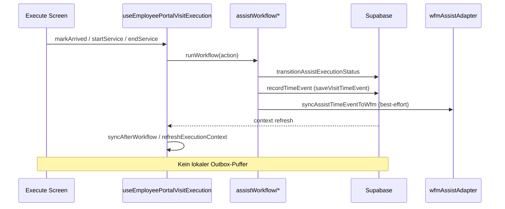
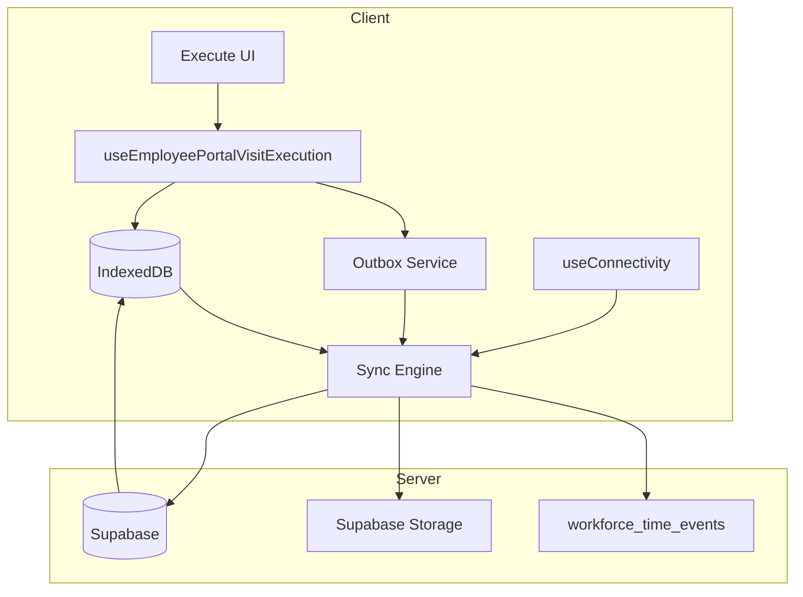

# CareSuite+ Offline-First — Mitarbeiterportal Einsatz-Ausführung: System-Audit & Blueprint

**Stand:** 2026-07-03  
**Workspace:** `CareSuite+`  
**Phase:** OFFLINE.0 (Read-only Audit)  
**Methode:** Codebase-Exploration, Verifikation gegen `src/`, Referenzstil `docs/audit/timekeeping-system-audit-and-blueprint.md` (ZEIT.0)  
**Sprache:** Deutsch  
**Zielgruppe:** Produkt, Engineering, Betrieb, Datenschutz  

---

## Dokumentzweck

Dieses Dokument konsolidiert den **Ist-Zustand** der Offline-/Online-Fähigkeit im **Mitarbeiterportal (MP)** mit Fokus auf **Einsatz-Ausführung (Execute)**, **Zeiterfassung**, **Dokumentation**, **Unterschrift** und **Sync**. Es definiert ein **Zielmodell** (IndexedDB, Outbox, Sync-Reihenfolge, Konflikt-UI) und einen **Implementierungsphasenplan OFFLINE.1–OFFLINE.8**.

**Explizit ausgeschlossen in OFFLINE.0:**

- Keine Code-Änderungen
- Keine Migrationen / RLS-Anpassungen
- Kein Deploy / kein `[deploy]`

**Verwandte parallele Tracks:**

- **ZEIT.1** — Portal-Identitäts-Hotfix für Arbeitszeit (`resolveEmployeeIdForUser`) — **orthogonal** zu Offline, aber für MP-Stempeln dringlich (siehe `docs/audit/timekeeping-system-audit-and-blueprint.md`).

---

## 1. Executive Summary

### 1.1 Kernergebnis

CareSuite+ Mitarbeiterportal und Assist-Einsatz-Ausführung sind **online-first** implementiert. Es existiert **keine** Offline-First-Architektur:

| Mechanismus | Verifiziert | Scope | Überlebt Reload? |
|-------------|-------------|-------|------------------|
| **Supabase (Live)** | Ja | SSOT für Status, Zeiten, Tasks, Docs, Signaturen, Proofs | Ja (serverseitig) |
| **sessionStorage** | Ja | UI-Workflow-Schritt, Signatur-Fallback, Chat-Draft, Landscape-Dismiss | Nur **Soft-Reload** gleicher Tab-Session |
| **In-Memory Maps** | Ja | GPS-Tracking (`TRACKING_STORE`), Demo-Execution-Store | **Nein** |
| **React State** | Ja | Dokumentation, Task-Drafts, Execution-Context | **Nein** |
| **IndexedDB** | **Nein** | — | — |
| **localStorage** | **Nein** in `src/` | — | — |
| **Service Worker / PWA** | **Nein** | — | — |
| **Client-Outbox / Sync-Queue** | **Nein** | Integrations-Outbox in DB existiert, **nicht** für MP-Execute | — |

### 1.2 Reifegrad Offline-First (Schätzung, verifiziert)

| Dimension | Anteil | Beleg im Code |
|-----------|--------|---------------|
| Connectivity-Erkennung | ~5 % | `OfflineNotice` existiert, `visible` default `false`, nicht an NetInfo gebunden |
| Lokale Datenspeicherung (persistent) | ~0 % | Kein IndexedDB/localStorage in `src/` (Grep: 0 Treffer `localStorage`, 0 Treffer `IndexedDB`) |
| Offline Workflow-Aktionen | ~0 % | Jede Transition → Supabase via `transitionAssistExecutionStatus`, `recordTimeEvent` |
| Offline Timer-Anzeige | ~25 % | `computeLiveVisitTimers` tickt clientseitig aus geladenen Events/Ankern |
| Signatur/Docs offline | ~10 % | sessionStorage-Fallback; Docs nur React State |
| Sync/Retry/Outbox | ~5 % | Realtime+Poll, Workflow-Timeout-Recovery; `handleOfflineReconnect` ist Stub |
| PWA/Shell-Cache | ~0 % | Kein Service Worker, kein `manifest.json` im Repo-Root |

**Gesamt gegen Offline-First-Soll:** **~5–8 %**.

### 1.3 Kritische P0-Risiken (Ist)

1. **Execute ohne Netz unmöglich** — MA kann keinen Einsatz starten, ankommen, Leistung erbringen oder abschließen.
2. **Datenverlust bei Reload/Tab-Schließen** — Tracking-In-Memory, ungeflushte Task-Drafts, Dokumentation, Execution-Context.
3. **Signatur nur sessionStorage** — Warnung im UI: „gilt nur bis Browser-Reload“ (`VisitSignatureSection.tsx`).
4. **Timer unzuverlässig offline** — Anzeige tickt nur mit bereits geladenen Events; neue Events ohne Netz werden nicht persistiert.
5. **OfflineNotice unwirksam** — Banner nie sichtbar (`AppStartScreen` rendert `<OfflineNotice />` ohne `visible={true}`).

### 1.4 Empfehlung in einem Satz

**Kein Sofort-Hotfix** für Offline — architektonisches Gap, kein 1–2-Dateien-Fix. **Nächster Schritt: OFFLINE.1** (Connectivity-Hook + IndexedDB-Grundschema + `OfflineNotice` verdrahten + Assignment-Cache-Vorbereitung). **ZEIT.1** (Portal-Identität) parallel und unabhängig.

### 1.5 Scope dieses Audits

| Im Scope | Außerhalb Scope |
|----------|-----------------|
| MP Routen unter `app/portal/employee/` | Office-Module Offline |
| Assist Workflow `src/features/assistWorkflow/` | Vollständige PWA-Strategie Produktweit |
| Portal Tracking `src/lib/portal/employeePortalVisitTracking*` | Integrations-Outbox Backend (E-Mail etc.) |
| WFM-Stempeln im MP (`wfmClockService`) | Native Background-Sync OS-Level |
| Signatur/Dokumentation/Proof | Budget-Ledger Offline |

---

## 2. Aktueller Zustand

### 2.1 Architektur-Überblick (Ist)

```
┌─────────────────────────────────────────────────────────────────────────────┐
│                    Mitarbeiterportal (Expo Web / Mobile)                     │
├──────────────────────┬──────────────────────┬──────────────────────────────┤
│ MP Übersicht/Tabs    │ MP Einsatz Execute   │ MP Arbeitszeit / Zeiten      │
│ index, assignments   │ assignments/[id]/    │ arbeitszeit, times,          │
│ profile, messages    │ execute              │ mobilitaet, execution        │
│ documents, schedule  │                      │                              │
└──────────┬───────────┴──────────┬───────────┴──────────────┬───────────────┘
           │                      │                          │
           ▼                      ▼                          ▼
┌──────────────────┐  ┌─────────────────────────┐  ┌─────────────────────┐
│ useAsyncQuery    │  │ useEmployeePortalVisit  │  │ wfmClockService     │
│ + Realtime/Poll  │  │ Execution + assistWorkflow│ │ (online-only)       │
└────────┬─────────┘  └────────────┬────────────┘  └──────────┬──────────┘
         │                         │                            │
         │   sessionStorage (UI)   │  In-Memory TRACKING_STORE │
         │   visitWorkflowPersist  │  employeePortalExecution   │
         │   visitSignatureSession │  STORE (Demo/Live-Fallback)│
         ▼                         ▼                            ▼
┌─────────────────────────────────────────────────────────────────────────────┐
│ Supabase — assignments, assist_visits, assist_time_events, signatures,     │
│ proofs, assist_visit_execution_state, workforce_time_events (WFM mirror)     │
└─────────────────────────────────────────────────────────────────────────────┘
```

### 2.2 Datenfluss Execute (Online-First, verifiziert)



### 2.3 MP-Seiten — Matrix Online / Offline / Cache / Storage / Reload / Sync / Risiko

| Route / Bereich | Pfad | Online nötig? | Cache | Storage | Nach Reload | Sync | Risiko |
|-----------------|------|---------------|-------|---------|-------------|------|--------|
| Dashboard | `(tabs)/index` | Ja | React Query-State | — | Leer ohne Netz | Realtime/Poll | Hoch |
| Einsatzliste | `(tabs)/assignments` | Ja | `useAsyncQuery` | — | Liste weg | Poll | **Kritisch P0** |
| Einsatz-Detail | `assignments/[id]` | Ja | Query-Cache | — | Detail weg | Poll | Hoch |
| **Execute** | `assignments/[id]/execute` | **Ja (Aktionen)** | Execution-Context RAM | sessionStorage (UI step) | **Workflow-Verlust** | Kein Outbox | **Kritisch P0** |
| Profil | `(tabs)/profile` | Ja | Query | — | Profil weg | — | Mittel |
| Nachrichten | `(tabs)/messages`, `messages/*` | Ja | — | sessionStorage (Chat-Draft) | Draft bis Tab-Ende | — | Mittel |
| Dokumente | `(tabs)/documents` | Ja | — | — | — | — | Niedrig (read) |
| Dienstplan | `(tabs)/schedule` | Ja | Query | — | — | Poll | Mittel |
| Arbeitszeit | `arbeitszeit` | Ja | — | — | Fehler/leer | — | Hoch (ZEIT.1) |
| Fahrten & Zeiten | `times` | Ja | — | — | — | — | Hoch |
| Mobilität | `mobilitaet` | Ja | — | — | — | — | Mittel |
| Execution Hub | `execution/index` | Ja | — | — | — | — | Hoch |
| Aufgaben | `tasks/index` | Ja | Query | — | — | — | Mittel |
| Hilfe | `help/index` | Nein (statisch) | — | — | — | — | Niedrig |

**Legende Risiko:**

- **Kritisch P0** — Kernprozess Pflegeeinsatz blockiert ohne Netz oder Datenverlust bei Unterbrechung
- **Hoch** — wesentliche MP-Funktion betroffen
- **Mittel** — Komfort/UX, Workaround möglich
- **Niedrig** — read-only oder statisch

### 2.4 Assist Execute — Detail-Matrix

| Aspekt | Ist-Verhalten | Primäre Datei(en) | Offline? |
|--------|---------------|-------------------|----------|
| **Status-Transitions** | `startEnRoute`, `markArrived`, `startService`, Pause, `endService`, `finalizeVisit` → Supabase | `src/features/assistWorkflow/*` | **Nein** |
| **UI-Persistenz** | Schritt, Signatur-Modal, No-Show-Form, Scroll | `visitWorkflowPersistence.ts`, `useWorkflowPersistence.ts` | Tab-Session only |
| **Signatur-Fallback** | sessionStorage + In-Memory Map; DB wenn online | `visitSignatureSessionStore.ts`, `VisitSignatureSection.tsx` | Teilweise (Tab) |
| **GPS/Tracking** | In-Memory `TRACKING_STORE`; DB via `assistTrackingPersistenceService` | `employeePortalVisitTrackingService.ts` | RAM only |
| **Timer-Anzeige** | 1s Client-Tick aus DB-Events oder Fallback-Ankern | `useLiveVisitTimers.ts`, `computeLiveVisitTimers.ts` | Display only |
| **Task-Drafts** | Optimistic RAM, 450ms Debounce → Server | `useTaskResultDrafts.ts` | **Nein** (flush braucht Netz) |
| **Dokumentation** | React State only, kein Draft-Store | `EmployeePortalVisitDocumentationPanel.tsx` | **Nein** |
| **Reload-Risiko Demo-Store** | Status-Historie/Pause in `STORE` Map (Demo-Modus) | `employeePortalExecutionService.ts` | **Nein** |
| **Timeout-Recovery** | `refreshExecutionContext` + `syncAfterWorkflow` | `useEmployeePortalVisitExecution.ts` | Online-Recovery |
| **Proof/Service Record** | `generateServiceRecord` nach Finalize | `finalizeVisit.ts`, `generateServiceRecord.ts` | **Nein** |
| **Execution State** | `assist_visit_execution_state` upsert | `assistVisitExecutionStatePersistence.ts` | Online |

### 2.5 Zeiterfassung — MP Arbeitszeit + Einsatz-Zeiten

| Aspekt | Ist | Offline-fähig? | Datei |
|--------|-----|----------------|-------|
| **WFM Stempeluhr** | Direkte Supabase-Inserts | **Nein** | `wfmClockService.ts` |
| **Assist-Zeit-Events** | `saveVisitTimeEvent` → `recordTimeEvent` + WFM-Mirror | **Nein** | `saveVisitTimeEvent.ts` |
| **Live-Timer UI** | Tick aus geladenen Events; Fallback-Anker | **Anzeige ja**, Schreiben nein | `computeLiveVisitTimers.ts` |
| **WFM-Sync** | Best-effort, non-blocking (`console.warn` in Dev) | Kein Retry-Queue | `wfmAssistAdapter.ts` |
| **Idempotenz (online)** | `ensureVisitTimeEvent`, `hasOpenPauseSegment` | Nur online wirksam | `saveVisitTimeEvent.ts` |
| **Offline-Reconnect Stub** | Gibt `{ reconnected: true }` zurück, keine Queue | **Nein** | `timeTrackingIntegrationSignals.ts` |
| **Manipulations-Schutz** | Server `occurred_at`, RLS `recorded_by` | Nur online | DB + Services |

**Verifizierter Code — Online-only Zeit-Event:**

```56:74:src/features/assistWorkflow/saveVisitTimeEvent.ts
export async function saveVisitTimeEvent(
  input: SaveVisitTimeEventInput,
): Promise<ServiceResult<{ id: string }>> {
  if (getServiceMode() !== 'supabase') {
    await mirrorAssistEventToWfm(input);
    return { ok: true, data: { id: 'demo' } };
  }

  const recorded = await recordTimeEvent(
    input.tenantId,
    {
      visitId: input.visitId,
      sessionId: input.sessionId ?? null,
      eventType: input.eventType,
      occurredAt: input.occurredAt ?? new Date().toISOString(),
      metadata: input.metadata,
    },
    input.recordedBy ?? null,
  );
```

**Verifizierter Code — Offline-Tick-Hinweis (Display only):**

```30:31:src/features/assistWorkflow/computeLiveVisitTimers.ts
/** Rebuild minimal time events from cached visit-time anchors for offline tick. */
export function buildTimeEventsFromVisitTimesSummary(summary: VisitTimesSummary): TimeEventLike[] {
```

### 2.6 Storage-Inventar (vollständig, verifiziert)

| Key / Store | Typ | Inhalt | Persistent? | Datei |
|-------------|-----|--------|-------------|-------|
| `portal-visit-workflow-{visitId}` | sessionStorage | UI step, flags, scroll | Tab-Session | `visitWorkflowPersistence.ts` |
| `assist_visit_signatures_session` | sessionStorage | Signatur dataUrl, Meta | Tab-Session | `visitSignatureSessionStore.ts` |
| `portal-new-chat-draft-*` | sessionStorage | Chat-Entwurf | Tab-Session | `portalNewChatDraftStore.ts` |
| `landscape-dismiss-*` | sessionStorage | UI-Präferenz Querformat | Tab-Session | `landscapeDismissStore.ts` |
| `TRACKING_STORE` | In-Memory Map | GPS, Consent, Timer-Anker, Geofence | **Nein** | `employeePortalVisitTrackingService.ts` |
| `sessionByKey` (Persistence) | In-Memory Map | Tracking-Session-IDs | **Nein** | `employeePortalVisitTrackingPersistence.ts` |
| `STORE` (Execution Demo) | In-Memory Maps | statusHistory, pauseEvents, docs | **Nein** | `employeePortalExecutionService.ts` |
| `sessionStore` (Signatur) | In-Memory Map | Signatur-Capture (hydrated from sessionStorage) | Tab-Session | `visitSignatureSessionStore.ts` |
| IndexedDB | — | **Nicht verwendet** | — | — |
| localStorage | — | **Nicht verwendet in src/** | — | Grep: 0 Treffer |

**Verifizierter Code — sessionStorage UI-Persistenz:**

```23:43:src/lib/portal/visitWorkflowPersistence.ts
export function readVisitWorkflowSnapshot(visitId: string): VisitWorkflowSnapshot | null {
  if (typeof globalThis.sessionStorage === 'undefined') return null;
  try {
    const raw = globalThis.sessionStorage.getItem(storageKey(visitId));
    if (!raw) return null;
    const parsed = JSON.parse(raw) as VisitWorkflowSnapshot;
    if (!parsed || parsed.visitId !== visitId) return null;
    return parsed;
  } catch {
    return null;
  }
}

export function writeVisitWorkflowSnapshot(snapshot: VisitWorkflowSnapshot): void {
  if (typeof globalThis.sessionStorage === 'undefined') return;
  try {
    globalThis.sessionStorage.setItem(storageKey(snapshot.visitId), JSON.stringify(snapshot));
  } catch {
    /* quota / private mode */
  }
}
```

**Verifizierter Code — In-Memory Tracking (Reload-Verlust):**

```37:37:src/lib/portal/employeePortalVisitTrackingService.ts
const TRACKING_STORE = new Map<string, TrackingEntry>();
```

**Verifizierter Code — Signatur session-only Fallback:**

```1:4:src/lib/assist/visitSignatureSessionStore.ts
/**
 * Session-only visit signature capture fallback when persistence write is unavailable.
 * Persist via assistVisitSignaturePersistenceService when assist_visit_signatures is reachable.
 */
```

**Verifizierter Code — Signatur-Warnung im UI:**

```114:117:src/components/assist/VisitSignatureSection.tsx
    } else if (!persistenceReady) {
      warning =
        'Dauerhafte Speicherung ist derzeit nicht verfügbar — Unterschrift gilt nur bis Browser-Reload.';
      setPersistWarning(warning);
```

### 2.7 PWA / Service Worker

| Prüfpunkt | Ergebnis | Methode |
|-----------|----------|---------|
| `serviceWorker` in Codebase | **Keine Treffer** | Grep |
| `workbox` / `registerSW` | **Keine Treffer** | Grep |
| `manifest.json` Repo-Root | **Nicht vorhanden** | Glob |
| Netlify Deploy | SPA/Expo-Web, kein Offline-Shell | `netlify.toml` (indirekt) |
| Expo Export | JS-Bundles, kein SW | `.audit-expo-export-*` Artefakte |

**Folge:** App lädt vollständig aus Netz; kein App-Shell-Cache für MP-Execute.

### 2.8 Connectivity / OfflineNotice

**Verifizierter Code:**

```7:18:src/components/ui/OfflineNotice.tsx
/** Prepared offline state — wire to connectivity when NetInfo is available. */
export function OfflineNotice({ visible = false }: OfflineNoticeProps) {
  if (!visible) return null;

  return (
    <InfoBanner
      variant="warning"
      title="Offline"
      message="Keine Verbindung. Einige Funktionen sind erst wieder online verfügbar."
      icon="📡"
    />
  );
}
```

`AppStartScreen.tsx` rendert `<OfflineNotice />` **ohne** `visible={true}` → Banner **nie sichtbar**.

Kein `navigator.onLine`-Hook, kein `@react-native-community/netinfo`-Binding im MP-Shell-Pfad gefunden.

### 2.9 Sync / Retry (Ist — kein Outbox)

| Mechanismus | Vorhanden? | Beschreibung |
|-------------|------------|--------------|
| Supabase Realtime | Ja | Assignment/Visit Updates |
| `useAsyncQuery` Poll | Ja | Periodisches Nachladen |
| Workflow-Timeout-Recovery | Ja | `refreshExecutionContext`, `syncAfterWorkflow` in Hook |
| WFM Mirror best-effort | Ja | Inline nach Event, kein Retry |
| Client Outbox | **Nein** | — |
| `handleOfflineReconnect` | Stub | Gibt immer `reconnected: true` zurück |
| Integrations-Outbox (DB) | Ja (Backend) | `outbox_*` Enums in `types.ts` — **nicht** MP Execute |

### 2.10 Demo- vs. Live-Modus

| Modus | Execute-Verhalten | Persistenz |
|-------|-------------------|------------|
| `getServiceMode() !== 'supabase'` | In-Memory `STORE`, Demo-Daten | Reload-Verlust |
| `supabase` (Live) | Alle Writes → Supabase | Server-SSOT, Client-RAM vergänglich |

**Wichtig:** Auch im Live-Modus sind **Client-seitige** Tracking-Anker und ungeflushte Drafts **nicht** persistent.

---

## 3. Muss-Anforderungen / Offline Use Cases A–E

### 3.1 Übersicht

| Use Case | Kurzbeschreibung | Ist | Soll-Priorität |
|----------|------------------|-----|----------------|
| **A** | Einsatz offline starten und durchführen | **Nein** | P0 — OFFLINE.4 |
| **B** | Zeit läuft offline weiter | **Teilweise** (Display) | P0 — OFFLINE.4 |
| **C** | Dokumentation & Unterschrift offline | **Nein** (Tab-only Signatur) | P0 — OFFLINE.5 |
| **D** | Sync nach Reconnect | **Minimal** | P0 — OFFLINE.6 |
| **E** | Tagesüberblick & Einsatzliste offline | **Nein** | P1 — OFFLINE.2 |

### 3.2 Use Case A — Einsatz offline starten und durchführen

**Akteur:** Pflegekraft im MP Execute-Screen.

**Soll-Ablauf:**

1. MA öffnet Einsatz aus gecachter Liste (auch offline).
2. MA tippt „Unterwegs“ → „Angekommen“ → „Leistung starten“ → optional Pause → „Leistung beenden“.
3. Jede Aktion wird **sofort lokal** gespeichert (IndexedDB Outbox + optimistische UI).
4. Status-Badge zeigt „Ausstehend (n)“ bis Sync.

**Ist:**

- Jede Aktion ruft Supabase (`transitionAssistExecutionStatus`, `recordTimeEvent`).
- **Ohne Netz = Fehler**, kein Queue, kein optimistischer Persist-Pfad.

**Muss-Kriterien:**

- Outbox für Status-Transitions + Zeit-Events
- Optimistische UI mit Pending-Badge
- State-Machine-Guards clientseitig (kein illegaler Übergang lokal)
- Hard-Stop bei `assignment locked` / `proof locked` (Server-Konflikt)

**Akzeptanz (Ziel):**

- Flugmodus-Test: voller Workflow bis „Leistung beenden“ ohne Netz → nach Reconnect grün sync.

### 3.3 Use Case B — Zeit läuft offline weiter

**Soll:**

- Fahrt-/Leistungs-/Pause-Timer ticken sichtbar.
- Start/End-Events werden mit **Geräte-Uhrzeit** lokal gespeichert.
- Nach Reconnect: Events in korrekter Reihenfolge an Server.

**Ist:**

- `useLiveVisitTimers` tickt clientseitig **nur**, wenn Events/Anker bereits im RAM/Context sind.
- Neue Events ohne Netz **werden nicht geschrieben**.
- Nach Reload ohne Netz: Timer basiert auf letztem DB-Fetch — fehlende Events = falsche Dauer.

**Muss-Kriterien:**

- Lokales Event-Log in IndexedDB (`visit_execution.timeEvents[]`)
- `occurred_at` aus Client-Uhr + monotonic sequence
- `computeLiveVisitTimers` liest **lokal zuerst**, dann Server
- Toleranzfenster ±5 min serverseitig (Ziel, DB-Gap §9)

### 3.4 Use Case C — Dokumentation & Unterschrift offline

**Soll:**

- Freitext-Dokumentation überlebt Reload.
- Signatur (dataUrl) überlebt Reload und Tab-Schließen (IDB).
- Finalize erst nach erfolgreichem Signatur-Sync **oder** explizitem „offline abgeschlossen“-Queue-Eintrag mit Review-Flag.

**Ist:**

- Dokumentation = React State (**Verlust bei Reload**).
- Signatur = sessionStorage (**Verlust bei Tab-Schließen**).
- `finalizeVisit` prüft **DB-Signatur** via `hasPortalPersistedClientSignature`.

**Muss-Kriterien:**

- IndexedDB `doc_drafts`, `signature_drafts`
- Optional WebCrypto-Verschlüsselung für Signatur-Blobs
- `validateVisitCloseReadiness` erweitern: lokale Signatur als „pending sync“ akzeptieren bis Sync

### 3.5 Use Case D — Sync nach Reconnect

**Soll:**

- Deterministische Reihenfolge (§4.3, Schritte 1–11).
- Idempotenz pro Operation.
- Konflikt-UI mit DE-Texten (§7).
- Retry mit exponential backoff; Dead-Letter nach N Versuchen.

**Ist:**

- Realtime-Subscribe + Poll.
- Workflow-Timeout → `refreshExecutionContext`.
- **Keine Outbox.**

**Muss-Kriterien:**

- `syncEngine.ts` (neu) mit Zustandsmaschine `idle → syncing → conflict | done`
- Banner: „Synchronisation läuft … (n ausstehend)“
- Admin/Support-Sicht auf Dead-Letter (Zukunft)

### 3.6 Use Case E — Tagesüberblick & Einsatzliste offline

**Soll:**

- Heutige Assignments + Stammdaten (Klient, Adresse, Tasks) aus Cache.
- Stale-Indicator wenn Cache > TTL.

**Ist:**

- Liste/Detail nur via Live-Fetch.
- **Kein Assignment-Cache.**

**Muss-Kriterien:**

- IndexedDB `assignments` Store mit TTL (24h default)
- Prefetch beim Login / wenn online (Hintergrund)
- Tenant-scoped Cache-Invalidierung bei Logout

### 3.7 Nicht-Ziele (OFFLINE.0)

- Vollständige Offline-Budget-Buchung
- Offline-Nachrichten senden (nur Draft behalten — bereits sessionStorage)
- Offline-Office-Module
- Background-GPS ohne Consent / ohne sichtbare UI

---

## 4. Zielarchitektur

### 4.1 Leitprinzipien

1. **Local-first writes, server-authoritative merge** — Client schreibt sofort lokal; Server entscheidet bei Konflikt.
2. **Outbox as single egress** — Kein direkter Supabase-Write aus UI-Hooks mehr (schrittweise Migration).
3. **Idempotency everywhere** — Jede mutierende Operation trägt `idempotencyKey`.
4. **Tenant isolation** — IndexedDB scoped per Origin; Logout löscht alle Stores.
5. **Progressive enhancement** — OFFLINE.1 liefert sichtbares Offline-Feedback ohne vollen Workflow.

### 4.2 IndexedDB Store (Vorschlag v1)

```
CareSuiteOfflineDB (version 1)
├── assignments
│     { tenantId, assignmentId, payload, cachedAt, etag, staleAfter }
├── visit_execution
│     { assignmentId, visitId, context, timeEvents[], status, localSeq, updatedAt }
├── outbox
│     { id, opType, payload, idempotencyKey, createdAt, retries, status, lastError }
├── doc_drafts
│     { assignmentId, visitId, fields, updatedAt }
├── signature_drafts
│     { assignmentId, visitId, dataUrlRef, signerMeta, signedAt, payloadHash }
├── gps_buffer
│     { sessionId, points[], throttledAt }
├── sync_meta
│     { lastSyncAt, deviceId, schemaVersion, tenantId }
└── wfm_pending
      { employeeId, events[], sessionState, updatedAt }
```

**Technologie-Empfehlung:** `idb` (kleiner Wrapper) oder Dexie — Entscheidung in OFFLINE.1.

### 4.3 Sync-Queue Schema (Outbox-Eintrag)

```typescript
type OutboxOperation =
  | 'assignment_status_transition'
  | 'assist_time_event'
  | 'gps_points_batch'
  | 'task_results_batch'
  | 'visit_documentation'
  | 'visit_signature'
  | 'visit_proof'
  | 'visit_finalize'
  | 'wfm_clock_event'
  | 'wfm_assist_mirror';

type OutboxEntry = {
  id: string;
  idempotencyKey: string;
  tenantId: string;
  assignmentId: string;
  visitId: string | null;
  operation: OutboxOperation;
  payload: Record<string, unknown>;
  clientOccurredAt: string;
  createdAt: string;
  status: 'pending' | 'in_flight' | 'done' | 'conflict' | 'failed';
  retryCount: number;
  lastError: string | null;
  serverAckAt: string | null;
  clientSeq: number;
};
```

### 4.4 Sync-Reihenfolge (1–11)

| # | Schritt | Abhängigkeit | Begründung |
|---|---------|--------------|------------|
| 1 | Connectivity + Auth-Session validieren | — | Kein Sync ohne gültiges JWT |
| 2 | Assignment-Cache pull (delta seit `lastSyncAt`) | 1 | Aktueller Server-Stand vor Merge |
| 3 | Consent / Tracking-Session (falls offen) | 2 | GPS-Session-ID serverseitig |
| 4 | Status-Transitions (chronologisch `clientOccurredAt`) | 3 | State machine order |
| 5 | `assist_time_events` (drive_start → arrive → service_start → pause → service_end → depart) | 4 | Zeiten an Status gekoppelt |
| 6 | GPS location points (batched, throttled) | 5 | Punkte referenzieren Session |
| 7 | Task-Results (batch merge) | 4 | Tasks nach Status stabil |
| 8 | Documentation | 7 | Doc kann Task-Referenzen enthalten |
| 9 | Signature (Storage upload + DB row) | 8 | payloadHash über Doc+Tasks |
| 10 | Proof / Service Record | 9 | Proof braucht Signatur+Doc |
| 11 | Finalize + WFM mirror | 10 | Abschluss + Lohnzeit |

### 4.5 Idempotenz-Matrix

| Operation | Idempotency-Key | Server-Mechanismus |
|-----------|-----------------|-------------------|
| `service_start` | `{visitId}:service_start` | `ensureVisitTimeEvent` (existiert) |
| `pause_start` / `pause_end` | `{visitId}:{eventType}:{segment}` | `ensureOpenPauseStartEvent` / `ensureOpenPauseEndEvent` |
| Status transition | `{assignmentId}:{toStatus}:{clientSeq}` | State machine guard (Ziel) |
| Task update | `{taskId}:{payloadHash}` | Upsert on task_id |
| Signature | `{visitId}:signature:{payloadHash}` | `payload_hash` unique |
| WFM mirror | `{visitId}:{eventType}:{occurredAt}` | `hasAssistWfmEvent` (existiert) |
| Finalize | `{visitId}:finalize:{proofHash}` | Assignment lock |

### 4.6 Architektur-Diagramm (Ziel)



---

## 5. Offline Zeitlogik

### 5.1 Event-Typen (Assist)

Verifiziert in `saveVisitTimeEvent.ts`: `drive_start`, `drive_end`, `arrive`, `service_start`, `service_end`, `pause_start`, `pause_end`, `depart`.

### 5.2 Client-Regeln (Ziel)

1. Sofort-Write lokal: Outbox + append zu `visit_execution.timeEvents[]`.
2. Timestamp: `clientOccurredAt = new Date().toISOString()`; `performance.now()` für Drift-Erkennung.
3. Sequenz: `clientSeq` monoton pro Visit.
4. Anzeige: `computeLiveVisitTimers` merged local ∪ server (dedupe by idempotencyKey).
5. Pause: `hasOpenPauseSegment` clientseitig spiegeln (existiert).

### 5.3 Server-Regeln (Ziel)

| Regel | Beschreibung |
|-------|--------------|
| Toleranzfenster | Client `occurred_at` ±5 min |
| Audit-Flag | `source: 'offline_queue'` |
| Abweichung >5 min | `review_required: true` |
| Idempotenz | Duplicate key → 200 OK |

### 5.4 Manipulationsschutz

| Maßnahme | Ist | Ziel |
|----------|-----|------|
| Monotonic sequence | Nein | `clientSeq` in Outbox |
| Server anchor | Ja | + Drift-Flag |
| RLS + recorded_by | Ja | Unverändert |
| Geofence offline | Metadata existiert | Weiter erlauben mit Flag |
| Finalize ohne Signatur-Sync | Blockiert | Pending local signature (Ziel) |

### 5.5 WFM-Mirror offline

**Ist:** Inline best-effort. **Ziel:** `wfm_pending` Store, Sync Schritt 11.

---

## 6. Einsatzdaten Cache + Datenschutz

### 6.1 Cache-Inhalt

| Feld | Cachen? |
|------|---------|
| Assignment-ID, Status, Zeiten | Ja |
| Klient Name / Initialen | Ja (Tenant-Policy) |
| Adresse | Ja |
| Task-Liste | Ja |
| Gesundheitsakte / Budget | **Nein** |
| Fremde Einsätze | **Nein** |

### 6.2 Schutzmaßnahmen

- IndexedDB pro Origin; Logout → `deleteDatabase` + sessionStorage clear
- TTL 24h default
- Signatur optional WebCrypto AES-GCM
- DSGVO-Hinweis in MP Hilfe (OFFLINE.8)

### 6.3 Löschkonzept

| Trigger | Aktion |
|---------|--------|
| Logout | Alle Stores löschen |
| Assignment done + synced | visit_execution purge nach 7 Tagen |
| Dead-Letter >30 Tage | Admin-Review |

---

## 7. Konfliktmodell

| Konflikt-Typ | User-Text (DE) |
|--------------|----------------|
| `STATUS_AHEAD_SERVER` | „Der Einsatz wurde auf dem Server noch nicht aktualisiert. Ihre lokalen Schritte werden synchronisiert …“ |
| `STATUS_BEHIND_SERVER` | „Dieser Einsatz wurde bereits bearbeitet (Status: {status}). Bitte Seite aktualisieren.“ |
| `DUPLICATE_TIME_EVENT` | „Zeitstempel bereits gespeichert — keine Doppelung.“ |
| `TIME_SKEW` | „Geräteuhr weicht stark ab. Bitte Uhrzeit prüfen oder Support kontaktieren.“ |
| `TIME_SEQUENCE` | „Zeitfolge unvollständig. Bitte Einsatz prüfen oder Support kontaktieren.“ |
| `TASK_VERSION` | „Aufgabe „{title}“ wurde zwischenzeitlich geändert. Bitte erneut prüfen.“ |
| `SIGNATURE_HASH_MISMATCH` | „Unterschrift ungültig — Aufgaben oder Dokumentation haben sich geändert. Bitte neu unterschreiben.“ |
| `DOC_REQUIRED` | „Dokumentation fehlt auf dem Server. Bitte erneut speichern.“ |
| `RLS_DENIED` | „Keine Berechtigung für diese Aktion. Bitte neu anmelden.“ |
| `PROOF_LOCKED` | „Leistungsnachweis bereits abgeschlossen — keine weiteren Änderungen möglich.“ |
| `WFM_SYNC_PARTIAL` | „Zeiterfassung wird nachgetragen. Ihr Einsatz ist trotzdem abgeschlossen.“ |
| `ASSIGNMENT_LOCKED` | „Dieser Einsatz ist gesperrt und kann nicht mehr bearbeitet werden.“ |
| `SIGNATURE_UPLOAD_FAILED` | „Unterschrift lokal gespeichert — Upload steht noch aus.“ |
| `CACHE_STALE` | „Einsatzdaten sind veraltet. Bitte verbinden Sie sich mit dem Internet.“ |

---

## 8. UI-Zielmodell

### 8.1 Banner

| Zustand | Text (DE) |
|---------|-----------|
| Offline | „Keine Verbindung. Ihre Eingaben werden lokal gespeichert und später synchronisiert.“ |
| Sync läuft | „Synchronisation läuft … ({n} ausstehend)“ |
| Sync OK | „Alle Daten synchronisiert.“ |

**Ist:** `OfflineNotice` default `visible=false`, Message ohne „lokal gespeichert“.

### 8.2 Badges

- **Pending** (orange): Outbox > 0
- **Offline-Modus** (grau): connectivity false
- **Timer lokal** (blau): unbestätigte Events
- **Signatur ausstehend** (gelb): IDB draft ohne server ack

Integration: `EmployeePortalShell` TopBar + Execute unter `PremiumBadge`.

---

## 9. Server/DB-Gaps

Keine Migrationen in OFFLINE.0.

| Artefakt | Zweck |
|----------|-------|
| `offline_sync_devices` | Geräte-Registrierung |
| `offline_outbox_ack` | Server Idempotency-Log |
| `assist_time_events.client_seq` | Client-Sequenz |
| `assist_time_events.source` | `portal_online` / `offline_queue` |
| RPC `apply_offline_visit_batch` | Atomare Event-Kette |

Bestehende Tabellen (0156): `assist_time_events`, `assist_visit_signatures`, `assist_visit_proofs`, `assist_visit_execution_state` — **ausreichend**, fehlt Client-Queue.

---

## 10. Service-Inventar

| Service | Online-only | Queue-fähig | Idempotenz | Konflikt | Risiko |
|---------|-------------|-------------|------------|----------|--------|
| `visitWorkflowPersistence` | — (local UI) | Nein | — | — | Niedrig |
| `visitSignatureSessionStore` | Fallback | Ja (→ IDB) | payloadHash | Signatur | **Hoch** |
| `useWorkflowPersistence` | — | Nein | — | — | Mittel |
| `saveVisitTimeEvent` | **Ja** | **Ja** | ensureVisitTimeEvent | TIME_SKEW | **Kritisch** |
| `visitExecutionService` | **Ja** | Teilweise | Task upsert | TASK_VERSION | Hoch |
| `finalizeVisit` | **Ja** | Ja (defer) | proof hash | PROOF_LOCKED | **Kritisch** |
| `wfmClockService` | **Ja** | Ja | event type/day | STATUS | Hoch |
| `wfmAssistAdapter` | **Ja** | Ja | hasAssistWfmEvent | WFM_PARTIAL | Mittel |
| `assistTrackingPersistenceService` | **Ja** | Ja (GPS) | session | — | Hoch |
| `employeePortalVisitTrackingService` | RAM | **Ja** | — | — | **Kritisch** |
| `employeePortalVisitTrackingPersistence` | **Ja** | Ja | status events | STATUS | **Kritisch** |
| `useEmployeePortalVisitExecution` | **Ja** | Indirekt | syncAfterWorkflow | STATUS | **Kritisch** |
| `useTaskResultDrafts` | **Ja** | **Ja** | taskId | TASK_VERSION | Hoch |
| `saveVisitDocumentation` | **Ja** | **Ja** | assignmentId | DOC | Hoch |
| `saveClientSignature` | **Ja** | **Ja** | payloadHash | SIGNATURE | **Kritisch** |
| `generateServiceRecord` | **Ja** | Ja (last) | proof hash | PROOF | Hoch |
| `useLiveVisitTimers` | — (display) | — | — | — | Mittel |
| `useEmployeeGpsTracking` | **Ja** | Ja (batch) | throttle | — | Hoch |
| `portalSyncChainService` | **Ja** | — | — | — | Niedrig |
| `OfflineNotice` | — | — | — | — | Niedrig (unwired) |
| `handleOfflineReconnect` | Stub | Ja | — | — | Niedrig |

**Kritischer Pfad:** UI → assistWorkflow (online) → Supabase; kein Outbox-Puffer.

---

## 11. Sicherheitszonen

### 11.1 Zonen-Übersicht

| Zone | Offline erlaubt? | Gate / Permission | RLS-Scope | Anmerkung |
|------|------------------|-------------------|-----------|-----------|
| **Execute (Status)** | Queue + Sync | `assist.execution.manage` | `assignments`, `assist_visits` | Kern-Workflow |
| **Signatur** | Draft lokal; Sync für Finalize | Consent + Doc complete | `assist_visit_signatures`, Storage | payloadHash bindend |
| **Proof** | Nach Signatur+Doc | `generateServiceRecord` | `assist_visit_proofs` | Immutable nach Lock |
| **Budget** | **Nein** (read-only online) | Portal feature gate | `client_budget_*` | Kein Offline-Schreiben |
| **WFM Stempeln** | Queue möglich | `time.tracking.own.*` | `workforce_*` | Separater Track ZEIT.* |
| **GPS Points** | Batch queue | Location Consent | `assist_tracking_sessions`, points | Privacy-kritisch |
| **Messages/Docs** | Read-cache optional | Portal permissions | tenant-scoped | Chat-Draft sessionStorage |
| **Finalize/Lock** | **Nur online** oder post-sync | State machine | assignment lock | Hard gate |
| **Task Results** | Queue | Task permissions | assignment tasks | Merge-Konflikt möglich |
| **Documentation** | Local draft | Doc required flag | execution state | Freitext PHI — TTL wichtig |
| **No-Show / Cancel** | Queue | Status machine | assignments | Selten, aber audit-relevant |
| **Integrations Outbox** | N/A (Backend) | `integrations.outbox.view` | Backend outbox | Nicht MP Execute |

### 11.2 Vertrauensgrenzen

```
┌─────────────────────────────────────────────────────────────┐
│ Zone A — Gerät (IndexedDB, sessionStorage)                   │
│  Vertrauen: niedrig — manipulierbar                          │
│  Enthält: drafts, outbox, cache                              │
├─────────────────────────────────────────────────────────────┤
│ Zone B — Transport (HTTPS, JWT)                              │
│  Vertrauen: mittel — Auth erforderlich                       │
├─────────────────────────────────────────────────────────────┤
│ Zone C — Supabase SSOT (RLS)                                 │
│  Vertrauen: hoch — audit trail, recorded_by                  │
├─────────────────────────────────────────────────────────────┤
│ Zone D — Proof Lock / Billing                                │
│  Vertrauen: maximal — irreversibel nach Freigabe             │
└─────────────────────────────────────────────────────────────┘
```

**Regel:** Zone-A-Daten dürfen Zone D **nie** direkt erreichen — immer über Sync-Engine + Server-Validierung.

### 11.3 RLS-relevante Tabellen (Execute-Pfad)

| Tabelle | Schreibzugriff MP | Offline-Queue Ziel |
|---------|-------------------|-------------------|
| `assignments` | Status-Update | Ja |
| `assist_visits` | Visit-Metadaten | Ja |
| `assist_time_events` | INSERT events | Ja |
| `assist_visit_signatures` | INSERT + Storage | Ja (Schritt 9) |
| `assist_visit_proofs` | INSERT proof | Ja (Schritt 10) |
| `assist_visit_execution_state` | UPSERT state | Ja |
| `assist_tracking_sessions` | Session start | Ja (Schritt 3) |
| `assist_tracking_points` | Batch INSERT | Ja (Schritt 6) |
| `workforce_time_events` | WFM mirror | Ja (Schritt 11) |
| `client_budget_transactions` | **Nein** | — |

### 11.4 Permission-Matrix (Portal)

Statische Rolle `employee_portal` (Auszug, relevant für Execute):

| Permission | Offline-Queue | Begründung |
|------------|---------------|------------|
| Assignment view/start | Read cache + queue transitions | Execute |
| Signature capture | Local draft | Use Case C |
| Time tracking own | WFM queue (optional) | Arbeitszeit |
| Budget view | Online read only | Kein Offline |
| Emergency contact | Cache wenn erlaubt | Navigation/Notfall |

### 11.5 Threat Model (Kurz)

| Threat | Mitigation (Ziel) |
|--------|-------------------|
| Client clock manipulation | TIME_SKEW + review_required |
| Replay outbox entries | idempotencyKey server ack |
| Cross-tenant cache bleed | tenantId in all keys, logout purge |
| Signature on stale payload | payloadHash recompute on sync |
| Stolen device | TTL + logout + optional OS PIN |
| Man-in-the-middle | HTTPS only, cert pinning (Native, Zukunft) |

---

## 12. Phasenplan OFFLINE.1–OFFLINE.8

### 12.0 Phasen-Übersicht

| Phase | Titel | Use Cases | Abhängigkeit |
|-------|-------|-----------|--------------|
| OFFLINE.1 | Connectivity + IDB Foundation | — (Infrastruktur) | — |
| OFFLINE.2 | Assignment-Cache + Prefetch | E | OFFLINE.1 |
| OFFLINE.3 | Outbox-Grundgerüst | D (partial) | OFFLINE.1 |
| OFFLINE.4 | Workflow offline (Status + Zeit) | A, B | OFFLINE.2, OFFLINE.3 |
| OFFLINE.5 | Docs + Signatur offline | C | OFFLINE.3 |
| OFFLINE.6 | Sync-Engine + Konflikt-UI | D | OFFLINE.4, OFFLINE.5 |
| OFFLINE.7 | WFM queue + GPS batch | B (WFM) | OFFLINE.6 |
| OFFLINE.8 | Härtung, E2E, DSGVO, optional PWA | alle | OFFLINE.7 |

### 12.1 OFFLINE.1 — Connectivity + IndexedDB-Foundation

**Ziel:** Sichtbares Offline-Feedback; IndexedDB öffnen/versionieren; keine Workflow-Änderung.

**Neue/Geänderte Dateien:**

| Datei | Änderung |
|-------|----------|
| `src/hooks/useConnectivity.ts` | **Neu** — Web: `navigator.onLine` + events; Native: NetInfo |
| `src/lib/offline/idb.ts` | **Neu** — DB open, schema v1, CRUD helpers |
| `src/lib/offline/types.ts` | **Neu** — Store types |
| `src/components/ui/OfflineNotice.tsx` | Message anpassen (lokal speichern) |
| `app/portal/employee/_layout.tsx` oder Shell | `OfflineNotice visible={isOffline}` |
| `src/lib/auth/logout.ts` (falls vorhanden) | IDB delete on logout |

**Risiken:**

- Web vs Native NetInfo-Unterschiede
- Safari private mode IDB quota
- False positive `navigator.onLine` (captive portal)

**Tests:**

- Unit: IDB CRUD round-trip (fake-indexeddb)
- Unit: useConnectivity state transitions
- Component: OfflineNotice visible prop

**Smoke:**

- DevTools → Offline → Banner sichtbar im MP
- Logout → IDB leer

**Deploy:** Normal release; kein `[deploy]` ohne explizite Anfrage.

**Abnahme:**

- [ ] Banner erscheint <500ms nach offline event
- [ ] Keine Regression Online-Flow
- [ ] Feature-Flag default off in Prod optional

---

### 12.2 OFFLINE.2 — Assignment-Cache + Prefetch

**Ziel:** Use Case E — Liste/Detail aus IDB wenn offline oder stale.

**Dateien:**

| Datei | Änderung |
|-------|----------|
| `src/lib/offline/assignmentCacheService.ts` | **Neu** |
| `src/lib/portal/employeePortalExecutionLiveService.ts` | Cache-first read path |
| `app/portal/employee/(tabs)/assignments.tsx` | Stale badge |
| `app/portal/employee/assignments/[id]/index.tsx` | Cache fallback |

**Risiken:**

- Stale data ohne prominenten Indicator
- Cache size auf schwachen Geräten

**Tests:**

- Cache hit/miss
- TTL expiry
- Tenant isolation

**Smoke:**

- Online login → assignments loaded → Flugmodus → Liste sichtbar
- Detail-Screen zeigt „Daten von {time}“

**Deploy:** Normal release.

**Abnahme:**

- [ ] Liste offline für heutige Einsätze
- [ ] TTL 24h enforced
- [ ] Logout clears assignments store

---

### 12.3 OFFLINE.3 — Outbox-Grundgerüst

**Ziel:** Queue insert/list/retry/status — noch kein Workflow-Hook.

**Dateien:**

| Datei | Änderung |
|-------|----------|
| `src/lib/offline/outboxService.ts` | **Neu** |
| `src/lib/offline/outboxTypes.ts` | **Neu** |
| `src/lib/offline/idb.ts` | outbox store |

**Risiken:**

- Duplicate inserts ohne idempotencyKey discipline
- Retry storm on reconnect

**Tests:**

- Insert, list pending, mark done/failed
- Retry count increment
- idempotencyKey uniqueness local

**Smoke:**

- Dev console: enqueue mock entry → sichtbar in IDB inspector

**Deploy:** Normal release (dead code path until OFFLINE.4 flag).

**Abnahme:**

- [ ] Outbox CRUD API stable
- [ ] max retry configurable
- [ ] dead letter status after N retries

---

### 12.4 OFFLINE.4 — Workflow offline (Status + Zeit-Events)

**Ziel:** Use Case A + B — Transitions und Zeit-Events queued.

**Dateien:**

| Datei | Änderung |
|-------|----------|
| `src/features/assistWorkflow/startEnRoute.ts` | Dual-write / outbox path |
| `src/features/assistWorkflow/markArrived.ts` | Dual-write |
| `src/features/assistWorkflow/startService.ts` | Dual-write |
| `src/features/assistWorkflow/startPause.ts` / `endPause.ts` | Dual-write |
| `src/features/assistWorkflow/endService.ts` | Dual-write |
| `src/hooks/useEmployeePortalVisitExecution.ts` | Queue-aware runWorkflow |
| `src/features/assistWorkflow/computeLiveVisitTimers.ts` | Read local events |
| `src/lib/offline/visitExecutionLocalStore.ts` | **Neu** |

**Risiken:**

- State machine desync client/server
- Optimistic UI zeigt falschen Status bei Konflikt
- Feature-Flag partial rollout

**Tests:**

- Offline transition sequence enqueued
- Local timer tick with queued events
- Idempotent double-tap

**Smoke:**

- Flugmodus: startService → pending badge → online → sync → DB row

**Deploy:** Feature-flagged; Pilot-Tenant zuerst.

**Abnahme:**

- [ ] Full workflow offline until endService (not finalize)
- [ ] Timer accurate offline >10 min
- [ ] Reload offline restores queued state

---

### 12.5 OFFLINE.5 — Docs + Signatur offline

**Ziel:** Use Case C — IDB drafts überleben Reload.

**Dateien:**

| Datei | Änderung |
|-------|----------|
| `src/components/portal/EmployeePortalVisitDocumentationPanel.tsx` | IDB autosave |
| `src/lib/assist/visitSignatureSessionStore.ts` | Migrate to IDB primary |
| `src/lib/offline/docDraftStore.ts` | **Neu** |
| `src/lib/offline/signatureDraftStore.ts` | **Neu** |
| `src/components/assist/VisitSignatureSection.tsx` | IDB warning statt session-only |

**Risiken:**

- Large dataUrl quota exceeded
- payloadHash drift if tasks change after sign

**Tests:**

- Doc draft survives reload
- Signature draft survives tab close
- payloadHash invalidates on task change

**Smoke:**

- Sign offline → kill tab → reopen → signature visible
- Doc text survives reload

**Deploy:** Feature-flagged.

**Abnahme:**

- [ ] No sessionStorage-only warning in happy path offline
- [ ] Finalize still blocked until signature synced (expected)

---

### 12.6 OFFLINE.6 — Sync-Engine + Konflikt-UI

**Ziel:** Use Case D — Reihenfolge 1–11, Banner/Badges, Konflikt-Modell §7.

**Dateien:**

| Datei | Änderung |
|-------|----------|
| `src/lib/offline/syncEngine.ts` | **Neu** |
| `src/lib/offline/syncScheduler.ts` | **Neu** — backoff |
| `src/components/portal/OfflineSyncBanner.tsx` | **Neu** |
| `src/components/portal/PendingSyncBadge.tsx` | **Neu** |
| `app/portal/employee/_layout.tsx` | Shell integration |

**Risiken:**

- Partial sync leaves inconsistent state
- UX overload bei vielen Konflikten

**Tests:**

- Full sync order integration test
- Conflict detection each type §7
- Retry backoff timing

**Smoke:**

- Offline workflow → reconnect → „Synchronisation läuft …“ → „Alle synchronisiert“
- Induced STATUS_BEHIND_SERVER shows correct DE text

**Deploy:** Feature-flagged; staged rollout.

**Abnahme:**

- [ ] Sync order 1–11 verified in test
- [ ] Pending count accurate
- [ ] Blockierende Konflikte stoppen Finalize

---

### 12.7 OFFLINE.7 — WFM offline queue + GPS batch

**Ziel:** Stempeln + GPS nachholen; WFM_PARTIAL handling.

**Dateien:**

| Datei | Änderung |
|-------|----------|
| `src/lib/wfm/wfmAssistAdapter.ts` | Queue path |
| `src/lib/timeTracking/timeTrackingIntegrationSignals.ts` | Real reconnect handler |
| `src/features/liveTracking/useEmployeeGpsTracking.ts` | gps_buffer flush |
| `src/lib/offline/wfmPendingStore.ts` | **Neu** |

**Risiken:**

- Duplicate WFM events if mirror + clock both fire
- GPS batch size limits

**Tests:**

- WFM queue flush order after assist events
- GPS throttle + batch insert
- hasAssistWfmEvent idempotency

**Smoke:**

- Offline visit → online → workforce_time_events populated

**Deploy:** Normal release after OFFLINE.6 stable.

**Abnahme:**

- [ ] WFM mirror retried from queue
- [ ] User sees WFM_PARTIAL info not error
- [ ] GPS points batched not lost

---

### 12.8 OFFLINE.8 — Härtung, E2E, DSGVO, optional PWA shell

**Ziel:** Production-ready offline execute; Dokumentation; optional Service Worker (shell only, **nicht** Execute-Cache in v1).

**Dateien:**

| Datei | Änderung |
|-------|----------|
| `.audit-*-offline-browser.mjs` | **Neu** E2E smoke scripts |
| `docs/help/employee-portal-offline.md` | **Neu** User-Hilfe |
| Datenschutzhinweis MP | Offline-Zwischenspeicherung |
| optional: `public/sw.js` | Shell cache only — **explizite Produktentscheidung** |

**Risiken:**

- E2E flaky in CI ohne network stub
- PWA scope creep

**Tests:**

- Full E2E: offline execute → sync → finalize online
- Load test: 50 outbox entries
- Logout purge audit

**Smoke:**

- Production-like `.audit-*-browser.mjs` grün
- Manual QA Tablet + Phone

**Deploy:** Explizite Anfrage; kein automatisches `[deploy]`.

**Abnahme:**

- [ ] OFFLINE Abschlussbericht alle Felder grün
- [ ] DSGVO Text live
- [ ] Kein P0 Datenverlust in QA-Matrix

---

### 12.9 Gesamt-Timeline (Schätzung)

| Phase | Aufwand (Personentage) | Kumulativ |
|-------|------------------------|-----------|
| OFFLINE.1 | 2–3 | 3 |
| OFFLINE.2 | 3–4 | 7 |
| OFFLINE.3 | 2–3 | 10 |
| OFFLINE.4 | 5–8 | 18 |
| OFFLINE.5 | 4–6 | 24 |
| OFFLINE.6 | 6–10 | 34 |
| OFFLINE.7 | 3–5 | 39 |
| OFFLINE.8 | 4–6 | 45 |

**Hinweis:** Schätzungen grob; OFFLINE.4+6 sind kritische Pfad-Phasen.

### 12.10 Abhängigkeit zu ZEIT.1

| Track | Orthogonal? | Interaktion |
|-------|-------------|-------------|
| ZEIT.1 Portal Identität | Ja | Arbeitszeit-Stempeln unabhängig von Execute-Offline |
| OFFLINE.7 WFM queue | Teilweise | Nutzt gleiche WFM-Tabellen |
| Empfehlung | Parallel | ZEIT.1 nicht auf OFFLINE warten |

---

## 13. Abschlussbericht — Empfohlene nächste Phase & Sofort-Hotfix

### 13.1 Audit-Fragen (Beantwortung)

| Frage | Antwort | Verifiziert |
|-------|---------|-------------|
| Funktionieren Assignments/Execute offline? | **Nein** — Laden und alle Aktionen benötigen Supabase | Ja — `useEmployeePortalVisitExecution`, Live Services |
| Datenverlust bei Reload? | **Ja** — Tracking-In-Memory, Docs, ungeflushte Tasks, Execution-Context; sessionStorage nur UI/Signatur innerhalb Tab-Session | Ja — `TRACKING_STORE`, `useTaskResultDrafts`, `visitWorkflowPersistence` |
| Läuft Zeit offline weiter? | **Teilweise** — UI-Tick ja wenn Events im RAM; keine persistenten neuen Events; nach Reload ohne Netz unzuverlässig | Ja — `computeLiveVisitTimers`, `saveVisitTimeEvent` online-only |
| Sync/Retry vorhanden? | **Minimal** — Realtime/Poll, Workflow-Timeout-Recovery, WFM best-effort; **keine Outbox** | Ja — `handleOfflineReconnect` Stub |
| sessionStorage vs persistent für Signaturen/Docs? | **Signatur:** sessionStorage-Fallback + DB when online; **Docs:** nur React State, **nicht persistent** | Ja — `visitSignatureSessionStore`, Documentation panel |

### 13.2 Entscheidungsmatrix (ja/nein)

| Feld | Wert | Begründung |
|------|------|------------|
| **Sofort-Hotfix empfohlen?** | **Nein** | Offline-Gaps sind architektonisch; kein 1–2-Dateien-Fix wie ZEIT.1 |
| **Execute offline heute nutzbar?** | **Nein** | Online-only Writes |
| **Datenverlust bei Reload?** | **Ja** | In-Memory + fehlende Doc-Persistenz |
| **Timer offline zuverlässig?** | **Nein** | Nur Display ohne persistente Events |
| **IndexedDB vorhanden?** | **Nein** | Grep: 0 Treffer in src |
| **Service Worker / PWA?** | **Nein** | Grep: 0 Treffer |
| **Outbox/Sync-Queue (Client)?** | **Nein** | Kein MP Execute Outbox |
| **OfflineNotice aktiv?** | **Nein** | `visible` default false |
| **Signatur überlebt Tab-Schließen?** | **Nein** | sessionStorage only |
| **Signatur überlebt Browser-Reload (gleicher Tab)?** | **Teilweise** | sessionStorage — Ja im selben Tab |
| **Dokumentation überlebt Reload?** | **Nein** | React State only |
| **Finalize offline möglich?** | **Nein** | DB-Signatur + Proof required |
| **WFM-Sync mit Retry-Queue?** | **Nein** | Best-effort inline |
| **Assignment-Liste offline?** | **Nein** | Kein Cache |
| **localStorage in src/?** | **Nein** | Grep: 0 Treffer |
| **Connectivity-Hook vorhanden?** | **Nein** | Kein useConnectivity |
| **Empfohlene nächste Phase** | **OFFLINE.1** | Connectivity + IndexedDB + OfflineNotice |
| **Parallel ZEIT.1 Hotfix?** | **Ja** (separater Track) | Portal Identität blockiert Arbeitszeit unabhängig von Offline |
| **PWA Shell in OFFLINE.8 empfohlen?** | **Optional** | Shell-only; nicht für Execute-SSOT |
| **DB-Migration in OFFLINE.1 nötig?** | **Nein** | Application layer first |

### 13.3 Reifegrad-Zusammenfassung

| Dimension | Ist % | Ziel nach OFFLINE.8 |
|-----------|-------|---------------------|
| Connectivity | ~5 | ~95 |
| Persistente lokale Stores | ~0 | ~90 |
| Offline Workflow | ~0 | ~85 |
| Offline Timer | ~25 | ~90 |
| Signatur/Docs offline | ~10 | ~85 |
| Sync/Outbox | ~5 | ~90 |
| PWA Shell | ~0 | ~30 (optional) |
| **Gesamt Offline-First** | **~5–8** | **~85** |

### 13.4 Empfohlene nächste Schritte

1. **OFFLINE.1** implementieren — `useConnectivity`, IDB schema v1, `OfflineNotice` im MP-Shell verdrahten.
2. **ZEIT.1** parallel — Portal-Identitäts-Hotfix (`resolveEmployeeIdForUser`) — orthogonal.
3. **Kein Deploy** ohne explizite Nutzeranfrage; kein `[deploy]` in Commits.
4. **Pilot-Tenant** für OFFLINE.4+ Feature-Flags definieren.
5. **DSGVO** Text vorbereiten (OFFLINE.8, Entwurf in §6.3).

### 13.5 OFFLINE.0 Abschluss-Checkliste

| Prüfpunkt | Status |
|-----------|--------|
| Codebase Exploration durchgeführt | Ja |
| 13 Sektionen dokumentiert | Ja |
| Key Claims verifiziert | Ja |
| Keine Code-Änderungen | Ja |
| Keine Migrationen | Ja |
| Kein Deploy | Ja |
| Blueprint-Datei angelegt | Ja |

---

## Anhang A — Verifizierte Code-Referenzen (Vollständig)

### A.1 OfflineNotice (unwired)

```7:18:src/components/ui/OfflineNotice.tsx
/** Prepared offline state — wire to connectivity when NetInfo is available. */
export function OfflineNotice({ visible = false }: OfflineNoticeProps) {
  if (!visible) return null;
  return (
    <InfoBanner
      variant="warning"
      title="Offline"
      message="Keine Verbindung. Einige Funktionen sind erst wieder online verfügbar."
      icon="📡"
    />
  );
}
```

### A.2 AppStartScreen — OfflineNotice ohne visible

```7:7:src/screens/AppStartScreen.tsx
import { OfflineNotice } from '@/components/ui/OfflineNotice';
```

Rendering: `<OfflineNotice />` (Zeile ~135) — default `visible=false`.

### A.3 finalizeVisit — DB-Signatur erforderlich

```42:49:src/features/assistWorkflow/finalizeVisit.ts
  const hasSignature =
    ctx.detail.requiresSignature
      ? await hasPortalPersistedClientSignature(
          ctx.tenantId,
          ctx.assignmentId,
          ctx.employeeId,
        )
      : true;
```

### A.4 handleOfflineReconnect — Stub

```69:76:src/lib/timeTracking/timeTrackingIntegrationSignals.ts
/** Offline/reconnect stub — preserves local session id for conflict detection. */
export function handleOfflineReconnect(
  tenantId: string,
  userId: string,
  sessionId: string,
): { reconnected: boolean; sessionId: string } {
  return { reconnected: true, sessionId };
}
```

### A.5 useTaskResultDrafts — Online flush

```28:41:src/hooks/useTaskResultDrafts.ts
  const flush = useCallback(async () => {
    const ctx = executionContext;
    const pending = { ...pendingRef.current };
    if (!ctx || Object.keys(pending).length === 0) return;
    // ...
    const result = await saveTaskResultsBatch({ ctx, updates });
```

Kein Offline-Queue — flush scheitert ohne Netz.

### A.6 employeePortalExecutionService — Demo In-Memory Store

```73:87:src/lib/portal/employeePortalExecutionService.ts
type ExecutionStore = {
  statusHistory: Map<string, EmployeePortalStatusHistoryEntry[]>;
  pauseEvents: Map<string, EmployeePortalPauseEvent[]>;
  documentations: Map<string, EmployeePortalDocumentationRecord>;
  signatureImpossible: Map<string, string>;
  lockedAssignments: Set<string>;
};

const STORE: ExecutionStore = {
  statusHistory: new Map(),
  pauseEvents: new Map(),
  documentations: new Map(),
  signatureImpossible: new Map(),
  lockedAssignments: new Set(),
};
```

### A.7 TRACKING_STORE clear on test reset

```439:444:src/lib/portal/employeePortalVisitTrackingService.ts
  TRACKING_STORE.clear();
// ...
  return TRACKING_STORE.size;
```

Bestätigt: In-Memory, nicht persistent über App-Lifetime hinaus gesichert.

---

## Anhang B — MP Routen-Inventar (app/portal/employee)

| Datei | Funktion |
|-------|----------|
| `(tabs)/index.tsx` | Dashboard |
| `(tabs)/assignments.tsx` | Einsatzliste |
| `(tabs)/profile.tsx` | Profil |
| `(tabs)/messages.tsx` | Nachrichten |
| `(tabs)/documents.tsx` | Dokumente |
| `(tabs)/schedule.tsx` | Dienstplan |
| `assignments/[id]/index.tsx` | Einsatz-Detail |
| `assignments/[id]/execute.tsx` | **Execute** |
| `arbeitszeit/index.tsx` | Stempeluhr |
| `arbeitszeit/abwesenheiten/index.tsx` | Abwesenheiten |
| `arbeitszeit/urlaub/index.tsx` | Urlaub |
| `times/index.tsx` | Fahrten & Zeiten |
| `mobilitaet/index.tsx` | Mobilität |
| `execution/index.tsx` | Execution Hub |
| `tasks/index.tsx` | Aufgaben |
| `help/index.tsx` | Hilfe |
| `messages/*` | Chat-Threads |
| `documents/[id]/index.tsx` | Dokument-Detail |
| `announcements/index.tsx` | Mitteilungen |

---

## Anhang C — assistWorkflow Dateien (Execute-Pfad)

| Datei | Rolle |
|-------|-------|
| `startEnRoute.ts` | Status → unterwegs |
| `markArrived.ts` | Angekommen + arrive event |
| `startService.ts` | Leistung starten |
| `startPause.ts` / `endPause.ts` | Pause |
| `endService.ts` | Leistung beenden |
| `finalizeVisit.ts` | Abschluss + Proof |
| `saveVisitTimeEvent.ts` | Zeit-Events |
| `saveVisitDocumentation.ts` | Dokumentation |
| `saveClientSignature.ts` | Signatur persist |
| `saveTaskResultsBatch.ts` | Tasks batch |
| `generateServiceRecord.ts` | Leistungsnachweis |
| `computeLiveVisitTimers.ts` | Timer display |
| `assistVisitExecutionStatePersistence.ts` | Execution state upsert |
| `internal/transitionAssistExecutionStatus.ts` | Status machine |

---

## Anhang D — Glossar

| Begriff | Definition |
|---------|------------|
| **SSOT** | Single Source of Truth — Supabase Live-DB |
| **Outbox** | Client-seitige Queue ausstehender Schreiboperationen |
| **MP** | Mitarbeiterportal (`/portal/employee/`) |
| **Execute** | Einsatz-Ausführungsscreen und Workflow |
| **IDB** | IndexedDB — Browser persistent storage |
| **WFM** | Workforce Management — zentrale Zeiterfassung |
| **Proof** | Leistungsnachweis / Service Record |
| **payloadHash** | Hash über Signatur-relevante Task/Doc-Daten |
| **clientSeq** | Monotone Client-Sequenznummer pro Visit |
| **Stale cache** | Cache älter als TTL |

---

## Anhang E — Suchprotokoll (OFFLINE.0)

| Pattern | Treffer | Interpretation |
|---------|---------|----------------|
| `IndexedDB` / `indexedDB` / `openDB` / `idb` | 0 in src | Keine IDB-Nutzung |
| `localStorage` | 0 in src | Keine localStorage-Nutzung |
| `serviceWorker` / `workbox` / `registerSW` | 0 | Kein PWA |
| `sessionStorage` | ~15 Dateien | UI, Signatur, Chat, Landscape |
| `TRACKING_STORE` | 1 Datei | In-Memory GPS |
| `OfflineNotice` | 2 Dateien | Unwired |
| `outbox` in src | Permissions + types only | Backend outbox, nicht MP queue |
| `offline` in wfm/healthos | Status labels | Nicht Connectivity |
| `saveVisitTimeEvent` | assistWorkflow | Online-only |
| `visitWorkflowPersistence` | portal | sessionStorage |

---

## Anhang F — Risiko-Heatmap (Ist)

```
                    Impact →
              Niedrig    Mittel    Hoch    Kritisch
         ┌─────────┬─────────┬─────────┬─────────┐
  Hoch   │ PWA     │ Messages│ Arbeits │ Execute │
         │ fehlt   │ Draft   │ zeit    │ offline │
         ├─────────┼─────────┼─────────┼─────────┤
Wahr-    │ Landscape│ Profile │ Times   │ Reload  │
schein-  │ dismiss │ offline │ offline │ Daten-  │
lichkeit ├─────────┼─────────┼─────────┼─────────┤
  Niedrig│ Help    │ Docs    │ GPS RAM │ Signatur│
         │ static  │ read    │ only    │ session │
         └─────────┴─────────┴─────────┴─────────┘
```

**Top-3 Maßnahmen:** OFFLINE.4 (Execute queue), OFFLINE.5 (Signatur IDB), OFFLINE.1 (Sichtbarkeit).

---

## Anhang G — Referenzdokumente

| Dokument | Relevanz |
|----------|----------|
| `docs/audit/timekeeping-system-audit-and-blueprint.md` | ZEIT.0 Stil, WFM, ZEIT.1 parallel |
| `docs/audit/assist-workflow-1-preflight.md` | Execute Workflow Grundlagen |
| `docs/audit/assist-phase3-persistence-schema-abschlussbericht.md` | Assist Persistence Schema |
| `docs/audit/p0-betriebssystem-e2e-stabilisierung.md` | Production Stand |
| `docs/audit/portal-m3-abschlussbericht.md` | Portal Reifegrad |

---

**Ende OFFLINE.0 — Offline-First Portal Execution Blueprint**

*Erstellt: 2026-07-03 | OFFLINE.0 Read-only Audit | Nächste Aktion: OFFLINE.1*
