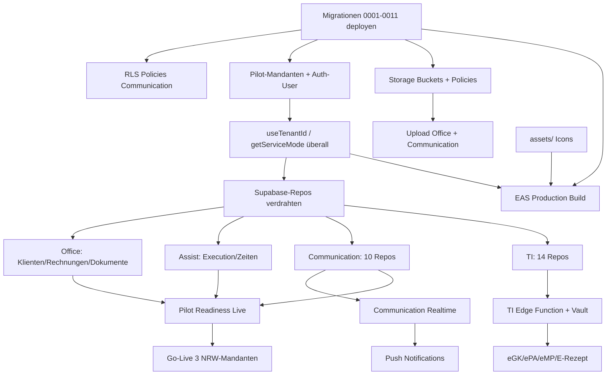

# CareSuite+ — Vollständige Liste offener Punkte

**Stand:** 2026-06-13  
**Basis:** Production-Readiness-Audit, Full-App-Audit, Communication-Closure-Audit, Architektur-Docs, Code-Verifikation (Grep/Read)  
**Methode:** Keine neuen Features — nur Konsolidierung und Verifikation

---

## 1. Executive Summary

| Priorität | Anzahl | Bedeutung |
|-----------|--------|-----------|
| **P0** | **55** | Blockiert Live-Pilot, Build oder Mandantenisolation |
| **P1** | **60** | Vor produktivem Pilotbetrieb erforderlich |
| **P2** | **61** | Wichtig für Vollständigkeit, nicht Pilot-kritisch |
| **P3** | **10** | Kosmetik, Doku, technische Schulden |
| **—** | **1** | Informativ (#158 Demo-Login funktioniert) |
| **Gesamt** | **187** | |

CareSuite+ ist ein **reifer Demo-/Schulungsprototyp** mit breiter UI-Abdeckung (~600 Work Packages, Typecheck/Test/Smoke grün), aber **nicht live-pilot-ready**. Die größten Lücken: Remote-Supabase ohne Schema (Migrationen 0001–0011 ausstehend), `DEMO_TENANT_ID` in ~220 Vorkommen statt Auth-Mandant, Communication/TI/Assist/Billing/Uploads überwiegend Demo-Store, fehlende App-Assets (EAS-Build blockiert), und der WP-100%-Report misst Datei-Vollständigkeit — nicht Produktionstiefe (~22 % geschätzte Produktionsreife). Quality Gates messen Code-Qualität, nicht Live-Anbindung.

---

## 2. Master-Tabelle (alle offenen Punkte)

| # | Bereich | Thema | Status | Priorität | Blockiert | Nächster Schritt | Betroffene Dateien/Module |
|---|---------|-------|--------|-----------|-----------|------------------|---------------------------|
| 1 | Infrastruktur | Migration `0001_core_schema.sql` nicht remote deployed | Nicht implementiert | P0 | Alles Live | `supabase db push` | `supabase/migrations/0001_core_schema.sql` |
| 2 | Infrastruktur | Migration `0002_rls_refinements.sql` nicht remote deployed | Nicht implementiert | P0 | RLS/Berechtigungen | `supabase db push` | `supabase/migrations/0002_rls_refinements.sql` |
| 3 | Infrastruktur | Migration `0003_office_clients.sql` nicht remote deployed | Nicht implementiert | P0 | Klient:innen Live | `supabase db push` | `supabase/migrations/0003_office_clients.sql` |
| 4 | Infrastruktur | Migration `0004_demo_seed.sql` nicht remote deployed | Nicht implementiert | P1 | Demo-Mandant Remote | Optional pushen oder Pilot-SQL | `supabase/migrations/0004_demo_seed.sql` |
| 5 | Infrastruktur | Migration `0005_employees_and_profiles.sql` nicht remote deployed | Nicht implementiert | P0 | Mitarbeitende Live | `supabase db push` | `supabase/migrations/0005_employees_and_profiles.sql` |
| 6 | Infrastruktur | Migration `0006_appointments_invoices.sql` nicht remote deployed | Nicht implementiert | P0 | Termine/Rechnungen Live | `supabase db push` | `supabase/migrations/0006_appointments_invoices.sql` |
| 7 | Infrastruktur | Migration `0007_assist_platform.sql` nicht remote deployed | Nicht implementiert | P0 | Assist Live | `supabase db push` | `supabase/migrations/0007_assist_platform.sql` |
| 8 | Infrastruktur | Migration `0008_ops_modules.sql` nicht remote deployed | Nicht implementiert | P1 | Ops-Module Live | `supabase db push` | `supabase/migrations/0008_ops_modules.sql` |
| 9 | Infrastruktur | Migration `0009_ti_module.sql` nicht remote deployed | Nicht implementiert | P0 | TI Live | `supabase db push` | `supabase/migrations/0009_ti_module.sql` |
| 10 | Infrastruktur | Migration `0010_client_extended.sql` nicht remote deployed | Nicht implementiert | P0 | Erweiterte Akte Live | `supabase db push` | `supabase/migrations/0010_client_extended.sql` |
| 11 | Infrastruktur | Migration `0011_communication_center.sql` nicht remote deployed | Nicht implementiert | P0 | Communication Live | `supabase db push` | `supabase/migrations/0011_communication_center.sql` |
| 12 | Infrastruktur | Remote-DB enthält nur Auth-Trigger, kein App-Schema | Blockiert durch #1–11 | P0 | Gesamter Live-Betrieb | `supabase migration list --linked` + Push | `docs/architecture/supabase-deployment.md` |
| 13 | Infrastruktur | Storage-Bucket `communication-attachments` nicht angelegt | Vorbereitet | P1 | Anhang-Upload | Dashboard/Migration Policies | Kommentar in `0011_communication_center.sql` |
| 14 | Infrastruktur | Storage-Bucket `communication-voice` nicht angelegt | Vorbereitet | P1 | Sprachnachrichten | Bucket + Policies anlegen | `0011`, `communication.constants.ts` |
| 15 | Infrastruktur | Storage-Bucket `communication-images` nicht angelegt | Vorbereitet | P1 | Bild-Anhänge | Bucket + Policies anlegen | `0011` |
| 16 | Infrastruktur | Storage-Bucket `communication-exports` nicht angelegt | Vorbereitet | P2 | Export-Funktion | Bucket anlegen | `0011` |
| 17 | Infrastruktur | Storage-Bucket-Policies fehlen im Repo | Nicht implementiert | P1 | Sicherer Upload | Separate Migration schreiben | `supabase/migrations/` |
| 18 | Infrastruktur | RLS-Policy fehlt: `communication_participants` | Blockiert durch #11 | P0 | Participant-Zugriff Live | Policies in 0011 oder 0012 | `0011_communication_center.sql` |
| 19 | Infrastruktur | RLS-Policy fehlt: `communication_attachments` | Blockiert durch #11 | P0 | Anhang-Zugriff Live | Policies ergänzen | `0011_communication_center.sql` |
| 20 | Infrastruktur | RLS-Policy fehlt: `communication_reactions` | Blockiert durch #11 | P0 | Reactions Live | Policies ergänzen | `0011_communication_center.sql` |
| 21 | Infrastruktur | RLS-Policy fehlt: `communication_assignments` | Blockiert durch #11 | P0 | Zuordnungen Live | Policies ergänzen | `0011_communication_center.sql` |
| 22 | Infrastruktur | RLS-Policy fehlt: `communication_read_receipts` | Blockiert durch #11 | P0 | Lesestatus Live | Policies ergänzen | `0011_communication_center.sql` |
| 23 | Infrastruktur | RLS-Policy fehlt: `communication_notifications` | Blockiert durch #11 | P0 | Benachrichtigungen Live | Policies ergänzen | `0011_communication_center.sql` |
| 24 | Infrastruktur | Edge Function `ti-provider-proxy` — Stub ohne Vault-API-Call | Vorbereitet | P1 | Echter KIM-Sync | Vault-Lookup + Connector implementieren | `supabase/functions/ti-provider-proxy/index.ts` |
| 25 | Infrastruktur | Edge Function nicht auf Production deployed | Nicht implementiert | P1 | TI produktiv | `supabase functions deploy ti-provider-proxy` | Supabase Dashboard |
| 26 | Infrastruktur | `EXPO_PUBLIC_SUPABASE_URL` / Anon-Key für Pilot nicht in EAS | Nicht implementiert | P0 | Live-Modus App | EAS Secrets setzen | `.env`, EAS |
| 27 | Infrastruktur | `EXPO_PUBLIC_DEMO_MODE=false` für Pilot nicht konfiguriert | Nicht implementiert | P0 | Live-Umschaltung | Env pro Build-Profil | `src/lib/supabase/config.ts` |
| 28 | Infrastruktur | Post-Deploy Security Advisor (`get_advisors`) nicht ausgeführt | Nicht implementiert | P1 | RLS-Validierung | MCP/Dashboard nach Push | Supabase MCP |
| 29 | Tenant/Auth | `DEMO_TENANT_ID` hardcoded (~220 Vorkommen, 210 Dateien) | Teilweise | P0 | Mandantenisolation | Zentraler `useTenantId()` aus Auth | `src/hooks/*`, `src/lib/*`, `src/data/demo/` |
| 30 | Tenant/Auth | `useClientWizard` speichert mit `DEMO_TENANT_ID` statt `profile.tenantId` | Demo-fähig | P0 | Klient Live anlegen | Zeile 94 auf Auth-Mandant umstellen | `src/hooks/useClientWizard.ts` |
| 31 | Tenant/Auth | Alle Communication-Hooks nutzen `DEMO_TENANT_ID` | Demo-fähig | P0 | Communication Live | Hooks auf Auth-Mandant | `src/hooks/communication/*` |
| 32 | Tenant/Auth | TI-Services nutzen `TI_DEMO_TENANT`, lehnen andere ab | Demo-fähig | P0 | TI Live | Supabase-Repos + Tenant aus Auth | `src/lib/ti/*.ts` |
| 33 | Tenant/Auth | Assist execution lehnt Nicht-Demo-Mandanten ab | Demo-fähig | P0 | Einsatz Live | `executionService` an Supabase | `src/lib/assist/executionService.ts` |
| 34 | Tenant/Auth | 3 NRW-Pilot-Mandanten nicht in Production-DB | Nicht implementiert | P0 | Pilot rm-001 | `tenants` + `profiles` anlegen | `src/lib/pilot/pilotConfig.ts` |
| 35 | Tenant/Auth | Auth-User für Pilot-PDLs nicht angelegt | Nicht implementiert | P0 | Login Live | Dashboard/SQL | Supabase Auth |
| 36 | Tenant/Auth | Portal-Sessions: nur Demo-Auth, kein separates Portal-Login | Demo-fähig | P1 | Portal Live | Portal-Auth-Konzept umsetzen | `src/lib/auth/` |
| 37 | Tenant/Auth | MFA für Admin/PDL nicht konfiguriert | Nicht implementiert | P2 | Security-Härtung | Supabase Auth MFA | Dashboard |
| 38 | Tenant/Auth | `getServiceMode()` nur in Client-Service verdrahtet | Teilweise | P0 | Modul-Umschaltung Demo/Live | Factory-Pattern für alle Domains | `src/lib/services/mode.ts` |
| 39 | App Assets | `assets/icon.png` fehlt | Nicht implementiert | P0 | EAS Build / Store | Icon-Set erstellen | `app.json` |
| 40 | App Assets | `assets/splash-icon.png` fehlt | Nicht implementiert | P0 | Splash Screen | Asset ablegen | `app.json` |
| 41 | App Assets | `assets/android-icon-foreground.png` fehlt | Nicht implementiert | P0 | Android Build | Asset ablegen | `app.json` |
| 42 | App Assets | `assets/android-icon-background.png` fehlt | Nicht implementiert | P0 | Android Build | Asset ablegen | `app.json` |
| 43 | App Assets | `assets/android-icon-monochrome.png` fehlt | Nicht implementiert | P0 | Android Build | Asset ablegen | `app.json` |
| 44 | App Assets | `assets/favicon.png` fehlt | Nicht implementiert | P1 | Web-Export | Asset ablegen | `app.json` |
| 45 | Office | Klient:innen-Liste/Detail — Hooks mit `DEMO_TENANT_ID` | Teilweise | P0 | Live-Liste | Hooks auf Auth-Mandant | `useClientList`, `useClientDetail` |
| 46 | Office | Klient Extended — nur `clientService` + `clientBackend` mit `getServiceMode()` | Teilweise | P0 | Vollständige Akte Live | Alle Extended-Hooks verdrahten | `src/lib/clients/` |
| 47 | Office | Rechnungen — ausschließlich `demoInvoices` | Nur UI | P0 | Abrechnung Live | `invoiceRepository.supabase` an Services | `invoiceListService`, `invoiceDetailService` |
| 48 | Office | Rechnung erstellen — Demo only | Demo-fähig | P0 | Rechnungsanlage Live | `invoiceCreateService` an Supabase | `src/lib/office/invoiceCreateService.ts` |
| 49 | Office | Dokument-Upload — Fake-UI ohne File-Picker/Storage | Nur UI | P0 | Akten-Upload | expo-document-picker + Storage | `OfficeDocumentUploadScreen.tsx` |
| 50 | Office | Office-Dokumente — nur Demo-Metadaten | Demo-fähig | P0 | Dokumentenverwaltung | Storage + DB Insert | `officeDocumentsService.ts` |
| 51 | Office | Termine — Demo-Store only | Demo-fähig | P1 | Terminplanung Live | `appointmentRepository.supabase` verdrahten | `appointmentListService.ts` |
| 52 | Office | Mitarbeitende — Demo-Store only | Demo-fähig | P1 | HR Live | `employeeRepository.supabase` verdrahten | `employeeListService.ts`, `employeeDetailService.ts` |
| 53 | Office | Budgets — Demo only | Demo-fähig | P1 | Budgetverwaltung Live | Supabase-Repos + Services | `budgetListService.ts`, `budgetDetailService.ts` |
| 54 | Office | Legacy Office-Messages (nicht Communication Center) — Demo | Demo-fähig | P2 | Konsolidierung | Auf Communication Center migrieren | `useOfficeMessages.ts`, `messages.ts` |
| 55 | Office | Termin anlegen — Demo only | Demo-fähig | P1 | Termin-CRUD Live | `appointmentCreateService.ts` | `src/lib/office/appointmentCreateService.ts` |
| 56 | Office | Mitarbeiter-Wizard/Edit — `DEMO_TENANT_ID` | Demo-fähig | P1 | HR-Anlage Live | Auth-Mandant | `useEmployeeWizard.ts`, `useEmployeeEdit.ts` |
| 57 | Assist | Einsatz-Durchführung Check-in/out — In-Memory Demo | Demo-fähig | P0 | Einsatz Live | `executionRepository.supabase` an `executionService` | `executionService.ts`, `AssignmentExecutionScreen.tsx` |
| 58 | Assist | Aktive Einsätze — Demo only | Demo-fähig | P0 | Dispo Live | Supabase execution wiring | `useActiveExecutions.ts` |
| 59 | Assist | Einsatzplanung — Demo assignments | Demo-fähig | P1 | Planung Live | `assignmentRepository.supabase` | `assignmentListService.ts` |
| 60 | Assist | Assist-Kalender — Placeholder-Screen | Nur UI | P2 | Kalenderansicht | Echten Kalender implementieren | `AssistCalendarPlaceholderScreen.tsx` |
| 61 | Assist | Live-Tracking / GPS — Demo-Geofence-Daten, kein `expo-location` | Demo-fähig | P2 | Echtzeit-Ortung | expo-location + Backend | `MobilityScreen.tsx`, `tripLogs.ts` |
| 62 | Assist | Geofence-Events — hardcoded Demo | Demo-fähig | P2 | Geofencing Live | GPS + Server-Logik | `src/data/demo/tripLogs.ts` |
| 63 | Assist | Fahrtenbuch — Demo only | Demo-fähig | P2 | Fahrtenbuch Live | `tripRepository.supabase` | `tripLogService.ts` |
| 64 | Assist | Leistungsnachweise — Demo only | Demo-fähig | P1 | Nachweise Live | `careRecordRepository.supabase` | `careRecordService.ts` |
| 65 | Assist | Signatur-Erfassung — `signatureDataUrl` immer `null` | Nur UI | P2 | Rechtssichere Nachweise | Signatur-Canvas + Speicherung | `careRecords.ts`, `CareRecordDetailScreen.tsx` |
| 66 | Assist | PDF-Export Leistungsnachweis — nur Demo-Text | Demo-fähig | P2 | PDF-Generierung | PDF-Library + Template | `careRecordService.ts` |
| 67 | Assist | Zeiterfassung — In-Memory, kein Supabase | Demo-fähig | P1 | Zeiten Live | Execution-Repos erweitern | `executionService.ts` |
| 68 | Assist | `executionRepository.supabase` — generisches Stub-Repo, nicht verdrahtet | Vorbereitet | P0 | Execution Live | Echtes Schema-Mapping + Service-Switch | `executionRepository.supabase.ts` |
| 69 | Communication | 0/10 Communication-Tabellen mit Supabase-Repo | Demo-fähig | P0 | Nachrichten Live | Repos unter `repositories/` | `src/features/communication/` |
| 70 | Communication | Alle Services → `communication.demoStore.ts` | Demo-fähig | P0 | Persistenz | `getServiceMode()`-Umschaltung | `communication.service.ts` etc. |
| 71 | Communication | Archivieren — Service existiert, UI-Handler fehlt | Teilweise | P1 | Thread archivieren | Buttons in ConversationScreen | `archiveThread()` vs. `ConversationHeader.tsx` |
| 72 | Communication | Löschen — Service existiert, UI-Handler fehlt | Teilweise | P1 | Soft-Delete UI | Delete-Aktionen in UI | `softDeleteThread/Message()` |
| 73 | Communication | `onVoicePress={() => {}}` — No-Op in UI | Nur UI | P2 | Sprachnachrichten | expo-av oder Button deaktivieren | `ConversationScreen.tsx:166` |
| 74 | Communication | Anhang-Upload — nur Metadaten, kein File/Storage | Demo-fähig | P1 | Echte Anhänge | File-Picker + Supabase Storage | `communication.attachments.ts` |
| 75 | Communication | Sprachnachrichten — Timer-Simulation ohne Mikrofon | Vorbereitet | P2 | Audio-Aufnahme | expo-av implementieren | `communication.voice.ts` |
| 76 | Communication | Realtime — Demo-Heartbeat, kein Supabase Channel | Vorbereitet | P1 | Live-Updates | `communication.realtime.ts` produktiv | `useCommunicationRealtime.ts` |
| 77 | Communication | Push Notifications — nicht implementiert | Nicht implementiert | P1 | Mobile Push | expo-notifications + Token-Tabelle | `package.json`, fehlende Migration |
| 78 | Communication | `push_enabled` in DB — Default `false`, keine Token-Tabelle | Vorbereitet | P1 | Push-Infrastruktur | Migration `push_tokens` | `0011` Settings-Schema |
| 79 | Communication | In-App-Notifications — Demo-Store only | Demo-fähig | P1 | Persistente Notifications | Supabase-Repo | `communication.notifications.ts` |
| 80 | Communication | Read Receipts — teilweise Demo | Teilweise | P2 | Lesestatus synchron | Supabase + Realtime | `communication_read_receipts` |
| 81 | Communication | Emoji-Reactions — Demo only | Demo-fähig | P2 | Reactions Live | Supabase-Repo | `communication.emoji.ts` |
| 82 | Communication | Message Assignments — Demo only | Demo-fähig | P2 | Zuordnung Live | Supabase-Repo | `communication.assignments.ts` |
| 83 | Communication | Audit Events — Demo only | Demo-fähig | P1 | Compliance | Supabase-Insert bei Aktionen | `communication.audit.ts` |
| 84 | Communication | Settings — Demo, `DEMO_TENANT_ID` in Screen | Demo-fähig | P1 | Mandanten-Settings Live | Supabase-Repo | `CommunicationSettingsScreen.tsx` |
| 85 | Portale | Mitarbeiterportal — Demo-Domain-Services | Demo-fähig | P1 | Portal Live | Supabase Portal-Repos | `employeePortalService.ts` |
| 86 | Portale | Klientenportal — simulierte Delays, Demo-Daten | Demo-fähig | P1 | Portal Live | `clientPortalRepository.supabase` | `clientPortalService.ts` |
| 87 | Portale | Angehörigenportal — nur Messages-Routen | Teilweise | P2 | Vollständiges Relative-Portal | Weitere Portal-Screens | `app/portal/relative/` |
| 88 | Portale | Redundante Routen `[id]` vs `[threadId]` (Client/Employee) | Vorbereitet | P3 | Routing-Klarheit | Eine Param-Konvention | `app/portal/*/messages/` |
| 89 | Portale | Portal `[id]/index.tsx` und `[threadId].tsx` — identischer Export | Vorbereitet | P3 | Wartbarkeit | Route konsolidieren | `app/portal/client/messages/` |
| 90 | Portale | Legacy `portal/messageService.ts` — Demo, getrennt von Communication Center | Demo-fähig | P2 | Einheitliche Messaging | Auf Communication Center umstellen | `src/lib/portal/messageService.ts` |
| 91 | Portale | Portal-Dokumente — simulierte Delays | Demo-fähig | P2 | Dokumentenzugriff Live | Storage + Auth | `portal/documentService.ts` |
| 92 | TI | Einziger Adapter: `MockKIMProvider` | Demo-fähig | P0 | KIM produktiv | Real-Adapter + Edge Function | `src/lib/ti/adapters/` |
| 93 | TI | 0/14 TI-Tabellen mit Supabase-Repo | Demo-fähig | P0 | TI Live | Repos pro Tabelle | `src/lib/ti/repositories/` (fehlt) |
| 94 | TI | `tiProviderService` — nur Demo, `TI_DEMO_TENANT` | Demo-fähig | P0 | Provider-Verwaltung Live | Supabase-Repo | `tiProviderService.ts` |
| 95 | TI | KIM Mailbox/Messages/Attachments — Demo only | Demo-fähig | P0 | KIM Live | Supabase-Repos | `kimMailboxService.ts`, `kimMessageService.ts` |
| 96 | TI | eGK-Vorbereitung — Nur Info-Text | Nur UI | P2 | eGK Auslesen | TI-Connector + Kartenleser | `EGKVorbereitungScreen.tsx` |
| 97 | TI | ePA-Vorbereitung — Nur Info-Text | Nur UI | P2 | ePA-Zugriff | ePA-Gateway + Consent | `EPAVorbereitungScreen.tsx` |
| 98 | TI | eMP-Vorbereitung — Nur Info-Text | Nur UI | P2 | Medikationsplan | Real-Provider | `EMPVorbereitungScreen.tsx` |
| 99 | TI | E-Rezept-Vorbereitung — Nur Info-Text | Nur UI | P2 | E-Rezept | Real-Provider | `ERezeptVorbereitungScreen.tsx` |
| 100 | TI | Kein `functions.invoke('ti-provider-proxy')` in Client-Services | Nicht implementiert | P1 | Server-seitiger TI-Zugriff | invoke in Services | `src/lib/ti/` |
| 101 | TI | `ti_provider_checks` — kein Service | Nicht implementiert | P2 | Provider-Monitoring | Service + UI | Migration 0009 |
| 102 | TI | `egk_insurance_data_drafts` — kein Service | Nicht implementiert | P2 | eGK-Daten | Service implementieren | Migration 0009 |
| 103 | TI | `epa_connections` — kein Service | Nicht implementiert | P2 | ePA-Verbindungen | Service implementieren | Migration 0009 |
| 104 | TI | `emp_medication_plans/items` — kein Service | Nicht implementiert | P2 | Medikationsplan DB | Services | Migration 0009 |
| 105 | TI | `erezept_items` — kein Service | Nicht implementiert | P2 | E-Rezept-Items | Service | Migration 0009 |
| 106 | TI | TI Consent/Audit/Permissions — Demo only | Demo-fähig | P1 | TI Compliance Live | Supabase-Repos | `tiConsentService.ts`, `tiAuditService.ts` |
| 107 | Klient Extended | `client_preferences` — Tabelle in 0010, kein Supabase-Fetch | Blockiert durch #10 | P1 | Präferenzen Live | `fetchPreferences` in Repo | `clientExtendedRepository.supabase.ts` |
| 108 | Klient Extended | `emergencyPlan` — immer `null` in Supabase-Pfad, keine DB-Tabelle | Nicht implementiert | P1 | Notfallplan Live | Tabelle + Migration + Repo | `clientExtendedRepository.supabase.ts:555` |
| 109 | Klient Extended | Extended-Hooks (`useClientBudget`, `useClientTasks`, …) — `DEMO_TENANT_ID` | Demo-fähig | P0 | Extended Live | Auth-Mandant + Supabase | `src/hooks/useClient*.ts` |
| 110 | Klient Extended | Demo-Repos für Risiken/Kontakte funktionieren, Live unvollständig | Teilweise | P1 | Parität Demo/Live | Fehlende CRUD-Methoden | `clientExtendedRepository.supabase.ts` |
| 111 | Pflege | Pflegepläne — Demo only (`carePlans.ts`) | Demo-fähig | P2 | Pflegeplanung Live | `pflegeRepository.supabase` | `carePlanListService.ts` |
| 112 | Pflege | Vitalwerte — Demo only | Demo-fähig | P2 | Vitals Live | Supabase + Geräte-Integration | `vitalService.ts` |
| 113 | Pflege | SIS (Strukturinformationssystem) — nicht vorhanden | Nicht implementiert | P2 | SIS-Pflichtdaten | Modul konzipieren | — |
| 114 | Pflege | Wunden/Medikamente/Risiko — Tabellen in 0010, keine App-Services | Vorbereitet | P2 | Klinische Tiefe | Services implementieren | `0010_client_extended.sql` |
| 115 | Pflege | MDK/Begutachtung — nur Demo-Text in TI/Demo-Daten | Demo-fähig | P3 | MDK-Workflow | Fachmodul | `data/demo/ti/`, `documents.ts` |
| 116 | Stationär | Bewohner — Demo only | Demo-fähig | P2 | Stationär Live | `stationaerRepository.supabase` | `residentListService.ts` |
| 117 | Beratung | Beratungsfälle — Demo only | Demo-fähig | P2 | Beratung Live | `beratungRepository.supabase` | `caseListService.ts` |
| 118 | Akademie | Kurse — Demo only | Demo-fähig | P2 | Akademie Live | `akademieRepository.supabase` | `courseListService.ts` |
| 119 | Billing | Service Records (`service_records`) — Schema, kein Live-Service | Vorbereitet | P1 | Leistungsabrechnung | Service + UI-Verdrahtung | `0010_client_extended.sql` |
| 120 | Billing | Budget-Transaktionen — Schema, kein Service | Vorbereitet | P2 | Budget-Buchungen | Service implementieren | `budget_transactions` |
| 121 | Billing | DATEV-Export — Demo-Outbox, kein API-Call | Demo-fähig | P1 | DATEV-Anbindung | Integration Provider + Vault | `integrationService.ts`, `outbox.ts` |
| 122 | Billing | Rechnungs-PDF — nicht produktiv | Nicht implementiert | P2 | PDF-Rechnungen | PDF-Generator | Office Billing |
| 123 | Templates | Katalog-Vorlagen — statischer Text | Nur UI | P2 | Leistungsvorlagen | Template-Engine | `CatalogTemplateScreen.tsx` |
| 124 | Templates | Task-Katalog — hardcoded Demo | Demo-fähig | P2 | Konfigurierbare Tasks | Supabase-Katalog | `catalogMutations.ts`, `catalogs.ts` |
| 125 | Templates | E-Mail-Vorlagen — fehlen | Nicht implementiert | P2 | Kommunikation | Template-System | — |
| 126 | Templates | Dokument-Vorlagen — nur Demo-Einträge | Demo-fähig | P2 | Doc-Generation | Storage + Templates | `data/demo/documents.ts` |
| 127 | Uploads | Office-Upload — kein echter File-Upload | Nur UI | P0 | Akten | Siehe #49 | `OfficeDocumentUploadScreen.tsx` |
| 128 | Uploads | Communication-Anhänge — Pfad definiert, kein Storage-Write | Vorbereitet | P1 | Anhänge | `supabase.storage.upload` | `communication.attachments.ts` |
| 129 | Uploads | Klient-Akte Dokumente — Anzeige Demo, Upload unklar | Teilweise | P1 | Akten Live | Storage + Extended Repo | `clientExtendedRepository.supabase.ts` |
| 130 | Reporting/PDL | Reporting — nur `REPORTING_DEMO_TENANT` | Demo-fähig | P1 | PDL-Cockpit Live | `reportingRepository.supabase` | `reportingService.ts` |
| 131 | Reporting/PDL | KPI-Dashboards — Demo-Daten | Demo-fähig | P2 | Echte KPIs | Live-Aggregationen | `data/demo/dashboard.ts` |
| 132 | Ops | Pilot-Readiness — AsyncStorage, nicht gegen Live-DB validiert | Demo-fähig | P1 | Echte Readiness | Live-Checks implementieren | `pilotReadinessService.ts` |
| 133 | Ops | Release-Gates — Demo-Checklisten | Demo-fähig | P2 | Release-Management | Supabase `releaseRepository` | `releaseDemo.ts` |
| 134 | Ops | QA/Security/Roadmap — Demo-Domains | Demo-fähig | P2 | Ops Live | Repos verdrahten | `src/data/demo/domains/` |
| 135 | Integrationen | Provider-Registry — Demo-Status, kein echter Connect | Demo-fähig | P2 | Integrationen | OAuth/API pro Provider | `providerRegistry.ts` |
| 136 | Integrationen | AI/OCR-Jobs — Demo-Daten | Demo-fähig | P3 | AI-Pipeline | Backend-Jobs | `aiJobs.ts`, `ocrJobs.ts` |
| 137 | Integrationen | Telemedizin — Create-Screen Demo only | Demo-fähig | P3 | Telemedizin | Provider-Anbindung | `TelemedicineCreateScreen.tsx` |
| 138 | Testing | Keine E2E-Tests mit `EXPO_PUBLIC_DEMO_MODE=false` | Nicht implementiert | P1 | Live-Vertrauen | E2E gegen Staging-Supabase | `src/__tests__/e2e/` |
| 139 | Testing | WP-Tests (~30) alle mit `DEMO_TENANT_ID` | Demo-fähig | P2 | Live-Testabdeckung | Live-Modus-Tests ergänzen | `src/__tests__/wp/` |
| 140 | Testing | Communication-Tests — nur Demo-Store | Demo-fähig | P2 | Repo-Tests | Supabase-Mock-Tests | `communicationCenter.test.ts` |
| 141 | Doku | WP-100%-Report — misst D-FULL (Datei), nicht P-PROD | Blockiert durch Stakeholder-Erwartung | P0 | Realistische Kommunikation | D-FULL vs P-PROD trennen | `module-completion-report.md` |
| 142 | Doku | `supabase-deployment.md` — fehlt Migration 0011 | Veraltet | P1 | Deployment | 0011 ergänzen | `docs/architecture/supabase-deployment.md` |
| 143 | Doku | `live-pilot.md` — referenziert nur 0001–0010 | Veraltet | P1 | Pilot-Doku | 0011 + Communication ergänzen | `docs/architecture/live-pilot.md` |
| 144 | UX/UI | `AssistCalendarPlaceholderScreen` — „Demnächst" | Nur UI | P2 | Kalender | Implementieren oder Route entfernen | `AssistCalendarPlaceholderScreen.tsx` |
| 145 | UX/UI | `ModuleOverviewScreen` — „Modul aktivieren" `onPress={() => {}}` | Nur UI | P3 | Modul-Aktivierung | Handler oder Button entfernen | `ModuleOverviewScreen.tsx:37` |
| 146 | UX/UI | `PlaceholderModuleScreen` — generische Stub-Routen | Nur UI | P3 | Modul-Tiefe | Fachscreens oder Redirect | `PlaceholderModuleScreen.tsx` |
| 147 | Lint/Tech Debt | `react-native-web` nicht in direkten Dependencies | Blockiert Web-Export | P3 | `expo start --web` | Dependency hinzufügen | `package.json` |
| 148 | Lint/Tech Debt | Generische Supabase-Repos (`createTenantTableRepository`) — nur title/status, falsche Table-Casts | Vorbereitet | P1 | Domain-Repos | Echte Mapper pro Entität | `src/lib/services/repositories/*.supabase.ts` |
| 149 | Lint/Tech Debt | ~25 Supabase-Repos existieren, nicht an Services gekoppelt | Vorbereitet | P0 | Live-Datenfluss | Service-Factory wie `clientService` | `src/lib/services/repositories/` |
| 150 | Lint/Tech Debt | `expo-av` fehlt in `package.json` | Nicht implementiert | P2 | Sprachnachrichten | Paket installieren oder UI deaktivieren | `package.json` |
| 151 | Lint/Tech Debt | `expo-notifications` fehlt in `package.json` | Nicht implementiert | P1 | Push | Paket + Konfiguration | `package.json` |
| 152 | Lint/Tech Debt | Kein `expo-document-picker` / `expo-image-picker` für Uploads | Nicht implementiert | P1 | File-Upload | Pakete installieren | Upload-Screens |
| 153 | Lint/Tech Debt | Kein `expo-location` für GPS/Live-Tracking | Nicht implementiert | P2 | Ortung | Paket + Permissions | Assist Mobility |
| 154 | Kataloge | Katalog-Mutationen — Demo only | Demo-fähig | P2 | Katalog Live | `catalogRepository.supabase` | `catalogMutations.ts` |
| 155 | Business | Business-Module — Demo-Dashboards | Demo-fähig | P2 | Business Live | `businessRepository.supabase` | `businessDashboardService.ts` |
| 156 | Platform | Platform/AI/OCR — Demo-Hub | Demo-fähig | P3 | Platform-Features | Supabase + Provider | `platformHubService.ts` |
| 157 | Auth | Supabase-Login braucht deployed Schema + Env | Blockiert durch #1–11 | P0 | Auth Live | Migration Push + Env | `AuthProvider.tsx` |
| 158 | Auth | Demo-Login funktioniert ohne Supabase | Demo-fähig | — | (kein Blocker Demo) | Für Live: echten Login testen | `demoSession.ts` |
| 159 | Communication | `isPreparedOnly: true` in Voice-Hook — Kennzeichnung unvollständig | Vorbereitet | P3 | UX-Klarheit | Badge „Vorbereitet" in UI | `communication.voice.ts` |
| 160 | Assist | Einsatz erstellen — Demo-Create-Flow | Demo-fähig | P1 | Planung Live | Assignment-Repo | `AssignmentCreateScreen.tsx` |
| 161 | Office | Office-Billing-Screen — `DEMO_TENANT_ID` | Demo-fähig | P1 | Abrechnungsübersicht | Auth-Mandant + Live | `OfficeBillingScreen.tsx` |
| 162 | Portale | Angehörigen-Communication — Filter/Permissions vorbereitet, Demo only | Demo-fähig | P2 | Relative Threads Live | Supabase + Portal-Auth | `communication.portalFilter.ts` |
| 163 | Infrastruktur | Pilot-Feature-Flags (`pilot_tenant`, `datev_export`) — Config only | Vorbereitet | P1 | Feature-Steuerung | Runtime-Prüfung gegen DB | `pilotConfig.ts` |
| 164 | Billing | Rechnungsdetail DATEV-Button — schreibt Demo-Outbox | Demo-fähig | P1 | Echter Export | Integration API | `InvoiceDetailScreen.tsx` |
| 165 | Klient Extended | `care_plans`, `care_reports`, `vital_signs` in 0010 — App nutzt separate Demo-Pflege-Module | Teilweise | P2 | Datenmodell-Konsolidierung | Einheitliche Services | Schema vs. `src/lib/pflege/` |
| 166 | Testing | Smoke/Typecheck/Test grün — misst nicht Live-Anbindung | Demo-fähig | P1 | Pilot-Gates erweitern | Live-Supabase in CI | `scripts/smoke-check.mjs` |
| 167 | Ops | EAS Production Build — blockiert durch fehlende Assets | Blockiert durch #39–43 | P0 | Store/Pilot-Build | Assets + Secrets | EAS |
| 168 | Communication | Domain-Compose (`domainMessageService`) — `DEMO_TENANT_ID` | Demo-fähig | P2 | Modul-Messages | Communication Live | `domainMessageService.ts` |
| 169 | Office | Klient-Bearbeiten-Wizard — `DEMO_TENANT_ID` | Demo-fähig | P0 | Edit Live | Auth-Mandant | `useClientEditWizard.ts` |
| 170 | Assist | Care Record Create — Demo-Flow | Demo-fähig | P1 | Nachweis-Anlage Live | careRecordService | `CareRecordCreateScreen.tsx` |
| 171 | Portale | Employee Time Entry Create — Demo | Demo-fähig | P2 | Zeiterfassung Portal | Supabase | `EmployeeTimeEntryCreateScreen.tsx` |
| 172 | Portale | Client Request Create — Demo | Demo-fähig | P2 | Anfragen Portal | Supabase | `ClientRequestCreateScreen.tsx` |
| 173 | TI | KIM Document Assignment — Demo + Screen | Demo-fähig | P2 | Dokument-Zuordnung Live | Supabase | `TIDocumentAssignmentScreen.tsx` |
| 174 | Infrastruktur | Supabase Vault-Secrets für TI/Integrationen nicht befüllt | Nicht implementiert | P1 | Provider-Calls | Secrets im Dashboard | Vault |
| 175 | Auth | Rollen/Berechtigungen — Demo-Permissions, Live-RLS ungetestet | Teilweise | P1 | Permission-Parität | RLS + App-Tests | `data/demo/permissions.ts` |
| 176 | Communication | ConversationScreen — kein Archiv/Löschen-Menü im Header | Nur UI | P1 | Moderation | Header-Actions | `ConversationHeader.tsx` |
| 177 | Communication | Attachment-Download/Preview — kein Storage-URL | Demo-fähig | P1 | Anhang öffnen | Signed URLs | `MessageAttachmentCard.tsx` |
| 178 | Office | Consents/Timeline/Tasks Hooks — `DEMO_TENANT_ID` | Demo-fähig | P0 | Extended Live | Auth-Mandant | `useClientConsents.ts`, `useClientTimeline.ts`, `useClientTasks.ts` |
| 179 | Assist | Assignment Execution Screen — `DEMO_TENANT_ID` | Demo-fähig | P0 | Einsatz-UI Live | Auth-Mandant + Live-Service | `AssignmentExecutionScreen.tsx` |
| 180 | Pflege | Pflege-Dashboard — Demo KPIs | Demo-fähig | P2 | Pflege-Cockpit | Live-Aggregation | `pflegeDashboardService.ts` |
| 181 | Stationär | Stationär-Dashboard — Demo | Demo-fähig | P2 | Stationär-Cockpit | Live-Daten | `stationaerDashboardService.ts` |
| 182 | Beratung | Beratung-Dashboard — Demo | Demo-fähig | P2 | Beratungs-Cockpit | Live-Daten | `beratungDashboardService.ts` |
| 183 | Akademie | Akademie-Dashboard — Demo | Demo-fähig | P2 | Akademie-Cockpit | Live-Daten | `akademieDashboardService.ts` |
| 184 | Integrationen | Outbox — Demo-Einträge, kein Worker | Demo-fähig | P1 | Async Export | Edge Function/Cron | `data/demo/outbox.ts` |
| 185 | Ops | Incident/Rollback — dokumentiert, nicht automatisiert | Vorbereitet | P2 | Incident-Response | Runbook-Automatisierung | `live-pilot.md` |
| 186 | Testing | `serviceFlows.test.ts` E2E — Demo-Flows only | Demo-fähig | P1 | Live E2E | Supabase Test-Project | `src/__tests__/e2e/serviceFlows.test.ts` |
| 187 | Doku | Production-Readiness-Report existiert, Stakeholder brauchen P-PROD-Spalte | Teilweise | P1 | Transparenz | Reports verknüpfen | `production-readiness-closure-report.md` |

---

## 3. P0-Liste (nummeriert, actionable)

1. **#1–11, #12** — Alle Migrationen 0001–0011 auf Production deployen (`supabase db push`)
2. **#18–23** — RLS-Policies für 6 Communication-Tabellen ergänzen
3. **#26–27** — Live-Env-Variablen (Supabase URL/Key, `DEMO_MODE=false`) für Pilot-Builds
4. **#29, #38** — Zentralen `useTenantId()` einführen; `getServiceMode()` für alle Domains
5. **#30, #45, #109, #169, #178, #179** — Kritische Hooks/Screens von `DEMO_TENANT_ID` auf Auth-Mandant
6. **#39–43** — App-Icon-Set unter `assets/` erstellen (EAS-Build blockiert)
7. **#47–50, #127** — Rechnungen, Dokument-Upload und Office-Dokumente an Supabase
8. **#57–58, #68, #149** — Assist Execution an echte Repos; generische Repos verdrahten
9. **#69–70** — Communication Supabase-Repositories (10 Tabellen) + Service-Umschaltung
10. **#92–95** — TI Supabase-Repositories (mindestens KIM, Provider, Consent, Audit)
11. **#141** — WP-100%-Report: D-FULL vs. P-PROD klar trennen (Stakeholder-Kommunikation)
12. **#157, #167** — Auth Live + EAS Build nach Assets/Schema
13. **#34–35** — 3 Pilot-Mandanten + Auth-User in Production-DB anlegen

---

## 4. P1-Liste

1. **#4, #8** — Ops-Migration + optional Demo-Seed remote
2. **#13–17, #128** — Storage-Buckets + Policies + Upload-Implementierung
3. **#24–25, #100, #174** — TI Edge Function produktiv (Vault, Deploy, Client invoke)
4. **#28** — Security Advisor nach Deploy
5. **#36** — Portal-Auth-Konzept
6. **#44** — Favicon für Web
7. **#51–53, #55–56, #161** — Termine, Mitarbeitende, Budgets Live
8. **#64, #67, #160, #170** — Leistungsnachweise, Zeiterfassung, Einsatz-CRUD
9. **#71–72, #74, #76, #79, #83–84, #176–177** — Communication UI-Handler, Storage, Realtime, Audit
10. **#77–78, #151** — Push Notifications (expo-notifications, Token-Tabelle)
11. **#85–86** — Portale an Supabase
12. **#106** — TI Consent/Audit/Permissions Live
13. **#107–110** — Klient Extended: preferences, emergencyPlan, Hook-Parität
14. **#119, #121, #164, #184** — Service Records, DATEV, Outbox-Worker
15. **#130, #132** — Reporting/PDL + Pilot-Readiness Live-Validierung
16. **#138, #166, #186** — E2E/Live-Tests in CI
17. **#142–143, #187** — Deployment-Doku aktualisieren (0011)
18. **#148** — Generische Repos durch echte Domain-Repos ersetzen
19. **#152** — File-Picker-Pakete für Uploads
20. **#163, #175** — Feature-Flags + Permission-RLS-Parität

---

## 5. P2-Liste

1. **#16, #37** — communication-exports Bucket, MFA
2. **#54, #60, #61–66** — Legacy Messages, Kalender, GPS, Geofence, Fahrtenbuch, Signaturen, PDF
3. **#73, #75, #80–82, #150, #153, #159** — Voice (expo-av), Reactions, Assignments, Location
4. **#87, #90–91, #162** — Angehörigenportal, Portal-Dokumente, Relative Threads
5. **#96–105, #173** — TI eGK/ePA/eMP/E-Rezept, fehlende TI-Services
6. **#111–115, #165, #180** — Pflege-Tiefe, SIS, klinische Tabellen, Dashboards
7. **#116–118, #181–183** — Stationär, Beratung, Akademie Live
8. **#120, #122** — Budget-Transaktionen, Rechnungs-PDF
9. **#123–126, #154** — Vorlagen-System, Kataloge
10. **#131, #133–135** — KPI-Dashboards, Ops-Module, Integrationen
11. **#139–140** — Erweiterte Testabdeckung Live
12. **#144** — Assist-Kalender Placeholder
13. **#168, #171–172** — Domain-Messages, Portal-Create-Flows
14. **#185** — Incident-Automatisierung

---

## 6. P3-Liste

1. **#88–89** — Redundante Portal-Routen `[id]` vs `[threadId]`
2. **#115** — MDK-Workflow (Demo-Text)
3. **#136–137, #156** — AI/OCR, Telemedizin, Platform-Hub
4. **#145–146** — ModuleOverview No-Op, PlaceholderModuleScreen
5. **#147** — react-native-web Dependency
6. **#88** — Routing-Konsolidierung Portale

---

## 7. Abhängigkeiten

**Kritischer Pfad:** Migrationen → Tenant-ID-Fix → Repo-Verdrahtung → Storage → Pilot-Mandanten → E2E Live-Tests → Go-Live

**Parallelisierbar:** App-Assets (#39–43), Doku-Updates (#141–143), TI Edge Function nach Migration 0009

**Blockiert extern:** TI Real-Provider (KIM-Connector, Kartenleser, ePA-Gateway), DATEV-API, Expo Push Credentials (APNs/FCM)

---

## 8. Geschätzter Aufwand (P0)

| P0-Paket | Aufwand | Anmerkung |
|----------|---------|------------|
| Migrationen 0001–0011 deployen + verifizieren | **M** | 1–2 Tage inkl. RLS-Review |
| RLS 6 Communication-Tabellen | **S** | SQL in Migration 0012 |
| `useTenantId()` + Hook-Migration (~210 Dateien) | **L** | 3–5 Tage, schrittweise |
| App-Assets (Icon-Set) | **S** | Design + Export |
| Communication Supabase-Repos (10 Tabellen) | **L** | 4–6 Tage |
| TI Supabase-Repos (Kern: 6–8 Tabellen) | **L** | 3–5 Tage |
| Assist Execution Live-Verdrahtung | **M** | 2–3 Tage |
| Office Rechnungen + Dokument-Upload | **M** | 2–3 Tage |
| Generische Repos → Domain-Repos (25 Stück) | **L** | 5–8 Tage parallelisierbar |
| Pilot-Mandanten + Auth Setup (3×) | **S** | 0,5–1 Tag |
| Live-Env/EAS Secrets | **S** | 0,5 Tag |
| WP-Report D-FULL/P-PROD Trennung | **S** | Doku only |

**Legende:** S = ≤1 Tag · M = 2–4 Tage · L = ≥5 Tage (1 Entwickler)

---

## 9. Was NICHT offen ist (Demo-fähig)

| Bereich | Status | Einschränkung |
|---------|--------|---------------|
| UI/Routing/Navigation | **Demo-fähig** | ~600 WP-Routen, Guards, Shell-Tabs |
| Typecheck / Unit-Tests / Smoke | **Demo-fähig** | 128/128 Tests, TS clean — misst nicht Live |
| Demo-Login & Demo-Session | **Demo-fähig** | Ohne Supabase-Env sofort nutzbar |
| Klient:innen CRUD (Demo) | **Demo-fähig** | Mandant `tenant-demo-001`; Live nur teilweise verdrahtet |
| Klient Extended (Demo) | **Demo-fähig** | Werner Müller / Helga Schneider Vollprofile |
| Communication Center (Demo) | **Demo-fähig** | 28+ Threads, Senden, Archiv (Service), Suche, Portal-Filter |
| TI KIM (Demo) | **Demo-fähig** | MockKIMProvider, Postfach, Nachrichten, Audit |
| Assist Einsatz-Durchführung (Demo) | **Demo-fähig** | Check-in/out im Demo-Store |
| Rechnungen/Budgets (Demo) | **Demo-fähig** | Listen, Detail, DATEV-Outbox simuliert |
| Portale (Demo) | **Demo-fähig** | Employee/Client/Relative Messages UI |
| Permissions/Rollen | **Demo-fähig** | Umfangreiches Permission-System in App |
| Pilot-Readiness UI | **Demo-fähig** | Checkliste in AsyncStorage, DATEV-Smoke Demo |
| Designsystem / UI-Komponenten | **Demo-fähig** | PremiumCard, Wizard, Tabs, Badges |
| Workflow-Engine / Validierung | **Demo-fähig** | Client-Wizard, Form-Validation |
| `clientService` + `clientExtendedRepository` | **Teilweise** | Einzige Domains mit `getServiceMode()`-Switch |

---

**Erstellt:** 2026-06-13 · Quellen: `production-readiness-closure-report.md`, `caresuite-full-app-audit.md`, Architektur-Docs, Code-Grep  
**Verifikation:** `DEMO_TENANT_ID` in 210 Dateien (~220 Vorkommen), 0 Supabase-Repos in Communication/TI, `assets/` fehlt, `expo-av`/`expo-notifications`/`react-native-web` nicht in Dependencies
