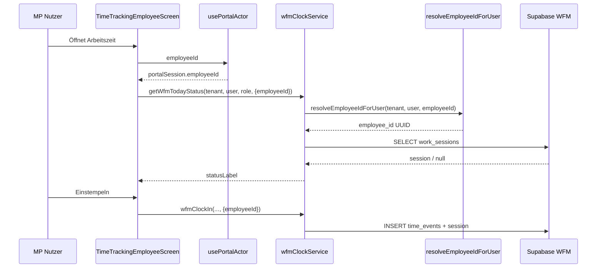

# CareSuite+ Zeitwirtschaft — System-Audit & Blueprint

**Stand:** 2026-07-03  
**Workspace:** `CareSuite+`  
**Methode:** Read-only Codebase-Exploration (Routen, Services, Migrationen, Tests, P0-Auditberichte)  
**Sprache:** Deutsch  
**Zielgruppe:** Produkt, Engineering, Betrieb  

---

## Dokumentzweck

Dieses Dokument konsolidiert den **Ist-Zustand** der Zeitwirtschaft in CareSuite+ (Office, Mitarbeiterportal, Assist), identifiziert **Root Causes** für das bekannte Portal-Symptom „Kein Mitarbeiterprofil…“ trotz sichtbarer Profildaten, und definiert ein **Zielmodell** mit Implementierungsphasen **ZEIT.1–ZEIT.8**.

Es ersetzt keine Migration-Freigabe und löst **keinen Deploy** aus.

---

## 1. Executive Summary

### Kernergebnis

CareSuite+ befindet sich in einer **Übergangsphase** von fragmentierter Zeiterfassung (Homeoffice-Modul 0161, Assist-GPS 0156, Legacy `time_entries`) hin zu einer **zentralen WFM-Datenbank** (`workforce_time_events`, `workforce_work_sessions`, …, Migration 0190 ff.). Die zentrale Schicht ist **teilweise implementiert** (`src/lib/wfm/`, Office-Routen, Portal-Route `/portal/employee/arbeitszeit`), aber **nicht durchgängig an die Portal-Identitätsauflösung angebunden**.

### Verifiziertes Hauptproblem (P0 UX)

| Bereich | Verhalten | Ursache (Code) |
|---------|-----------|----------------|
| **MP Profil** | Zeigt Name, Rolle, Einsätze, Zeiterfassungs-Historie | `usePortalActor()` → `portalSession.employeeId` → direkter `employees`-SELECT |
| **MP Arbeitszeit** | Fehler „Kein Mitarbeiterprofil für diesen Benutzer gefunden.“ | `TimeTrackingEmployeeScreen` nutzt `profile?.employeeId` (meist `null` bei Portal-only Auth) + `resolveEmployeeIdForUser()` prüft nur `employees.profile_id`, **nicht** `employee_portal_accounts` |

Die Datenbank-RLS ist **weiter** als der Client-Resolver: `resolve_current_employee_id()` in Postgres kombiniert Portal-Konto **und** Profil-Pfad. Der **Anwendungscode** hinkt hinterher — insbesondere `resolveEmployeeIdForUser` in `wfmWorkSessionRepository.ts`.

### Reifegrad (Schätzung)

| Dimension | Anteil | Anmerkung |
|-----------|--------|-----------|
| Zentrale WFM-Schema + Services | ~45 % | Tabellen, Clock-Service, Assist-Adapter, RLS-Fixes 0223–0225 |
| Portal Arbeitszeit (Stempeln) | ~25 % | UI vorhanden, Identitäts-Bug blockiert Portal-only Nutzer |
| Assist → WFM Sync | ~60 % | RPC `sync_assist_visit_times_to_wfm` nach P0.1; Tenant-Mismatch behoben (0225) |
| Office Live / Team | ~35 % | Screens existieren, Datenqualität abhängig von Sync |
| Abwesenheiten / Urlaub (WFM) | ~30 % | `WfmAbsencePortalScreen`, Schema dual (`employee_absences` + `workforce_absences`) |
| Zeitkonten / Export / Regeln | ~20 % | Ampel, Regel-Engine, Export-Stubs vorhanden |
| Legacy Homeoffice (0161) | ~65 % | Parallelbetrieb, Adapter `wfmHomeofficeAdapter` |

**Gesamt gegen Vollspezifikation** (`docs/spec/wfm-workforce-management-spezifikation.md`): **~30–35 %**.

### Empfehlung in einem Satz

**Sofort-Hotfix** für Portal-Identitätsauflösung (Screen + Repository), danach **ZEIT.1** abschließen (eine Schreibquelle, Portal-Stempeln E2E-grün), bevor Urlaub/Live-Karte (ZEIT.2+) ausgebaut werden.

---

## 2. Aktueller Zustand

### 2.1 Architektur-Überblick (Ist)

```
┌─────────────────────────────────────────────────────────────────────────┐
│                         CareSuite+ Clients                               │
├──────────────┬──────────────────────┬───────────────────────────────────┤
│ Office       │ Mitarbeiterportal (MP)│ Assist / MP Einsatz               │
│ /business/   │ /portal/employee/     │ assignments, visit execution      │
│ office/time- │ arbeitszeit, profil   │ assist_time_events                │
│ tracking/*   │ times, execution      │                                   │
└──────┬───────┴──────────┬───────────┴───────────────┬───────────────────┘
       │                  │                           │
       ▼                  ▼                           ▼
┌──────────────┐  ┌──────────────────┐    ┌─────────────────────────────┐
│ src/lib/wfm/ │  │ src/lib/portal/  │    │ src/lib/assist/             │
│ wfmClock*    │  │ employeeProfile* │    │ assistTrackingPersistence*  │
│ wfmAssist*   │  │ usePortalActor   │    │ useEmployeePortalVisitExec  │
└──────┬───────┘  └────────┬─────────┘    └──────────────┬──────────────┘
       │                   │                              │
       │    resolveEmployeeIdForUser  ◄── GAP (nur profile_id)
       │                   │ portalSession.employeeId ✓
       ▼                   ▼                              ▼
┌─────────────────────────────────────────────────────────────────────────┐
│ Supabase (Live)                                                          │
│  workforce_time_events / workforce_work_sessions  ← Ziel-SSOT           │
│  assist_time_events / assist_visits               ← Einsatz-Quelle      │
│  homeoffice_workdays / homeoffice_time_entries    ← Legacy HO           │
│  employee_absences / workforce_absences           ← Abwesenheit dual    │
│  employees / profiles / employee_portal_accounts  ← Identität           │
└─────────────────────────────────────────────────────────────────────────┘
```

### 2.2 Produktionsstand (P0.1, 2026-07-02)

Laut `docs/audit/p0-betriebssystem-e2e-stabilisierung.md`:

- Migrationen **0222–0225** auf Supabase angewendet.
- Assist-Finalize spiegelt WFM-Events via RPC **grün** (localhost nach 0224/0225).
- Budget-Ledger (`client_budget_transactions`) production-fähig.
- Verbleibendes Risiko: Client-seitiges Stempeln im MP weiterhin durch Identitäts-Bug betroffen; Assist-Sync ist separater Pfad.

### 2.3 Drei parallele Zeitsysteme

| System | Tabellen | Primär genutzt von | WFM-Adapter |
|--------|----------|-------------------|-------------|
| **WFM Zentral** | `workforce_time_events`, `workforce_work_sessions` | Office Team/Live, MP Arbeitszeit (Ziel) | — |
| **Homeoffice** | `homeoffice_workdays`, `homeoffice_time_entries`, `homeoffice_audit_logs`, `homeoffice_correction_requests` | Legacy HO-Flow, `timeTrackingWorkdayService` | `wfmHomeofficeAdapter.ts` |
| **Assist GPS** | `assist_time_events`, `assist_tracking_sessions`, `assist_visits` | Einsatz-Ausführung MP/Assist | `wfmAssistAdapter.ts` + RPC |

### 2.4 Was funktioniert (nachweisbar im Code)

- **Office-Stempeln** für Business-User mit `profiles` → `employees.profile_id` Verknüpfung.
- **Assist-Einsatz** persistiert `assist_time_events`; WFM-Mirror über `syncAssistVisitTimesToWfm` (RPC-first seit 0224).
- **MP Profil & Dashboard** laden über `portalSession.employeeId`.
- **MP Fahrten & Zeiten** (`/portal/employee/times`) nutzt `listEmployeeVisitTimes` mit optionalem `employeeId`-Parameter — gleiches Identitäts-Risiko wie Arbeitszeit-Screen wenn `profile.employeeId` fehlt.
- **Office Team/Live/Export/Audit-Routen** existieren mit Permission-Gates.
- **Statische Portal-Rolle** `employee_portal` enthält `TIME_TRACKING_OWN` Permissions.

### 2.5 Was nicht oder nur teilweise funktioniert

- **MP Stempeluhr** für reine Portal-Accounts ohne Business-Profil-Verknüpfung.
- **Einheitliches Zeitkonto** (Monats-/Jahreswerte) portalweit sichtbar.
- **Live-Uhr im Portal-Header** (Spec Modul 9) — nicht implementiert.
- **Büro QR/NFC Check-In** — Schema/Service-Stubs (`wfmCheckinService`), kein vollständiger Rollout.
- **DATEV-Zeitexport** — Stub in `wfmExportService`, produktiv nur HO-CSV-Pfad.
- **Vollständige Abwesenheits-UI** Office + Portal — fragmentarisch.

---

## 3. Root Causes — „Kein Mitarbeiterprofil…“ vs. Profil zeigt Daten

### 3.1 Symptom

Mitarbeiter:in meldet sich im **Mitarbeiterportal** an. Unter **Profil** sind Stammdaten, Einsätze und ggf. Zeiterfassungs-Historie sichtbar. Unter **Arbeitszeit** (`/portal/employee/arbeitszeit`) erscheint:

> **Kein Mitarbeiterprofil für diesen Benutzer gefunden.**

### 3.2 Root Cause A — UI: falscher Identitäts-Hook (verifiziert)

**Datei:** `src/components/timeTracking/TimeTrackingEmployeeScreen.tsx` (Zeilen **70–73**)

```typescript
const { profile, user } = useAuth();
const employeeId = profile?.employeeId ?? null;
// ...
const wfmOptions = useMemo(
  () => ({ employeeId, source: wfmSource }),
  [employeeId, wfmSource],
);
// ...
return getWfmTodayStatus(tenantId, userId, roleKey, wfmOptions);
```

**Profil-Screen** (korrekt):

**Datei:** `src/hooks/useEmployeePortalProfile.ts`

```typescript
const { tenantId, employeeId, actorId, roleKey, isReady } = usePortalActor();
// portalContext = { tenantId, employeeId }
return fetchEmployeePortalProfile(profileId, roleKey, portalContext);
```

**Datei:** `src/hooks/usePortalActor.ts`

```typescript
// usePortalActor.ts, Zeile 38
const employeeId = portalSession?.employeeId ?? null;
```

**Erklärung:** Portal-Login (`employeePortalAuthService.loginEmployeePortal`) setzt `portalSession.employeeId` aus `employee_portal_accounts.employee_id`. Das Business-`Profile`-Objekt aus `useAuth()` hat für reine Portal-Nutzer typischerweise **`employeeId: null`**, weil kein Eintrag in `profiles` mit verknüpftem `employees.profile_id` existiert.

### 3.3 Root Cause B — Service: asymmetrische Auflösung (verifiziert)

**Datei:** `src/lib/wfm/wfmWorkSessionRepository.ts` (Zeilen **403–428**)

Funktion `resolveEmployeeIdForUser`:

```typescript
export async function resolveEmployeeIdForUser(
  tenantId: string,
  userId: string,
  knownEmployeeId?: string | null,
): Promise<ServiceResult<string>> {
  if (knownEmployeeId) return { ok: true, data: knownEmployeeId };

  // ...
  const { data, error } = await supabase
    .from('employees')
    .select('id')
    .eq('tenant_id', tenantId)
    .eq('profile_id', userId)
    .maybeSingle();

  if (!data?.id) {
    return { ok: false, error: 'Kein Mitarbeiterprofil für diesen Benutzer gefunden.' };
  }
  return { ok: true, data: data.id };
}
```

**Es fehlt:** Lookup über `employee_portal_accounts` WHERE `auth_user_id = userId`.

**Kontrast — dieselbe Datei, Funktion `resolveAuthUserIdForWfmSession` (Zeilen **364–400**, korrekt, bidirektional):**

1. `employees.profile_id` für gegebene `employeeId`
2. Fallback: `employee_portal_accounts.auth_user_id`

→ Die Codebasis **kennt** das Portal-Konto-Muster, wendet es aber **nicht** auf `resolveEmployeeIdForUser` an.

### 3.4 Root Cause C — DB vs. Client (RLS weiter als App)

**Postgres** (`supabase/migrations/0092_office_messaging_phase3.sql`):

```sql
CREATE OR REPLACE FUNCTION public.current_employee_id()
-- employee_portal_accounts.auth_user_id = auth.uid()

CREATE OR REPLACE FUNCTION public.current_employee_id_from_profile()
-- employees via profiles

CREATE OR REPLACE FUNCTION public.resolve_current_employee_id()
-- COALESCE(portal, profile)
```

Migration **`0223_wfm_portal_rls_alignment.sql`** stellt WFM-RLS auf `resolve_current_employee_id()` um (App-Layer **nicht** angepasst). **Direkte Supabase-Queries** mit korrekt gesetztem JWT und expliziter `employee_id` können RLS passieren — **aber** der TypeScript-Service bricht **vorher** ab, wenn `resolveEmployeeIdForUser` fehlschlägt und kein `knownEmployeeId` übergeben wird.

### 3.5 Root Cause D — Permissions (sekundär, nicht Hauptursache des Profil-Fehlers)

Portal-Rolle hat statisch `time.tracking.own.*` (`staticRolePermissions.ts`: `employee_portal: [...PORTAL_EMPLOYEE, ...TIME_TRACKING_OWN]`).

In der **Datenbank** verlangte `wfm_events_insert` (pre-0223) zusätzlich `has_permission('time.tracking.own.start')` über `profiles→role_permissions`. Portal-only User ohne Profil-Zeile hatten diese DB-Permission **nicht** — behoben für Assist-Mirror via 0223 (`is_employee_portal_rls_context` + `source=assist`).

Für **manuelles Stempeln** (`source=portal`) gilt weiterhin Permission **oder** Portal-Kontext (0223 Session-Insert). Der **sichtbare Fehlertext** „Kein Mitarbeiterprofil…“ stammt jedoch aus **Root Cause B**, nicht aus Permission denied.

### 3.6 Kausalkette (Zusammenfassung)

```
Portal-Login
  → portalSession.employeeId = ✓ (UUID aus employee_portal_accounts)
  → profile.employeeId = ✗ (null)

Profil-Route
  → usePortalActor().employeeId
  → fetchLiveEmployeePortalProfile(tenantId, employeeId)
  → Erfolg

Arbeitszeit-Route
  → profile?.employeeId = null
  → getWfmTodayStatus(..., { employeeId: null })
  → resolveEmployeeIdForUser(tenant, auth.uid(), null)
  → SELECT employees WHERE profile_id = auth.uid()
  → 0 rows
  → Fehler „Kein Mitarbeiterprofil…“
```

### 3.7 Betroffene Codepfade (gleiches Muster)

| Komponente | employeeId-Quelle | Risiko |
|------------|-------------------|--------|
| `TimeTrackingEmployeeScreen` | `profile?.employeeId` | **Hoch** |
| `EmployeePortalTimesScreen` | `profile?.employeeId` (Z. 42) | **Hoch** |
| `WfmAbsencePortalScreen` | `profile?.employeeId` (Z. 52) | **Hoch** |
| `useEmployeePortalVisitExecution` | `portalEmployeeId ?? profile?.employeeId` (Z. 199) | **Niedrig** (Portal first) |
| `wfmClockIn/Out/...` | via `options.employeeId` → `resolveEmployeeIdForUser` | **Hoch** wenn null |
| `wfmAssistAdapter` | explizit übergebenes `employeeId` aus Execution Context | **Niedrig** |

---

## 4. Datei-, Routen- und Service-Inventar

### 4.1 Mitarbeiterportal (MP)

#### Routen (`app/portal/employee/`)

| Route | Datei | Screen / Komponente | Funktion |
|-------|-------|---------------------|----------|
| `/portal/employee/arbeitszeit` | `arbeitszeit/index.tsx` | `TimeTrackingEmployeeScreen` | Stempeluhr, WFM-Status, Zeitkonto-Panel |
| `/portal/employee/arbeitszeit/urlaub` | `arbeitszeit/urlaub/index.tsx` | `WfmAbsencePortalScreen` (vacation) | Urlaubsanträge |
| `/portal/employee/arbeitszeit/abwesenheiten` | `arbeitszeit/abwesenheiten/index.tsx` | `WfmAbsencePortalScreen` (sick) | Krank & Co. |
| `/portal/employee/times` | `times/index.tsx` | `EmployeePortalTimesScreen` | Fahrten & Einsatzzeiten 14 Tage |
| `/portal/employee/(tabs)/profile` | `(tabs)/profile.tsx` | `src/screens/portal/EmployeeProfileScreen.tsx` | Profil read-only via `useEmployeePortalProfile` |
| `/portal/employee/assignments/[id]/execute` | `assignments/[id]/execute.tsx` | Visit Execution | Assist + GPS + WFM-Sync |
| `/portal/employee/execution` | `execution/index.tsx` | Execution Hub | Einsatzübersicht |
| `/portal/employee/mobilitaet` | `mobilitaet/index.tsx` | Mobilität | Fahrten/KM (adjazent) |

**Konstante:** `TIME_TRACKING_PORTAL_ROUTE = '/portal/employee/arbeitszeit'` in `src/lib/timeTracking/index.ts`.

#### MP Services & Hooks (Zeit-relevant)

| Pfad | Rolle |
|------|-------|
| `src/hooks/usePortalActor.ts` | **Kanoniche** Portal-Identität (`tenantId`, `employeeId`, `roleKey`) |
| `src/hooks/useEmployeePortalProfile.ts` | Profil + Timesheet |
| `src/hooks/useEmployeePortalDashboard.ts` | Dashboard-Projektion |
| `src/hooks/useEmployeePortalVisitExecution.ts` | Einsatz-Ausführung, WFM-Sync |
| `src/lib/portal/employeeProfileService.ts` | Profil-Fassade Demo/Live |
| `src/lib/portal/employeeProfileLiveService.ts` | Live `employees`-SELECT by ID |
| `src/lib/auth/employeePortalAuthService.ts` | Login, `portalSession.employeeId` |
| `src/lib/auth/portalSessionStore.ts` | Session-Typ mit `employeeId?` |
| `src/components/portal/EmployeePortalLiveTimersPanel.tsx` | Einsatz-Live-Timer (nicht WFM-Session) |
| `src/components/timeTracking/TimeTrackingEmployeeScreen.tsx` | **Shared** Office + MP Arbeitszeit (Bug: `profile?.employeeId`) |
| `src/components/wfm/EmployeePortalTimesScreen.tsx` | Fahrten & Einsatzzeiten 14 Tage (gleicher Bug) |
| `src/components/wfm/WfmAbsencePortalScreen.tsx` | Urlaub/Krank MP (gleicher employeeId-Bug) |
| `src/components/wfm/WfmTimeAccountPanel.tsx` | Monatskonto-Panel (eingebettet in Arbeitszeit) |
| `src/components/wfm/WfmCheckinScanPanel.tsx` | Büro-QR Scan (Office-Kontext) |
| `src/components/wfm/WfmCheckinQrPanel.tsx` | QR-Anzeige Admin |
| `src/components/wfm/WfmRuleWarningsPanel.tsx` | ArbZG-Warnungen |
| `src/components/wfm/OfficeLiveEmployeesScreen.tsx` | Office Live-Liste |
| `src/components/wfm/OfficeWfmLiveMapScreen.tsx` | Live-Karte |
| `src/components/wfm/WfmExportScreen.tsx` | Export-UI |
| `src/components/timeTracking/TimeTrackingSettingsScreen.tsx` | HO-Einstellungen Office |
| `src/components/timeTracking/TimeTrackingAuditScreen.tsx` | Audit (HO + WFM) |

### 4.2 Office

#### Routen (`app/business/office/time-tracking/`)

| Route | Datei | Komponente |
|-------|-------|------------|
| `/business/office/time-tracking` | `index.tsx` | `TimeTrackingEmployeeScreen` (Office-Kontext) |
| `/business/office/time-tracking/team` | `team.tsx` | `TimeTrackingTeamScreen` |
| `/business/office/time-tracking/live` | `live.tsx` | `OfficeLiveEmployeesScreen` |
| `/business/office/time-tracking/live-map` | `live-map.tsx` | `OfficeWfmLiveMapScreen` |
| `/business/office/time-tracking/export` | `export.tsx` | `WfmExportScreen` |
| `/business/office/time-tracking/audit` | `audit.tsx` | Time-Audit (HO-Legacy + WFM) |

**Navigation:** `src/lib/navigation/modulenav/officenav.ts` — Einträge „Arbeitszeit“, „Live-Mitarbeiter“.

**Settings:** `/business/office/settings/time-tracking` (über `TIME_TRACKING_SETTINGS_ROUTE`).

#### Office Services (Zeit-relevant)

| Pfad | Rolle |
|------|-------|
| `src/lib/wfm/wfmSessionService.ts` | Team-Sessions heute |
| `src/lib/wfm/wfmLiveStatusService.ts` | Live-Übersicht, Map-Marker |
| `src/lib/wfm/wfmExportService.ts` | CSV/PDF/DATEV-Stub |
| `src/lib/wfm/wfmCorrectionService.ts` | Korrekturen Admin |
| `src/lib/wfm/wfmApprovalService.ts` | Genehmigungen |
| `src/lib/wfm/wfmAbsenceService.ts` | WFM-Abwesenheiten |
| `src/lib/wfm/wfmRuleEngine.ts` | ArbZG-Regeln |
| `src/lib/wfm/wfmCheckinService.ts` | Büro Check-In QR |
| `src/lib/office/absenceService.ts` | Legacy `employee_absences` |
| `src/lib/office/employeeHomeOfficeService.ts` | HO-Einstellungen pro MA |
| `src/features/liveTracking/getOfficeLiveEmployees.ts` | Live MA Aggregation |
| `src/lib/timeTracking/*` | Legacy HO (18 Services) |

### 4.3 Assist

#### Routen (Auswahl)

| Bereich | Typische Pfade | Zeit-Bezug |
|---------|----------------|------------|
| Live-Status | Assist-Modul Live Screen | Einsatz-Status, nicht WFM-Dashboard |
| Execution | MP `/assignments/[id]/execute` | `assist_time_events` |
| Disposition | Office Assist Planning | `assignments`, `assist_visits` |

#### Assist Services (Zeit-relevant)

| Pfad | Rolle |
|------|-------|
| `src/lib/assist/assistTrackingPersistenceService.ts` | Schreibt `assist_time_events` |
| `src/lib/wfm/wfmAssistAdapter.ts` | Mirror → WFM, RPC-first |
| `src/features/assistWorkflow/calculateVisitTimes.ts` | Timer-Berechnung |
| `src/features/assistWorkflow/finalizeVisitProof.ts` | Finalize + WFM best-effort |
| `src/features/liveTracking/resolveEmployeeLiveContext.ts` | GPS/Live-Kontext |
| `supabase/migrations/0156_assist_execution_persistence.sql` | Assist-Zeit-Schema |
| `supabase/migrations/0224_wfm_assist_portal_sync_rpc.sql` | RPC Sync |
| `supabase/migrations/0225_wfm_assist_portal_sync_tenant_fix.sql` | Tenant-Fix |

### 4.4 Zentrale WFM-Bibliothek (`src/lib/wfm/`)

| Datei | Export / Aufgabe |
|-------|------------------|
| `index.ts` | Public API Barrel |
| `wfmWorkSessionRepository.ts` | CRUD Sessions/Events, **resolveEmployeeIdForUser** |
| `wfmClockService.ts` | clockIn/Out, Pause, Status |
| `wfmSessionService.ts` | Team-Listen |
| `wfmAssistAdapter.ts` | Assist-Sync |
| `wfmHomeofficeAdapter.ts` | HO-Sync |
| `wfmPortalTimesService.ts` | Visit-Zeiten für MP |
| `wfmTimeAccountService.ts` | Monatskonto, Ampel |
| `wfmAbsenceService.ts` | Abwesenheiten WFM |
| `wfmApprovalService.ts` | Genehmigungen |
| `wfmCorrectionService.ts` | Korrekturen |
| `wfmLiveStatusService.ts` | Office Live |
| `wfmExportService.ts` | Export |
| `wfmRuleEngine.ts` | Regelwerk |
| `wfmCheckinService.ts` | Büro Check-In |
| `wfmWorkTypes.ts` | Tätigkeits-Mapping |
| `wfmLegacyGate.ts` | Feature-Gate Legacy Store |
| `wfmPdfWeb.ts` | PDF-Hilfen Web |

### 4.5 Tests

| Datei | Abdeckung |
|-------|-----------|
| `src/__tests__/wfm/wfmClockService.test.ts` | Clock In/Out |
| `src/__tests__/wfm/wfmAssistAdapter.test.ts` | Assist-Mapping |
| `src/__tests__/wfm/wfmAssistAdapterRpc.test.ts` | RPC-Pfad |
| `src/__tests__/wfm/wfmAssistAdapterFkSafety.test.ts` | user_id FK |
| `src/__tests__/wfm/wfmAbsenceService.test.ts` | Abwesenheiten |
| `src/__tests__/wfm/wfmExportService.test.ts` | Export |
| `src/__tests__/wfm/wfmRuleEngine.test.ts` | Regeln |
| `src/__tests__/wfm/wfmCheckinService.test.ts` | Check-In |
| `src/__tests__/timeTracking/timeTracking.test.ts` | Legacy HO |
| `src/__tests__/office/profileRoleAndTimeTrackingFix.test.ts` | Rollen/Permissions |

### 4.6 Migrationen (Zeit-relevant, chronologisch)

| Migration | Inhalt |
|-----------|--------|
| `0005_employees_and_profiles.sql` | `employees`, `profiles` |
| `0007_assist_platform.sql` | `assignments` |
| `0016_auth_access_portals_and_user_management.sql` | `employee_portal_accounts` |
| `0051_employee_absences.sql` | Abwesenheiten Legacy |
| `0116_assist_visits_disposition.sql` | `assist_visits` |
| `0156_assist_execution_persistence.sql` | Assist-Zeit |
| `0161_homeoffice_time_tracking.sql` | HO-Kern |
| `0187_homeoffice_time_tracking_rls_grants.sql` | HO RLS |
| `0190_wfm_foundation.sql` | WFM-Kern-Tabellen |
| `0192_wfm_realtime_publication.sql` | Realtime |
| `0194_wfm_checkin_and_rules.sql` | Check-In, Regeln |
| `0195_wfm_datev_export_and_ho_backfill.sql` | Export/Backfill |
| `0223_wfm_portal_rls_alignment.sql` | Portal RLS Fix |
| `0224_wfm_assist_portal_sync_rpc.sql` | Assist RPC |
| `0225_wfm_assist_portal_sync_tenant_fix.sql` | Tenant Mismatch Fix |

---

## 5. Datenmodell-Inventar

### 5.1 `workforce_time_events`

**Zweck:** Append-only Single Source of Truth für Zeitstempel.

| Spalte (Auswahl) | Typ | Bedeutung |
|------------------|-----|-----------|
| `id` | UUID | PK |
| `tenant_id` | UUID | Mandant |
| `employee_id` | UUID | FK → `employees.id` |
| `user_id` | UUID | FK → `auth.users` (optional) |
| `event_type` | TEXT | enum: clock_in, visit_started, … |
| `work_mode` | TEXT | field, office, homeoffice, … |
| `source` | TEXT | portal, office, assist, system, … |
| `occurred_at` | TIMESTAMPTZ | fachlicher Zeitpunkt |
| `session_id` | UUID | FK → work_sessions |
| `reference_type` | TEXT | visit, assignment, … |
| `reference_id` | UUID | z. B. assist_visits.id |
| `correction_of_id` | UUID | revisionssichere Korrektur |

**Migration:** `0190_wfm_foundation.sql`  
**RLS:** Select own via `resolve_current_employee_id()` oder Team/Admin (0223).

### 5.2 `workforce_work_sessions`

**Hinweis:** Kanonischer Tabellenname ist `workforce_work_sessions` — **nicht** `workforce_time_sessions` (häufiger Tippfehler in Specs/Alt-Docs). FK in `workforce_time_events.session_id` zeigt hierher.

**Zweck:** Aggregierte Tages-Session, Realtime-fähig.

| Spalte (Auswahl) | Bedeutung |
|------------------|-----------|
| `work_date` | DATE, UNIQUE (tenant, employee, date) |
| `status` | offline, clocked_in, on_visit, … |
| `display_status` | DE-UI: im_einsatz, buero, pause, … |
| `gross_minutes`, `net_minutes`, `pause_minutes` | Aggregation |
| `current_visit_id` | FK → assist_visits |
| `is_online` | Live-Flag |

### 5.3 `assist_visits`

**Zweck:** Konkreter Einsatz/Visit an einem Assignment.

| Bezug | Feld |
|-------|------|
| Mandant | `tenant_id` |
| Mitarbeiter | `employee_id` |
| Assignment | `assignment_id` |
| Status | workflow-enum (unterwegs, gestartet, beendet, …) |
| Zeiten | `planned_*`, `actual_*` |

**Zeit-Events:** separat in `assist_time_events` mit `visit_id`.

### 5.4 `assignments`

**Zweck:** Geplanter Einsatz (Disposition).

| Relevanz Zeit | |
|---------------|--|
| `employee_id` | Zuständige Person |
| `scheduled_start`, `scheduled_end` | Soll |
| `status` | Dispositions-Status |
| Verknüpfung | 1:n → assist_visits |

### 5.5 `employees`

**Zweck:** HR-Stammdaten Mitarbeiter:in.

| Spalte | Bedeutung |
|--------|-----------|
| `id` | PK (WFM-Fremdschlüssel) |
| `tenant_id` | Mandant |
| `profile_id` | Optional FK → `profiles.id` (Business-User) |
| `first_name`, `last_name`, `role_title` | Anzeige |
| `weekly_hours` | Soll-Basis |
| `staff_number` | Personalnummer (kein separates `staff`-Table) |

**Hinweis:** Es existiert **keine** Tabelle `staff`; „Personal“ = `employees` + ggf. `profiles`.

### 5.6 `profiles`

**Zweck:** Business-Auth-Identität (Office-Nutzer).

| Spalte | Bedeutung |
|--------|-----------|
| `id` | PK, oft = auth.users.id |
| `tenant_id`, `role_key` | Mandant + Rolle |
| `auth_user_id` | Alternative Auth-Verknüpfung |

Verknüpfung zu MA: `employees.profile_id = profiles.id`.

### 5.7 `employee_portal_accounts`

**Zweck:** Separates Login für MP (Username/Passwort, eigener Auth-User).

| Spalte | Bedeutung |
|--------|-----------|
| `id` | Account-ID (= portalSession.accountId) |
| `employee_id` | FK → employees (**kanonisch für MP**) |
| `auth_user_id` | FK → auth.users |
| `username` | Login |
| `status` | active, blocked, pending_first_login, … |

**RLS:** restriktiv; Management-View `employee_portal_accounts_mgmt`.

### 5.8 Abwesenheiten — dual

#### `employee_absences` (Legacy, 0051 / 0190 backfill)

- Richeres Schema (sick_details, certificates, …)
- Office `absenceService.ts`

#### `workforce_absences` (WFM, 0190)

- Kanonisches Ziel
- `legacy_absence_id` für Migration
- Service: `wfmAbsenceService.ts`

### 5.9 Korrektur-Tabellen

| Tabelle | System | Service |
|---------|--------|---------|
| `homeoffice_correction_requests` | HO Legacy | `timeTrackingCorrectionService.ts` |
| `workforce_time_events.correction_of_id` | WFM | `wfmCorrectionService.ts` |
| `workforce_approvals` (type time_correction) | WFM | `wfmApprovalService.ts` |

### 5.10 Audit-Logs

| Tabelle | Inhalt |
|---------|--------|
| `workforce_audit_log` | WFM-Änderungen (0190) |
| `homeoffice_audit_logs` | HO Hash-Kette |
| Login-Audit | `loginAuditService` (Auth-Ebene) |

### 5.11 Weitere WFM-Tabellen (0190)

| Tabelle | Zweck |
|---------|-------|
| `workforce_approvals` | Unified Genehmigungen |
| `workforce_time_accounts` | Monats-Snapshots, Ampel |
| `workforce_rule_violations` | Regelverstöße (0194) |
| `workforce_locations` | Büro-Standorte (Check-In) |

### 5.12 Identitäts-Auflösung — Vergleichstabelle

| Mechanismus | Portal-Konto | Profil-Pfad | Verwendet in |
|-------------|--------------|-------------|--------------|
| `current_employee_id()` | ✓ | ✗ | RLS Basis |
| `current_employee_id_from_profile()` | ✗ | ✓ | RLS Fallback |
| `resolve_current_employee_id()` | ✓ | ✓ | WFM RLS (0223) |
| `resolveEmployeeIdForUser()` TS | ✗ | ✓ | **GAP** — WFM Client Services |
| `usePortalActor().employeeId` | ✓ | ✗ | MP Profil, Dashboard |
| `profile?.employeeId` | ✗ | ✓ | MP Arbeitszeit (**Bug**) |

---

## 6. UX-Probleme

### 6.1 Kritisch (P0)

| ID | Problem | Auswirkung | Nutzergruppe |
|----|---------|------------|--------------|
| UX-01 | Arbeitszeit zeigt „Kein Mitarbeiterprofil…“ | Stempeln unmöglich | MP Portal-only |
| UX-02 | Profil funktioniert, Arbeitszeit nicht | Vertrauensverlust, widersprüchliche UX | MP Portal-only |
| UX-03 | Gleiche Komponente Office/MP ohne Portal-Actor | Falsche Annahme „kein MA“ | MP |

### 6.2 Hoch (P1)

| ID | Problem | Auswirkung |
|----|---------|------------|
| UX-04 | Kein Live-Uhr-Header (Spec §9) | Status nur auf Unterseite |
| UX-05 | Zwei Zeitanzeigen (HO-Timer vs WFM vs Assist) | Nutzer verstehen Quelle nicht |
| UX-06 | Fahrten & Zeiten (`/times`) gleicher employeeId-Bug | Leere Liste oder Fehler |
| UX-07 | Admin-Fallback UI in MP wenn Fehler + Team-Rechte | Irreführende Office-Links im MP |

### 6.3 Mittel (P2)

| ID | Problem |
|----|---------|
| UX-08 | Urlaub/Abwesenheit nur Stub-Screens, wenig Office-Gegenstück |
| UX-09 | Zeitkonto-Panel ohne echte Monatswerte wenn Accounts leer |
| UX-10 | Privacy-Consent Modal HO-spezifisch, WFM-Kontext unklar |
| UX-11 | Feierabend/Offline-Begriffe wechseln je nach display_status vs status |
| UX-12 | Kein Offline-Modus-Hinweis auf WFM-Sessions |

### 6.4 Niedrig (P3)

| ID | Problem |
|----|---------|
| UX-13 | Check-In QR Panel in Office-Screen, MP ohne Büro-Check-In Erklärung |
| UX-14 | Export/DATEV in UI sichtbar, Backend stub |
| UX-15 | Breadcrumb „Arbeitszeit“ vs Menü „Zeiterfassung“ inkonsistent |

### 6.5 UX-Zielprinzipien (Blueprint)

1. **Eine Identität, ein employee_id** — überall `usePortalActor` im MP.
2. **Eine Uhr** — WFM-Session als primäre Anzeige; Assist-Timer als Detail.
3. **Deutsche Statuslabels** — aus `display_status`, nicht rohe Enums.
4. **Fehler differenzieren** — „nicht verknüpft“ vs „keine Berechtigung“ vs „Netzwerk“.
5. **Profil bleibt read-only** — keine Stammdaten-Editierung im MP (siehe §13).

---

## 7. Zielmodell CareSuite+ Zeitwirtschaft

### 7.1 Vision

Alle Arbeitszeiten — Büro, Homeoffice, Einsatz, Pause, Abwesenheit — fließen in **eine** mandantenisolierte WFM-Datenbank. Office, MP und Assist sind **Clients** mit definierten Schreibpfaden; keine parallele Wahrheit ohne Adapter.

### 7.2 Schreibpfade (Soll)

```
Stempeln MP/Office     → wfmClockService → workforce_time_events
Assist Visit-Status    → wfmAssistAdapter / RPC → workforce_time_events (source=assist)
HO Legacy (Übergang)   → wfmHomeofficeAdapter → workforce_time_events
Abwesenheit Antrag     → wfmAbsenceService → workforce_absences → workforce_approvals
Korrektur              → neue Events mit correction_of_id + audit
Aggregation            → workforce_work_sessions (materialisiert)
Monatsabschluss        → workforce_time_accounts (Job)
```

### 7.3 Lesepfade (Soll)

| Actor | Daten |
|-------|-------|
| MA MP | eigene sessions, events, accounts, absences |
| Team Lead Office | Team sessions heute, Regelverstöße |
| Admin Office | alle MA, Korrekturen, Export, Audit |
| Assist Live | sessions + assist_visits + GPS-Projektion |
| GF Dashboard | aggregierte KPIs (Phase 4+) |

### 7.4 Identitätsmodell (Soll)

```typescript
// Kanonische Auflösung — eine Funktion, überall
resolveEmployeeIdForActor({
  tenantId,
  authUserId,
  portalEmployeeId?,  // aus portalSession
  profileEmployeeId?, // aus profile
}): ServiceResult<string>

// Reihenfolge:
// 1. explizit übergebene employeeId (validiert gegen tenant)
// 2. employee_portal_accounts.auth_user_id
// 3. employees.profile_id = authUserId
// 4. Fehler mit differenziertem Code
```

Client MP: **immer** `usePortalActor().employeeId` an Services übergeben.

### 7.5 Legacy-Abschaltung (Soll)

| Phase | Maßnahme |
|-------|----------|
| ZEIT.1–2 | Dual-Write HO → WFM |
| ZEIT.3 | Assist nur noch WFM für Anwesenheitsstatus |
| ZEIT.6 | HO-Store read-only |
| ZEIT.8 | `wfmLegacyGate` entfernt Legacy |

### 7.6 Referenzdokumente

- `docs/spec/wfm-workforce-management-spezifikation.md`
- `docs/spec/wfm-architektur-zentral.md`
- `docs/roadmap/wfm-phasenplan.md`
- `docs/audit/wfm-ist-abgleich.md`

---

## 8. Statusmodell (internal + DE UI)

### 8.1 Session-Status (`WfmSessionStatus`)

| Internal | DE UI (Standard) | Farbe (Spec) | Bedeutung |
|----------|------------------|--------------|-----------|
| `offline` | Offline / Nicht gestartet | ⚪ | Kein aktiver Tag |
| `clocked_in` | Aktiv | 🔵 | Eingestempelt, generisch |
| `paused` | Pause | 🟠 | Pause aktiv |
| `on_visit` | Im Einsatz | 🟢 | Visit/service aktiv |
| `driving` | Unterwegs | 🟡 | Anfahrt |
| `homeoffice` | Home Office | 🟣 | HO-Modus |
| `office` | Büro | 🔵 | Büro-Check-In |
| `standby` | Bereitschaft | 🔵 | Bereitschaft |
| `training` | Fortbildung | 🔵 | Schulung |
| `ended` | Feierabend | ⚫ | Tag abgeschlossen |

Quelle Labels: `wfmClockService.ts` → `SESSION_STATUS_LABELS`, `formatWfmStatusLabel()`.

### 8.2 Display-Status (`WfmDisplayStatus`) — bevorzugt für UI

| Internal | DE UI | Priorität |
|----------|-------|-----------|
| `im_einsatz` | Im Einsatz | über status |
| `buero` | Büro | |
| `homeoffice` | Home Office | |
| `pause` | Pause | |
| `unterwegs` | Unterwegs | |
| `feierabend` | Feierabend | |
| `krank` | Krank | aus Abwesenheit |
| `urlaub` | Urlaub | aus Abwesenheit |
| `offline` | Offline | |

**Regel:** UI sollte `display_status` bevorzugen, falls gesetzt (`formatWfmStatusLabel` implementiert das).

### 8.3 Event-Typen (Auswahl)

| Event | DE Label (TimeTrackingEmployeeScreen) |
|-------|---------------------------------------|
| `clock_in` | Arbeitsbeginn |
| `clock_out` | Feierabend |
| `pause_start` / `pause_end` | Pause / Fortsetzung |
| `visit_started` | Einsatz |
| `office_check_in` | Büro |
| `homeoffice_start` | Home Office |

Vollenum in `src/types/modules/wfm.ts` → `WfmEventType`.

### 8.4 Assist → WFM Mapping

| Assist Event | WFM Event | Session-Status |
|--------------|-----------|----------------|
| drive_start | visit_drive_start | driving |
| arrive | visit_arrived | on_visit |
| service_start | visit_started | on_visit |
| pause_start | pause_start | paused |
| service_end | visit_ended | clocked_in |

Quelle: `wfmAssistAdapter.ts`.

### 8.5 Abwesenheits-Status

| Internal | DE UI |
|----------|-------|
| `requested` | Beantragt |
| `approved` | Genehmigt |
| `rejected` | Abgelehnt |
| `cancelled` | Storniert |
| `active` | Aktiv |
| `completed` | Abgeschlossen |

---

## 9. Rollenmodell

### 9.1 Permission-Keys (Zeit)

| Key | Bedeutung |
|-----|-----------|
| `time.tracking.own.view` | Eigene Zeiten sehen |
| `time.tracking.own.start` | Einstempeln |
| `time.tracking.own.pause` | Pause |
| `time.tracking.own.resume` | Fortsetzen |
| `time.tracking.own.switch` | Tätigkeit wechseln |
| `time.tracking.own.close` | Ausstempeln |
| `time.tracking.team.view` | Team-Übersicht |
| `time.tracking.admin.view` | Admin-Ansicht |
| `time.tracking.admin.correct` | Korrekturen |
| `time.tracking.admin.export` | Export |
| `time.audit.view` | Audit-Logs |
| `time.settings.manage` | HO/WFM-Einstellungen |
| `portal.employee.absences.view` | Eigene Abwesenheiten MP |
| `portal.employee.absences.request` | Antrag stellen |

### 9.2 Rollenmatrix (vereinfacht)

| Rolle | Own | Team | Admin | MP Abwesenheit |
|-------|-----|------|-------|----------------|
| `employee_portal` | ✓ (static) | ✗ | ✗ | ✓ |
| `caregiver`, `nurse`, `counselor` | ✓ | ✗ | ✗ | teilweise |
| `dispatch`, `business_manager` | ✓ | ✓ | teilweise | Office |
| `business_admin` | ✓ | ✓ | ✓ | ✓ |

**Wichtig:** MP nutzt **statische** Permissions (`staticRolePermissions.ts`), nicht DB-`role_permissions` — solange kein Profil existiert.

### 9.3 RLS vs. App-Permissions

| Aktion | App Check | DB RLS |
|--------|-----------|--------|
| WFM Select own | `enforcePermission` + employee resolve | `resolve_current_employee_id()` |
| WFM Insert portal | `time.tracking.own.start` | Permission **OR** `is_employee_portal_rls_context` (Sessions) |
| WFM Insert assist | Execution Context | `source=assist` ohne own.start (0223) |
| WFM Admin correct | `time.tracking.admin.correct` | gleich |

### 9.4 Dual-Role (Office + MP)

Migration `0208_assist_permissions_2b_dual_role_portal_rls.sql` — Nutzer mit Business-Profil **und** Portal-Konto: `resolve_current_employee_id()` liefert konsistente ID; dennoch muss Client **portalSession.employeeId** nicht ignorieren.

---

## 10. Datenmodell-Gaps

### 10.1 Schema-Gaps

| Gap | Beschreibung | Priorität |
|-----|--------------|-----------|
| DM-01 | Dual Abwesenheits-Tabellen ohne vollständigen Sync | Hoch |
| DM-02 | `workforce_time_accounts` oft leer — kein Nacht-Aggregations-Job produktiv | Hoch |
| DM-03 | `workforce_locations` / Geofence nicht vollständig befüllt | Mittel |
| DM-04 | Legacy HO Tabellen parallel ohne verbindlichen Cutover | Hoch |
| DM-05 | `assignments.current_visit` vs `work_sessions.current_visit_id` Denormalisierung | Mittel |
| DM-06 | Fehlende FK `workforce_work_sessions.user_id` ↔ Portal auth konsistent | Mittel |

### 10.2 Anwendungs-Gaps

| Gap | Beschreibung |
|-----|--------------|
| DM-07 | `resolveEmployeeIdForUser` ohne Portal-Konto |
| DM-08 | TimeTracking Screens ohne `usePortalActor` |
| DM-09 | `EmployeePortalTimesScreen` gleicher Bug |
| DM-10 | Kein zentraler `PortalEmployeeContext` Provider |

### 10.3 Integrations-Gaps

| Gap | Beschreibung |
|-----|--------------|
| DM-11 | DATEV/Personio Export Stubs |
| DM-12 | Kalender-Sync nur Legacy absences |
| DM-13 | Notifications ohne WFM-Trigger |
| DM-14 | GF-Dashboard ohne WFM-KPIs |

### 10.4 Datenqualitäts-Gaps

| Gap | Beschreibung |
|-----|--------------|
| DM-15 | Tenant-Mismatch bei RPC (0225 gefixt, Monitoring nötig) |
| DM-16 | `user_id` in WFM manchmal null trotz Auth (FK-Safety Tests existieren) |
| DM-17 | Doppelte Events wenn Client + RPC Sync parallel (Idempotenz via `hasAssistWfmEvent`) |

---

## 11. Sicherheitszonen

### 11.1 Zonenmodell

```
┌─────────────────────────────────────────────────────────────┐
│ Zone A — Öffentlich                                          │
│ Login-Screens, Passwort-Reset                                │
└─────────────────────────────────────────────────────────────┘
                              │
┌─────────────────────────────────────────────────────────────┐
│ Zone B — Authentifiziert (JWT)                               │
│ MP / Office / Assist — tenant_id aus JWT/Session             │
└─────────────────────────────────────────────────────────────┘
                              │
        ┌─────────────────────┼─────────────────────┐
        ▼                     ▼                     ▼
┌───────────────┐   ┌─────────────────┐   ┌─────────────────┐
│ Zone C — MA   │   │ Zone D — Team   │   │ Zone E — Admin  │
│ Own data only │   │ Team view       │   │ Correct/Export  │
│ RLS employee  │   │ team.view perm  │   │ admin.* perm    │
└───────────────┘   └─────────────────┘   └─────────────────┘
                              │
┌─────────────────────────────────────────────────────────────┐
│ Zone F — Service Role / SECURITY DEFINER RPC                 │
│ sync_assist_visit_times_to_wfm, resolve_current_employee_id  │
│ Nur Edge/DB — nie Client-exposed Keys                        │
└─────────────────────────────────────────────────────────────┘
```

### 11.2 Mandantenisolation

- Alle WFM-Tabellen: `tenant_id = current_tenant_id()`.
- Portal RPC 0225: Tenant-Auflösung auch über `employee_portal_accounts` wenn JWT-Tenant abweicht.

### 11.3 GPS & sensible Daten

- Roh-GPS in Assist-Tabellen; WFM speichert `location_label`, `gps_status` — keine Track-History in Events.
- `geo.live_tracking` Permission für Live-Karte sensibel.
- Retention: Assist-Pings getrennt policy (Spec DSGVO).

### 11.4 Audit & Revisionssicherheit

- Events append-only; Korrektur via `correction_of_id`.
- `workforce_audit_log` + HO Hash-Kette parallel bis Merge.
- Admin-Korrekturen brauchen `time.tracking.admin.correct`.

### 11.5 Portal-spezifisch

- `employee_portal_accounts` SELECT für authenticated entzogen (0017) — nur Management-View.
- Portal-MA identifiziert sich über `auth_user_id` in SECURITY DEFINER Funktionen.

---

## 12. ZEIT.1–ZEIT.8 Implementierungsplan

Die Phasen **ZEIT.1–8** strukturieren die Umsetzung des Zielmodells. Jede Phase enthält: **Ziel**, **Dateien**, **Risiken**, **Tests**, **Smoke**, **Deploy**, **Abhängigkeiten**.

---

### ZEIT.1 — Identität & Portal-Stempeln (P0 Hotfix + Foundation)

**Ziel:** MP-Nutzer können Arbeitszeit stempeln; `employee_id`-Auflösung ist konsistent mit DB-RLS und Profil-Screen.

**Dateien:**

| Aktion | Pfad |
|--------|------|
| Fix | `src/lib/wfm/wfmWorkSessionRepository.ts` — `resolveEmployeeIdForUser` + Portal-Lookup |
| Fix | `src/components/timeTracking/TimeTrackingEmployeeScreen.tsx` — `usePortalActor()` |
| Fix | `src/components/wfm/EmployeePortalTimesScreen.tsx` — gleiches Pattern |
| Neu | `src/lib/wfm/resolveWfmEmployeeId.ts` (optional, zentral) |
| Test | `src/__tests__/wfm/resolveEmployeeIdForUser.test.ts` |
| Test | `src/__tests__/wfm/wfmPortalClock.test.ts` |

**Risiken:**

- Falsche `employee_id` bei Dual-Role wenn Portal und Profil auf unterschiedliche MA zeigen (selten, Datenfehler).
- Regression Office-User ohne Portal-Konto.

**Tests:**

- Unit: Portal auth_user_id → employee_id
- Unit: profile_id → employee_id
- Unit: knownEmployeeId short-circuit
- Integration: getWfmTodayStatus mit Mock Supabase

**Smoke:**

- MP Login → Profil OK → Arbeitszeit lädt ohne Fehler
- Einstempeln → `workforce_time_events` row source=portal
- Office Business-User weiterhin OK

**Deploy:**

- Reiner Client-Fix: normaler Commit, **ohne** `[deploy]` bis Abnahme
- Keine Migration zwingend (optional Kommentar in DB-Funktion)

**Abhängigkeiten:** Keine; blockiert ZEIT.2+.

---

### ZEIT.2 — Zentrale Clock-API & Session-Aggregation

**Ziel:** Alle Stempel-Aktionen laufen über `wfmClockService`; Legacy HO-Stempeln spiegelt via Adapter.

**Dateien:**

| Pfad |
|------|
| `src/lib/wfm/wfmClockService.ts` |
| `src/lib/wfm/wfmHomeofficeAdapter.ts` |
| `src/lib/timeTracking/timeTrackingWorkdayService.ts` (Delegation) |
| `src/lib/wfm/wfmLegacyGate.ts` |
| `supabase/migrations/0190_*` (falls noch nicht applied) |

**Risiken:** Dual-Write-Inkonsistenz; Feature-Flag nötig.

**Tests:** `wfmClockService.test.ts`, HO-Regression `timeTracking.test.ts`

**Smoke:** HO Start/Stop erzeugt WFM-Events; MP + Office identische Session.

**Deploy:** Migration 0190/0192 nur nach Freigabe; Realtime aktivieren.

**Abhängigkeiten:** ZEIT.1.

---

### ZEIT.3 — Assist-Vollsync & Einsatzstatus

**Ziel:** Jeder Visit-Lifecycle spiegelt zuverlässig in WFM; Office Live zeigt „Im Einsatz“.

**Dateien:**

| Pfad |
|------|
| `src/lib/wfm/wfmAssistAdapter.ts` |
| `supabase/migrations/0224_*.sql`, `0225_*.sql` |
| `src/features/assistWorkflow/finalizeVisitProof.ts` |
| `src/hooks/useEmployeePortalVisitExecution.ts` |
| `src/lib/realtime/presets.ts` — WFM subscriptions |

**Risiken:** Tenant mismatch (behoben 0225); doppelte Events; Finalize best-effort.

**Tests:** `wfmAssistAdapterRpc.test.ts`, `wfmAssistAdapterFkSafety.test.ts`, E2E Dual-Scoring C10

**Smoke:** MP Einsatz Start→Ende → workforce_time_events source=assist; Session status on_visit→ended

**Deploy:** RPC-Migrationen bereits live; Bundle muss RPC-first Adapter enthalten.

**Abhängigkeiten:** ZEIT.1, ZEIT.2.

---

### ZEIT.4 — Office Live & Team-Übersicht

**Ziel:** Disponent:sie sieht alle MA live; Team-Filter; Realtime <5s.

**Dateien:**

| Pfad |
|------|
| `src/components/wfm/OfficeLiveEmployeesScreen.tsx` |
| `src/components/wfm/TimeTrackingTeamScreen.tsx` |
| `src/lib/wfm/wfmLiveStatusService.ts` |
| `src/features/liveTracking/getOfficeLiveEmployees.ts` |
| `app/business/office/time-tracking/live.tsx`, `team.tsx` |

**Risiken:** Performance bei >200 MA; Realtime-Last.

**Tests:** Live Service Unit; Permission matrix team.view

**Smoke:** Zwei MA eingestempelt → beide Karten sichtbar; Statusänderung refresht.

**Deploy:** Realtime Publication 0192; kein Breaking Change.

**Abhängigkeiten:** ZEIT.2, ZEIT.3 (für sinnvolle Einsatz-Status).

---

### ZEIT.5 — Abwesenheiten & Urlaub (WFM-kanonisch)

**Ziel:** MP Urlaub/Krank beantragen; Office genehmigt; Kalender-Sync; display_status krank/urlaub.

**Dateien:**

| Pfad |
|------|
| `src/lib/wfm/wfmAbsenceService.ts` |
| `src/lib/wfm/wfmApprovalService.ts` |
| `src/components/wfm/WfmAbsencePortalScreen.tsx` |
| `app/portal/employee/arbeitszeit/urlaub/*`, `abwesenheiten/*` |
| `src/lib/office/absenceService.ts` — Delegation |
| Migration `workforce_absences`, `workforce_approvals` |

**Risiken:** Dual-Write employee_absences vs workforce_absences; Halbtags-Urlaub.

**Tests:** `wfmAbsenceService.test.ts`; Kalender Regression

**Smoke:** Antrag MP → pending in DB → Office approve → status approved

**Deploy:** Migrationen 0190 Abschnitt 3–4; Seed-Permissions.

**Abhängigkeiten:** ZEIT.1.

---

### ZEIT.6 — Zeitkonten & Monatsaggregation

**Ziel:** Soll/Ist, Überstunden, Ampel, Monatsabschluss in `workforce_time_accounts`.

**Dateien:**

| Pfad |
|------|
| `src/lib/wfm/wfmTimeAccountService.ts` |
| `src/components/wfm/WfmTimeAccountPanel.tsx` |
| Edge Function `wfm-aggregate-accounts` (neu) |
| Migration `0199_wfm_time_accounts.sql` (Spec) |

**Risiken:** Falsche Soll-Basis ohne `weekly_hours`; Abschluss-Sperre.

**Tests:** Ampel-Berechnung; Monatsgrenze

**Smoke:** Nach 1 Woche Daten → Monatskonto plausibel; Ampel grün/gelb/rot

**Deploy:** Cron/Nacht-Job; Service-Role Policy.

**Abhängigkeiten:** ZEIT.2, ZEIT.5.

---

### ZEIT.7 — Regelwerk, Korrekturen, Export

**Ziel:** ArbZG-Warnungen, revisionssichere Korrekturen, CSV/PDF-Export produktiv.

**Dateien:**

| Pfad |
|------|
| `src/lib/wfm/wfmRuleEngine.ts` |
| `src/components/wfm/WfmRuleWarningsPanel.tsx` |
| `src/lib/wfm/wfmCorrectionService.ts` |
| `src/lib/wfm/wfmExportService.ts` |
| `src/components/wfm/WfmExportScreen.tsx` |
| `workforce_rule_violations`, `workforce_audit_log` |

**Risiken:** False-positive Regeln; Export PII.

**Tests:** `wfmRuleEngine.test.ts`, `wfmExportService.test.ts`

**Smoke:** 6h ohne Pause → Violation; Admin Export CSV download

**Deploy:** Regel-Seed Migration; Export ggf. Edge Function.

**Abhängigkeiten:** ZEIT.6.

---

### ZEIT.8 — Live-Karte, Legacy-Abschaltung, Integrationen

**Ziel:** Office Live-Karte; HO-Legacy read-only; DATEV-Stubs → produktiv; Portal Live-Uhr Header.

**Dateien:**

| Pfad |
|------|
| `src/components/wfm/OfficeWfmLiveMapScreen.tsx` |
| `src/lib/wfm/wfmCheckinService.ts` |
| `src/lib/timeTracking/*` — Deprecation |
| `wfmLegacyGate.ts` — enforce central only |
| Portal Header Komponente (neu, Spec §9) |
| `docs/audit/wfm-ist-abgleich.md` — Update |

**Risiken:** GPS-Kosten; Legacy-Nutzer ohne Migration; DATEV Mapping-Fehler.

**Tests:** Map Cluster; Legacy Gate; E2E Full WFM

**Smoke:** 10 MA auf Karte; HO-Route zeigt Deprecation-Banner; Export DATEV-Format validiert

**Deploy:** Major Release; `[deploy]` nur auf explizite Anfrage; Migrations 0196+.

**Abhängigkeiten:** ZEIT.3, ZEIT.4, ZEIT.7.

---

## 13. Profil-read-only-Regel MP

### 13.1 Regel

Im **Mitarbeiterportal** ist das **Profil read-only**. Mitarbeiter:innen dürfen **keine** Stammdaten (Name, Adresse, Vertrag, Bank, Qualifikationen) selbst ändern.

### 13.2 Begründung

- HR-Datenhoheit liegt beim Office / Personalakte.
- DSGVO: Änderungen müssen über geprüfte Prozesse laufen.
- Trennung: Portal zeigt **Projektion**, Office pflegt **Master** (`employees`, Personalakte-Services).

### 13.3 Ist-Umsetzung

| Aspekt | Status |
|--------|--------|
| `src/screens/portal/EmployeeProfileScreen.tsx` | Anzeige via `useEmployeePortalProfile` — keine Edit-Form |
| `fetchEmployeePortalProfile` | SELECT only |
| Navigation | Kein „Profil bearbeiten“ im MP |
| Avatar | Ggf. Upload über separaten Hook — prüfen ob erlaubt (Sonderfall) |

### 13.4 Zeiterfassung vs. Profil

- **Arbeitszeit** ist **kein** Profil-Edit, sondern **eigene Schreiboperation** (WFM Events).
- Fehler „Kein Mitarbeiterprofil…“ ist **missverständlich** — gemeint ist „keine employee_id-Auflösung“, nicht fehlende Profil-Daten.
- **Empfehlung:** Fehlertext ersetzen durch:  
  *„Ihr Konto ist keinem Mitarbeiterstamm zugeordnet. Bitte wenden Sie sich an das Büro.“*  
  Technischer Code: `WFM_EMPLOYEE_LINK_MISSING`.

### 13.5 Soll-Verhalten nach Fix

1. Profil lädt über `portalSession.employeeId` (unverändert).
2. Arbeitszeit nutzt **dieselbe** employeeId.
3. Kein Schreibzugriff auf `employees` vom MP-Client aus.
4. Korrekturanträge über dedizierten Workflow (`wfmCorrectionService` / HO corrections), nicht Profil-Form.

---

## 14. Empfehlung nächste Phase

### 14.1 Sofort (Woche 1)

1. **ZEIT.1 umsetzen** — Hotfix Identität (Repository + 2 Screens).
2. **Vitest** für Portal employee resolution.
3. **Manueller MP-Smoke** Profil + Arbeitszeit + Einstempeln.
4. **Fehlertext** UX-Verbesserung (§13.4).

### 14.2 Kurzfristig (Wochen 2–4)

1. **ZEIT.2** — HO Dual-Write zum WFM absichern.
2. **ZEIT.3** — Assist-Sync Monitoring in Production (C10 Dual-Scoring dauerhaft grün).
3. **ZEIT.4** — Office Live für Disponent:innen produktiv nutzbar machen.

### 14.3 Mittelfristig

- **ZEIT.5** Urlaub/Krank Portal + Office Approvals
- **ZEIT.6** Zeitkonten
- Parallel: `docs/audit/wfm-ist-abgleich.md` aktualisieren

### 14.4 Nicht jetzt

- Live-Karte (ZEIT.8) vor stabilem Session-Modell
- DATEV-Export vor Monatsaggregation
- Büro QR/NFC Rollout vor Location-Stammdaten

### 14.5 Erfolgskriterien „Phase ZEIT.1 abgeschlossen“

- [ ] MP Portal-only: Arbeitszeit-Screen lädt Status
- [ ] Einstempeln erzeugt `workforce_time_events` mit korrekter `employee_id`
- [ ] Kein Regression Office-Business-User
- [ ] Unit-Tests grün
- [ ] Kein Widerspruch Profil ↔ Arbeitszeit

---

## 15. Sofort-Hotfix ja/nein

### Entscheidung: **JA — Sofort-Hotfix empfohlen**

| Kriterium | Bewertung |
|-----------|-----------|
| Schwere | **Hoch** — Kernfunktion MP unbenutzbar |
| Scope | **Klein** — 2–3 Dateien, ~30–80 Zeilen |
| Risiko | **Niedrig** — additive Portal-Lookup, Pattern existiert in `resolveAuthUserIdForWfmSession` |
| Migration nötig | **Nein** |
| Deploy-Druck | Kann mit normalem Release; kein `[deploy]` ohne Nutzerwunsch |

### Hotfix-Inhalt (minimal)

1. **`resolveEmployeeIdForUser`:** Nach fehlendem `profile_id`-Match Lookup auf  
   `employee_portal_accounts` WHERE `auth_user_id = userId` AND `tenant_id = tenantId`.

2. **`TimeTrackingEmployeeScreen`:**  
   ```typescript
   const { employeeId: portalEmployeeId } = usePortalActor();
   const employeeId = portalEmployeeId ?? profile?.employeeId ?? null;
   ```

3. **`EmployeePortalTimesScreen`** und **`WfmAbsencePortalScreen`:** gleiche Änderung (`profile?.employeeId` → `usePortalActor()`).

4. **Test:** Portal-Pfad in `resolveEmployeeIdForUser.test.ts`.

### Was der Hotfix **nicht** löst

- Zeitkonten, Urlaub, Live-Karte, DATEV
- Legacy HO vs WFM Dualität
- Live-Uhr Header
- DB-Permission-Seeding für Hybrid-User

→ Diese bleiben **ZEIT.2+**.

---

## Anhang A — Sequenzdiagramm Soll (Portal Stempeln)



---

## Anhang B — Checkliste Code-Review Zeitwirtschaft

- [ ] Jeder MP-Screen mit MA-Bezug nutzt `usePortalActor().employeeId`
- [ ] Kein direkter `employees.profile_id = user.id` Lookup ohne Portal-Fallback
- [ ] WFM `user_id` ist auth.users.id, nie employees.id
- [ ] Assist-Sync idempotent (`hasAssistWfmEvent`)
- [ ] RLS-kompatible Tenant-IDs in RPCs
- [ ] Permissions: static für MP, DB für Business
- [ ] Profil MP read-only
- [ ] Fehlertexte nutzerfreundlich DE
- [ ] Tests für Portal + Business Pfad
- [ ] Kein `[deploy]` ohne explizite Anfrage

---

## Anhang C — Glossar

| Begriff | Erklärung |
|---------|-----------|
| WFM | Workforce Management — zentrale Zeitwirtschaft |
| MP | Mitarbeiterportal (`/portal/employee/*`) |
| SSOT | Single Source of Truth — `workforce_time_events` |
| Portal-only | Auth via `employee_portal_accounts` ohne Business-Profil |
| Dual-Write | Übergang: Legacy + WFM parallel |
| Stempeln | clock_in / clock_out über wfmClockService |
| Session | Tagesaggregat `workforce_work_sessions` |
| Assist Mirror | Kopie Assist-Events nach WFM mit source=assist |

---

## Anhang D — Verwandte Audit-Dateien

| Dokument | Inhalt |
|----------|--------|
| `docs/audit/wfm-ist-abgleich.md` | Spec vs Code (~24 % Stand Juni) |
| `docs/audit/p0-betriebssystem-e2e-stabilisierung.md` | P0.1 WFM RPC, RLS 0223–0225 |
| `docs/roadmap/wfm-phasenplan.md` | Original 5-Phasen-Roadmap |
| `docs/spec/wfm-architektur-zentral.md` | Ziel-Architektur |
| `docs/audit/healthos-h5-employee-portal-report.md` | MP Shell / Navigation |

---

*Ende des Dokuments — erstellt durch Codebase-Audit 2026-07-03, read-only, keine Commits.*
