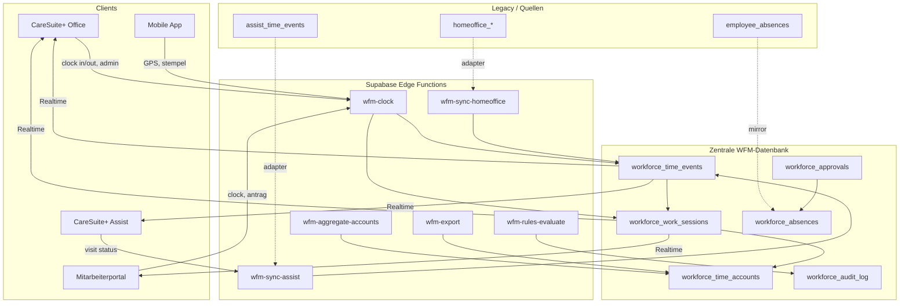
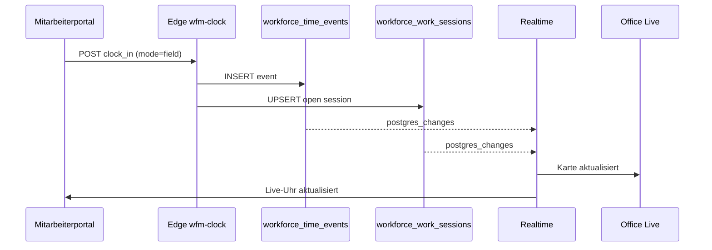
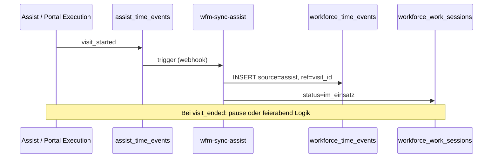

# CareSuite+ WFM — Zentrale Zeitdatenbank-Architektur

**Stand:** 2026-06-28  
**Prinzip:** Eine zentrale Workforce-Datenbank — alle Module lesen/schreiben über definierte Schnittstellen.

---

## 1. Architekturprinzipien

1. **Single Write Path:** Jeder Zeitstempel wird genau einmal in `workforce_time_events` persistiert.
2. **Session-Aggregation:** `workforce_work_sessions` materialisiert den aktuellen Tagesstatus (Realtime-fähig).
3. **Legacy-Adapter:** Bestehende Systeme (`homeoffice_*`, `assist_time_events`) schreiben über Sync-Adapter in die Zentral-DB (Übergangsphase).
4. **Tenant-Isolation:** Alle Tabellen mit `tenant_id` + RLS via `current_tenant_id()`.
5. **Append-Only Events:** Korrekturen = neue Events mit `correction_of_id`, keine Hard-Deletes.

---

## 2. Systemdiagramm



---

## 3. Modul-Zugriffsmatrix

| Modul | Lesezugriff | Schreibzugriff | Realtime-Tabellen |
|-------|-------------|----------------|-------------------|
| **Office — Live-Mitarbeiter** | `workforce_work_sessions`, `workforce_time_events` (aggregiert), `employees`, `assignments` | — (nur Anzeige) | `workforce_work_sessions` |
| **Office — Zeitkonten** | `workforce_time_accounts`, `workforce_time_events`, `workforce_absences` | Korrekturen via `wfm-clock` + Audit | `workforce_time_accounts` |
| **Office — Genehmigungen** | `workforce_approvals`, `workforce_absences` | Approve/Reject | `workforce_approvals` |
| **Assist — Einsatz** | `assignments`, `assist_visits`, eigene `assist_time_events` | Visit-Status → Adapter → `workforce_time_events` | `assist_time_events`, `workforce_work_sessions` |
| **Assist — Live-Status** | `workforce_work_sessions`, `assist_location_points` | — | `assignments`, `assist_tracking_sessions` |
| **Mitarbeiterportal — Arbeitszeit** | Eigene Sessions/Events/Accounts | `clockIn/Out`, Anträge | `workforce_work_sessions` |
| **Mitarbeiterportal — Einsatz** | `assignments`, Timer-Projektion | Execution (bestehend) + Sync | `assist_time_events` |
| **GF-Dashboard** | Aggregierte Views / KPI-RPC | — | `workforce_work_sessions` |
| **Export / DATEV** | `workforce_time_accounts`, Events | — (read-only Service Role) | — |

---

## 4. Realtime-Sync (Supabase Realtime)

### Publikations-Tabellen (Phase 1+)

```sql
-- Ergänzung zu supabase/migrations/0106_realtime_publication_tables.sql
ALTER PUBLICATION supabase_realtime ADD TABLE workforce_work_sessions;
ALTER PUBLICATION supabase_realtime ADD TABLE workforce_time_events;
ALTER PUBLICATION supabase_realtime ADD TABLE workforce_approvals;
```

### Client-Subscriptions

| Preset | Datei | Tabellen |
|--------|-------|----------|
| WFM Live Team | `src/lib/realtime/presets.ts` (neu) | `workforce_work_sessions`, `workforce_time_events` |
| Assist Ops (bestehend) | `presets.ts` | `assignments`, `assist_time_events`, … |
| Abwesenheiten (bestehend) | `presets.ts` | `employee_absences` |

### Sync-Strategie

1. **Optimistic UI:** Portal stempelt lokal, schreibt Event, Realtime bestätigt.
2. **Konflikt:** Letzter gültiger Event gewinnt; Duplikate via `(tenant_id, employee_id, event_type, occurred_at)` Unique-Index verhindern.
3. **Offline:** Queue in AsyncStorage; Replay bei Reconnect via Edge Function `wfm-clock` (Idempotency-Key).

---

## 5. RLS-Strategie

### Rollen-Matrix

| Policy | Bedingung |
|--------|-----------|
| **Self read/write** | `employee_id` → `auth.uid()` via `profiles`/`employees` Join |
| **Team lead read** | `has_permission('time.tracking.team.view')` + gleicher Mandant |
| **Admin read/write** | `has_permission('time.tracking.admin.*')` oder `is_tenant_admin()` |
| **Audit read** | `has_permission('time.audit.view')` |
| **Assist sync** | Service Role in Edge Function only — **nicht** Client |

### Wichtige Regeln (Supabase Security)

- Keine Authorization aus `user_metadata` — nur `app_metadata` / `has_permission()`.
- UPDATE auf Events verboten — nur INSERT (Korrektur = neues Event).
- Views mit `security_invoker = true` für aggregierte KPIs.

---

## 6. Edge Functions (geplant)

| Function | Trigger | Aufgabe |
|----------|---------|---------|
| `wfm-clock` | HTTP POST | Stempeln, Pause, Moduswechsel; schreibt Event + Session |
| `wfm-sync-assist` | DB Webhook / Cron | `assist_time_events` → `workforce_time_events` |
| `wfm-sync-homeoffice` | DB Webhook / Cron | `homeoffice_time_entries` → zentral |
| `wfm-aggregate-accounts` | Cron (nächtlich) | Monats-Snapshots in `workforce_time_accounts` |
| `wfm-rules-evaluate` | Cron + Event | ArbZG-Regeln, Violations |
| `wfm-export` | HTTP GET | CSV/DATEV/Personio |

---

## 7. Datenfluss — Stempel-Beispiel



---

## 8. Assist-Einsatz-Integration



**Bestehender Code:**

- `src/lib/assist/assistTrackingPersistenceService.ts` — schreibt `assist_time_events`
- `src/hooks/useEmployeePortalVisitExecution.ts` — Portal-Einsatz mit GPS/Geofence
- `src/lib/assist/assistLiveTrackingViewService.ts` — Live-Status-Anzeige

**Gap:** Kein Adapter nach `workforce_*` (Phase 1/3).

---

## 9. Homeoffice-Integration

**Bestehend:** Migration `0161`, Services unter `src/lib/timeTracking/`.

**Migrationspfad:**

1. Phase 1: Dual-Write (homeoffice + workforce) in `timeTrackingWorkdayService.ts`
2. Phase 2: Read-Pfad auf workforce umstellen
3. Phase 4: homeoffice-Tabellen als Archive/View

---

## 10. Abwesenheiten-Integration

**Bestehend:** `employee_absences` (0051), `src/lib/office/absenceService.ts`.

**Ziel:** `workforce_absences` als canonical API; `employee_absences` bleibt kompatibel via Trigger oder View bis Phase 2 abgeschlossen.

---

## 11. Technische Abhängigkeiten

| Komponente | Status |
|------------|--------|
| Supabase Auth + RLS | ✅ vorhanden |
| Realtime Presets | ✅ erweiterbar (`src/lib/realtime/presets.ts`) |
| Permissions `time.*` | ✅ Migration 0161 |
| Edge Functions Infra | 🟡 projektabhängig |
| Expo Push | 🟡 Office Notifications vorhanden |

---

## 12. Offene Architektur-Entscheidungen

1. **Session-Modell:** Eine offene Session pro MA/Tag vs. mehrere (HO + Einsatz am selben Tag)?
   - *Empfehlung:* Eine Session, `work_mode` wechselt per Event.
2. **GPS-Speicherung zentral:** Rohe Koordinaten in `workforce_time_events.metadata` vs. separate `workforce_location_pings`?
   - *Empfehlung:* Pings separat (DSGVO, Retention); Events nur Referenz.
3. **Zeitkonto-Snapshots:** Täglich inkrementell vs. nur Monatsabschluss?
   - *Empfehlung:* Nächtlicher Job + manueller Monatsabschluss.

---

## Referenzen

- Spezifikation: `docs/spec/wfm-workforce-management-spezifikation.md`
- Phasenplan: `docs/roadmap/wfm-phasenplan.md`
- Migration-Entwurf: `supabase/migrations/0190_wfm_foundation.sql`
