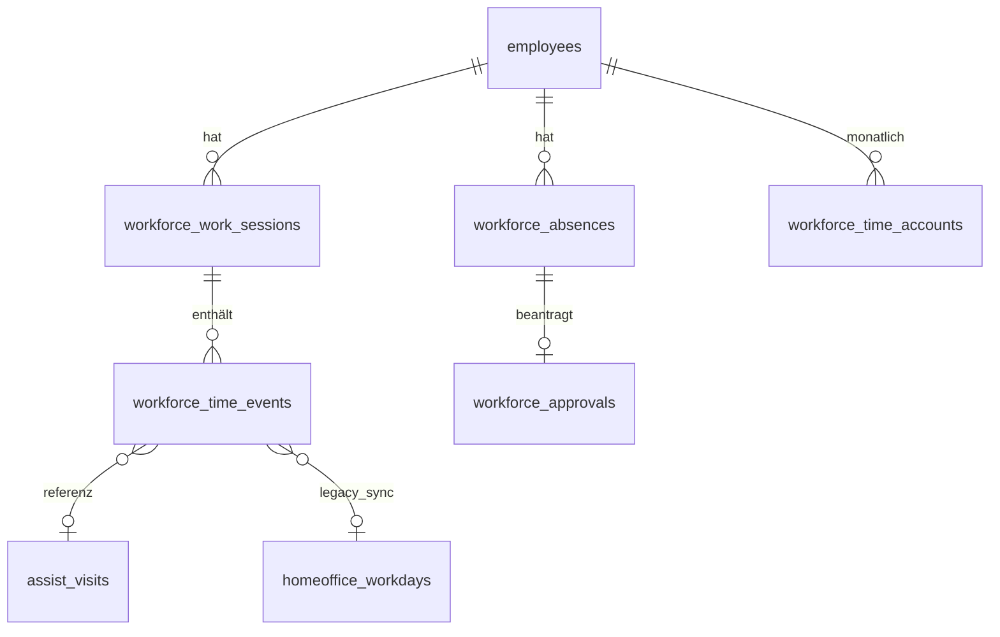

# CareSuite+ Workforce Management (WFM) — Produktspezifikation

**Stand:** 2026-06-28  
**Status:** Zielbild / nicht vollständig implementiert  
**Supabase-Projekt:** `euagyyztvmemuaiumvxm`

---

## Ziel

CareSuite+ erhält ein vollständig integriertes Workforce-Management-System. Alle Arbeitszeiten, Einsätze, Bürozeiten, Homeoffice-Zeiten, Bereitschaften, Urlaube, Krankmeldungen, Fehlzeiten und Zeitkonten werden **zentral** verwaltet.

Alle Daten sind in Echtzeit zwischen **Office**, **Mitarbeiterportal** und **Assist** synchronisiert. Es existiert **nur eine zentrale Zeitdatenbank** — keine doppelte Zeiterfassung.

---

## Modul 1 — Live-Anwesenheit (Office Dashboard)

### Anforderung

Die Office-Verwaltung erhält ein eigenes Dashboard **„Live-Mitarbeiter“**. Alle Mitarbeitenden werden in Echtzeit als Live-Karten angezeigt.

**Pro Karte:** Profilbild, Name, Position, aktueller Status, seit wann, heutige Arbeitszeit, aktueller Standort, aktueller Einsatz, verbleibende Arbeitszeit, heutige Pause, nächster Einsatz, Akkustand (optional), GPS-Status, Online/Offline.

**Statusfarben:**

| Farbe | Status |
|-------|--------|
| 🟢 | Im Einsatz |
| 🔵 | Büro |
| 🟣 | Home Office |
| 🟠 | Pause |
| 🟡 | Unterwegs |
| ⚫ | Feierabend |
| 🔴 | Krank |
| 🌴 | Urlaub |
| ⚪ | Offline |

Aktualisierung ohne Browser-Reload (Supabase Realtime).

### Akzeptanzkriterien

- [ ] Office-Route `/office/live-mitarbeiter` (oder vergleichbar) listet **alle** aktiven Mitarbeitenden des Mandanten.
- [ ] Karten aktualisieren sich innerhalb von ≤5 s nach Statusänderung (Realtime oder Polling-Fallback).
- [ ] Jede Karte zeigt mindestens: Name, Status, Status-seit, heutige Netto-Arbeitszeit, nächster geplanter Einsatz (falls vorhanden).
- [ ] Filter nach Team, Rolle, Status; Suche nach Name.
- [ ] Berechtigung: `wfm.live.view` oder `time.tracking.team.view` + Office-Rolle.
- [ ] Keine GPS-Rohdaten für Rollen ohne `wfm.location.view_sensitive`.

---

## Modul 2 — Live-Karte

### Anforderung

Office erhält eine Live-Karte mit: Mitarbeitenden, Live-Standorten, laufenden Einsätzen, Anfahrten, Touren, Geofencing, Verspätungen, Ankunft/Abfahrt, Ampelsystem.

### Akzeptanzkriterien

- [ ] Kartenansicht auf Basis zentraler `workforce_work_sessions` + Assist-Standortprojektion.
- [ ] Marker pro Mitarbeiter mit Statusfarbe (Modul 1).
- [ ] Einsatz-Polygone / Geofence-Radius sichtbar für Disponent:innen.
- [ ] Verspätungs-Badge wenn `planned_start + Toleranz < actual_start`.
- [ ] Klick auf Marker öffnet Detail-Sheet (Einsatz, Timer, Kontakt).
- [ ] Performance: ≤200 Marker ohne spürbares Ruckeln (Clustering ab 50).

---

## Modul 3 — Arbeitszeiterfassung (zentral)

### Anforderung

Ein zentrales Zeitsystem für alle Arbeitsarten:

Arbeitsbeginn/-ende, Pause Beginn/Ende, Home Office Beginn/Ende, Büro Beginn/Ende, Bereitschaft, Fortbildung, Besprechung, Fahrt, Dienstreise, Springer, Notdienst.

### Akzeptanzkriterien

- [ ] Jeder Zeitstempel wird **einmal** in `workforce_time_events` geschrieben.
- [ ] Event-Typen enum-validiert; Quelle (`office`, `portal`, `assist`, `system`) protokolliert.
- [ ] Stempeln erzeugt/aktualisiert `workforce_work_sessions` (offene Session pro Mitarbeiter/Tag).
- [ ] Keine parallelen Schreibpfade in `homeoffice_*` / `assist_time_events` ohne Sync-Adapter (Übergangsphase dokumentiert).
- [ ] API: `clockIn`, `clockOut`, `pauseStart`, `pauseEnd`, `switchWorkMode(mode)`.

---

## Modul 4 — Einsatzzeiten (Assist-Integration)

### Anforderung

Einsatzzeiten werden automatisch übernommen. Bei Einsatzstart läuft Arbeitszeit; bei Einsatzende automatische Rückkehr (Unterwegs / Büro / Feierabend je nach Planung).

### Akzeptanzkriterien

- [ ] Assist-Statusübergänge (`unterwegs`, `gestartet`, `beendet`, …) erzeugen zentrale Events mit `source=assist`, `reference_type=visit`.
- [ ] Fahrt- und Einsatz-Timer aus `assist_time_events` werden in WFM-Sessions aggregiert.
- [ ] Nach letztem Einsatz des Tages: automatischer Vorschlag „Feierabend“ oder „Unterwegs zurück“.
- [ ] Disponent sieht Einsatzzeit ≠ Sollzeit in Live-Dashboard.

---

## Modul 5 — Home Office

### Anforderung

Eigene Arbeitsart mit Start, Pause, Ende; optional GPS, IP, Gerät, Browser; Audit und Arbeitsnachweis.

### Akzeptanzkriterien

- [ ] Homeoffice-Modus als `work_mode=homeoffice` in zentraler DB.
- [ ] Bestehendes Modul (`homeoffice_workdays`, Migration 0161) migriert oder spiegelt in WFM-Events.
- [ ] Inaktivitäts-Prompts und Metadata-Events weiterhin DSGVO-konform (keine Inhaltsdaten).
- [ ] Privacy-Consent vor erstem Start Pflicht.
- [ ] Tätigkeitsnachweis exportierbar (PDF/CSV).

---

## Modul 6 — Büro (Check-In)

### Anforderung

Check-In/Check-Out per QR-Code, NFC, Bluetooth Beacon, GPS oder PIN — administrativ konfigurierbar.

### Akzeptanzkriterien

- [ ] Mandanten-Einstellung: erlaubte Check-In-Methoden.
- [ ] Büro-Standorte mit Koordinaten / Beacon-IDs in `workforce_locations`.
- [ ] Check-In erzeugt Event `office_check_in`; Check-Out `office_check_out`.
- [ ] PIN-Fallback für Terminals ohne NFC.
- [ ] Audit-Log für manuelle Büro-Korrekturen.

---

## Modul 7 — Live Timer (Portal)

### Anforderung

Jeder Mitarbeitende sieht: Arbeitszeit heute, Pausen, Überstunden, Sollstunden, Restarbeitszeit, Monats-/Jahresstunden, Zeitkonto, Ampel — live aktualisiert.

### Akzeptanzkriterien

- [ ] Widget zeigt Ist-, Soll- und Restwerte für aktuellen Tag und Monat.
- [ ] Aktualisierung via Realtime auf `workforce_work_sessions` / `workforce_time_accounts`.
- [ ] Ampel: grün/gelb/rot nach konfigurierbaren Schwellen.
- [ ] Offline-Anzeige mit „Stand: …“ Timestamp.

---

## Modul 8 — Mitarbeiterportal „Arbeitszeit“

### Anforderung

Eigener Menüpunkt mit: Heute, Woche, Monat, Zeitkonto, Urlaub, Krank, Abwesenheiten, Pausen, Schichten, Über-/Minusstunden, Soll/Ist, Vertrag, Urlaubsanspruch, Resturlaub, Genehmigungen.

### Akzeptanzkriterien

- [ ] Route `/portal/employee/arbeitszeit` mit Tab-Navigation (bestehend erweitern).
- [ ] Alle Unterseiten lesen aus zentraler WFM-DB.
- [ ] Mobile-first Layout analog Portal M.3 Shell-Standard.
- [ ] Berechtigungen: `time.tracking.own.view`, `portal.employee.absences.*`.

---

## Modul 9 — Live-Uhr (Portal Header)

### Anforderung

Immer sichtbar oben im Mitarbeiterportal: Arbeitsstatus, Arbeitszeit, Pausenzeit, Restpause, Restarbeitszeit.

### Akzeptanzkriterien

- [ ] Sticky Header-Komponente auf allen Portal-Employee-Routen.
- [ ] Ein-Klick: Pause / Fortsetzen (wenn berechtigt).
- [ ] Kollabiert auf Mobile zu kompaktem Badge.
- [ ] Kein Layout-Shift beim Tick (1 s Intervall lokal, Sync alle 30 s).

---

## Modul 10 — Urlaub

### Anforderung

Übersicht: Anspruch, Verbraucht, Genehmigt, Beantragt, Resturlaub, Vorjahr, Sonderurlaub, Bildungsurlaub, Elternzeit.

### Akzeptanzkriterien

- [ ] Urlaubskonto pro Mitarbeiter/Jahr in `workforce_time_accounts` oder `employee_leave_balances`.
- [ ] Antrag erzeugt `workforce_absences` + `workforce_approvals`.
- [ ] Halbtags-Urlaub unterstützt.
- [ ] Resturlaub-Vortrag automatisch zum 1.1.

---

## Modul 11 — Abwesenheiten

### Anforderung

Eigener Bereich: Krank, Kind krank, Fortbildung, Berufsschule, Mutterschutz, Elternzeit, Freistellung, Unbezahlt, Sonderurlaub, Dienstreise, Sonstige.

### Akzeptanzkriterien

- [ ] Mapping auf `employee_absences.absence_type` (bestehend) + WFM-Sync.
- [ ] Krankmeldung mit optionalem AU-Dokument (Document Engine).
- [ ] Kalender-Sync (`calendar_events`) bleibt konsistent.
- [ ] Sensible Details nur mit `office.employees.absences.view_sensitive`.

---

## Modul 12 — Genehmigungen

### Anforderung

Mitarbeiter beantragt: Urlaub, Home Office, Zeitkorrektur, Diensttausch, Fortbildung, Abwesenheit — alles landet automatisch im Office.

### Akzeptanzkriterien

- [ ] Einheitlicher Posteingang Office: `/office/approvals` oder Integration in Personalakte.
- [ ] Status: `pending`, `approved`, `rejected`, `cancelled`.
- [ ] Benachrichtigung an Antragsteller und Genehmiger.
- [ ] Genehmigung schreibt auditierbare `workforce_approvals`-Zeile.

---

## Modul 13 — Office Zeitkonten-Verwaltung

### Anforderung

Seite „Zeitkonten“: pro Mitarbeiter Soll/Ist, Über-/Minusstunden, Pausen, Fehlzeiten, Urlaub, Krank, Abwesenheiten, HO, Büro, Einsatz, Fahrt, Bereitschaft, Fortbildung — automatisch berechnet.

### Akzeptanzkriterien

- [ ] Tabellen- und Detailansicht pro Mitarbeiter/Monat.
- [ ] Drill-down in Einzel-Events.
- [ ] Export-Button (CSV mindestens).
- [ ] Berechtigung: `time.tracking.admin.view`.

---

## Modul 14 — Zeitkonto (Monatsübersicht)

### Anforderung

Monatsübersicht grafisch, Ampelsystem, Historie, Korrekturen, manuelle Buchungen, Audit.

### Akzeptanzkriterien

- [ ] Chart: Soll vs. Ist pro Tag/Woche.
- [ ] Manuelle Buchung nur mit Grund + Genehmiger.
- [ ] Monats-Snapshot in `workforce_time_accounts` (immutable nach Abschluss).
- [ ] Monatsabschluss sperrt bearbeitbare Felder.

---

## Modul 15 — Korrekturen (revisionssicher)

### Anforderung

Nur Office darf Zeiten, Pausen, Urlaub, Fehlzeiten und Zeitkonten korrigieren — alles revisionssicher mit Audit-Pflicht.

### Akzeptanzkriterien

- [ ] Korrektur erzeugt Gegenbuchung, löscht keine Events (append-only).
- [ ] Pflichtfelder: Grund, Bearbeiter, Zeitstempel.
- [ ] Mitarbeiter sieht Korrektur-Hinweis im Portal.
- [ ] Hash-Kette oder unveränderliches Audit-Log.

---

## Modul 16 — Automatische Regeln (Regelwerk)

### Anforderung

Automatische Pausen, Arbeitszeitgesetz, Ruhezeiten, Maximalarbeitszeit, Wochenarbeitszeit, Feiertage, Nacht-/Wochenendzuschläge, Über-/Minusstunden, Warnungen.

### Akzeptanzkriterien

- [ ] Regel-Engine als Edge Function oder DB-Job (täglich + bei Event).
- [ ] Konfiguration pro Mandant (Bundesland, Tarif).
- [ ] Warnungen als `workforce_rule_violations`.
- [ ] Keine automatische Stempelung ohne Nutzeraktion (nur Hinweise/Vorschläge).

---

## Modul 17 — Benachrichtigungen

### Anforderung

Automatische Hinweise: Pause vergessen, Arbeitszeit überschritten, Ruhezeit verletzt, kein Check-Out, kein Einsatz beendet, Urlaub genehmigt/abgelehnt, Zeitkorrektur genehmigt.

### Akzeptanzkriterien

- [ ] Integration Office Notifications + Push (Expo).
- [ ] Opt-in pro Kanal (In-App, E-Mail, Push).
- [ ] Eskalation an Teamleitung nach konfigurierbarer Zeit.
- [ ] Deduplizierung (max. 1 Warnung pro Regel/Tag).

---

## Modul 18 — Dashboard Geschäftsführung

### Anforderung

Live-KPIs: Anwesend, Im Einsatz, Büro, HO, Urlaub, Krank, Pause, Unterwegs, Feierabend, Überstunden, offene Genehmigungen, Personalquote, Auslastung.

### Akzeptanzkriterien

- [ ] Route `/business/office/wfm-dashboard` oder Erweiterung Office-Dashboard.
- [ ] KPI-Karten mit Realtime-Zählern.
- [ ] Trend sparklines (7 Tage).
- [ ] Rollen: `management`, `geschaeftsfuehrung`, `owner`.

---

## Modul 19 — Auswertungen & Exporte

### Anforderung

Zeiträume: Tag, Woche, Monat, Quartal, Jahr. Formate: CSV, Excel, PDF, DATEV, Lohnexport, Lexware, Personio, DATEV LODAS, DATEV Lohn & Gehalt, API.

### Akzeptanzkriterien

- [ ] Phase 1: CSV/Excel intern.
- [ ] Phase 5: DATEV/Personio-Adapter mit Feld-Mapping-Dokumentation.
- [ ] API: REST oder Edge Function mit Service-Role / OAuth.
- [ ] Export enthält Prüfsumme und Export-Zeitstempel.

---

## Modul 20 — Architektur (Querschnitt)

### Anforderung

Keine getrennte Speicherung — ein zentrales Workforce-System für Office, Assist, Mitarbeiterportal, Mobile App, Dashboard, Lohn, Controlling, Reporting, Disposition, Genehmigungsworkflow.

### Akzeptanzkriterien

- [ ] Single Source of Truth: `workforce_*` Tabellen.
- [ ] Legacy-Tabellen nur als Read-Replicas oder Sync-Views während Migration.
- [ ] Realtime-Publikation auf Kern-Tabellen.
- [ ] RLS: Mandant + Self + Team-Lead + Admin.
- [ ] Architektur-Dokument: `docs/spec/wfm-architektur-zentral.md`.

---

## Datenmodell — Übersicht

### Kern-Entitäten (Zielbild)

| Entität | Tabelle (Ziel) | Beschreibung |
|---------|----------------|--------------|
| Zeit-Event | `workforce_time_events` | Append-only Stempel (Typ, Quelle, Geo, Referenz) |
| Arbeitssession | `workforce_work_sessions` | Aggregierte Tages-/Schicht-Session pro MA |
| Abwesenheit | `workforce_absences` | Urlaub, Krank, etc. (sync mit `employee_absences`) |
| Genehmigung | `workforce_approvals` | Unified Approval Workflow |
| Zeitkonto | `workforce_time_accounts` | Monatliche Snapshots (Soll/Ist/Über/Minus) |
| Standort | `workforce_locations` | Büros, Beacons, Geofences |
| Regelverstoß | `workforce_rule_violations` | Phase 4 |
| Audit | `workforce_audit_log` | Revisionssichere Änderungen |

### Beziehungen (vereinfacht)

### Bestehende Tabellen (Ist — nicht zentral)

| Bereich | Tabellen | Migration |
|---------|----------|-----------|
| Homeoffice | `homeoffice_workdays`, `homeoffice_time_entries`, … | 0161, 0187 |
| Assist Einsatz | `assist_time_events`, `assist_tracking_sessions`, … | 0156 |
| Assist GPS (legacy) | `time_entries` | älter |
| Abwesenheiten | `employee_absences`, `employee_absence_requests` | 0051 |
| Live Monitor | `live_operation_events` | 0129 |
| MA-Einstellungen | `employee_work_settings` | 0172 |

---

## Nicht-Ziele (dieses Dokument)

- Vollständige Lohnabrechnung in CareSuite+ (Export-Schnittstelle genügt).
- Ersatz externer HR-Systeme (Personio-Sync, nicht Vollersatz).
- Implementierungsdetails einzelner UI-Komponenten (siehe Phasenplan).

---

## Referenzen

- Ist-Abgleich: `docs/audit/wfm-ist-abgleich.md`
- Architektur: `docs/spec/wfm-architektur-zentral.md`
- Phasenplan: `docs/roadmap/wfm-phasenplan.md`
- Migration (Entwurf): `supabase/migrations/0190_wfm_foundation.sql`
